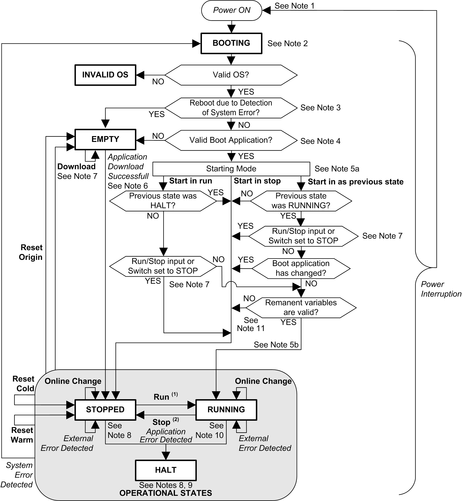

# Controller State Diagram

## Controller State Diagram

This diagram describes the controller operating mode:

**ALL-CAPS BOLD:** Controller states

**Bold:** User and application commands

***Italics*:** System events

**Normal text:** Decisions, decision results, and general information

**(1)** For details on STOPPED to RUNNING state transition, refer to [Run Command](D-SE-0008848.html#D-SE-0008848__D-SE-0008848.2).

**(2)** For details on RUNNING to STOPPED state transition, refer to [Stop Command](D-SE-0008848.html#D-SE-0008848__D-SE-0008848.8).

## Note 1

The Power Cycle (Power Interruption followed by a Power ON) deletes all output forcing settings. Refer to [Controller State and Output Behavior](D-SE-0002679.html#D-SE-0002679) for further details.

## Note 2

The outputs will assume their hardware initialization values.

## Note 3

In some cases, when a system error is detected, it will cause the controller to reboot automatically into the EMPTY state as if no Boot application were present in the non-volatile memory. However, the Boot application is not deleted from the non-volatile memory. In this case, the ERR LED (red) flashes regularly.

## Note 4

After verification of a valid Boot application the following events occur:

* The application is loaded into RAM.
* The [Post Configuration](D-SE-0010304.html#D-SE-0010304) file settings (if any) are applied.

During the load of the boot application, a Check context test occurs to verify that the remanent variables are valid. If the Check context test is invalid, the boot application will load but the controller will transitions to the [STOPPED state](D-SE-0008848.html#D-SE-0008848__D-SE-0008848.9).

## Note 5a

The Starting Mode is set in the PLC settings tab of the [**Controller Device Editor**](D-SE-0006801.html#D-SE-0006801).

## Note 5b

Not applicable.

## Note 6

During a successful application download the following events occur:

* The application is loaded directly into RAM.
* By default, the Boot application is created and saved into the non-volatile memory.

## Note 7

The default behavior after downloading an application program is for the controller to enter the STOPPED state irrespective of the switch position or the last controller state before the download.

However, there are two considerations in this regard:

|  |  |  |  |  |  |
| --- | --- | --- | --- | --- | --- |
| **Online Change** | An online change (partial download) initiated while the controller is in the RUNNING state returns the controller to the RUNNING state if successful and provided the Run/Stop switch is set to Run. Before using the **Login with online change** option, test the changes to your application program in a virtual or non-production environment and confirm that the controller and attached equipment assume their expected conditions in the RUNNING state.   | WARNING | | | --- | --- | |  | UNINTENDED EQUIPMENT OPERATION  Always verify that online changes to a RUNNING application program operate as expected before downloading them to controllers.  Failure to follow these instructions can result in death, serious injury, or equipment damage. |   NOTE: Online changes to your program are not automatically written to the Boot application, and will be overwritten by the existing Boot application at the next reboot. If you wish your changes to persist through a reboot, manually update the Boot application by selecting Create boot application in the online menu (the controller must be in the STOPPED state to achieve this operation). |
| **Multiple Download** | EcoStruxure Machine Expert has a feature that allows you to perform a full application download to multiple targets on your network or fieldbus. One of the default options when you select the Multiple Download... command is the Start all applications after download or online change option, which restarts all download targets in the RUNNING state, irrespective of their last controller state before the multiple download was initiated. Deselect this option if you do not want all targeted controllers to restart in the RUNNING state. In addition, before using the **Multiple Download** option, test the changes to your application program in a virtual or non-production environment and confirm that the targeted controllers and attached equipment assume their expected conditions in the RUNNING state.   | WARNING | | | --- | --- | |  | UNINTENDED EQUIPMENT OPERATION  Always verify that your application program will operate as expected for all targeted controllers and equipment before issuing the "Multiple Download..." command with the "Start all applications after download or online change" option selected.  Failure to follow these instructions can result in death, serious injury, or equipment damage. |   NOTE: During a multiple download, unlike a single download, EcoStruxure Machine Expert does not offer the option to create a Boot application. You can manually create a Boot application at any time by selecting Create boot application in the Online menu on all targeted controllers. |

## Note 8

The EcoStruxure Machine Expert software platform allows many powerful options for managing task execution and output conditions while the controller is in the STOPPED or HALT states. Refer to [Controller States Description](D-SE-0008844.html#D-SE-0008844) for further details.

## Note 9

To exit the HALT state it is necessary to issue one of the Reset commands (Reset Warm, Reset Cold, Reset Origin), download an application or cycle power.

In case of non-recoverable event (hardware watchdog or internal error), a power cycle is mandatory.

## Note 10

The RUNNING state has two exception conditions:

* RUNNING with External Error: this exception condition is indicated by the I/O LED, which displays solid red. You may exit this state by clearing the external error (probably changing the application configuration). No controller commands are required, but may however include the need of a power cycle of the controller. For more information, refer to [I/O Configuration General Description](D-SE-0061767.html#D-SE-0061767).
* RUNNING with Breakpoint: this exception condition is indicated by the RUN LED, which displays a single green flash. Refer to [Controller States Description](D-SE-0008844.html#D-SE-0008844) for further details.

## Note 11

The boot application can be different from the application loaded. It can happen when the boot application was downloaded through SD card, FTP, or file transfer or when an online change was performed without creating the boot application.

EIO0000003089.10