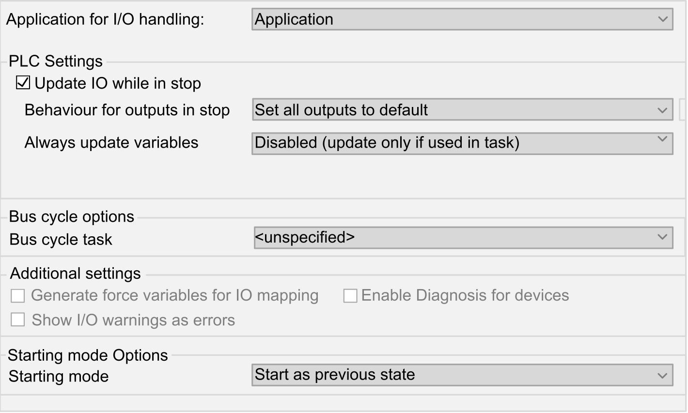

# PLC Settings

## Overview

The figure below presents the PLC Settings tab:

| Element | | Description |
| --- | --- | --- |
| Application for I/O handling | | Select Application (as there is only one application in the controller).  NOTE: If None is selected, the application will not be built. |
| PLC settings | Update IO while in stop | If this option is activated (default), the values of the input and output channels are also updated when the controller is stopped. |
| Behavior for outputs in Stop | From the selection list, choose one of the following options to configure how the values at the output channels should be handled in case of controller stop:   * Keep current values * Set all outputs to default |
| Always update variables | From the selection list, choose one of the following options:   * Disabled (update only if used in task) * Enabled 1 (use bus cycle task if not used in any task) * Enabled 2 (always in bus cycle task) |
| Bus cycle options | Bus cycle task | This configuration setting is the parent for all Bus cycle task parameters used in the application Devices tree.  Some devices with cyclic calls, such as a **CANopen manager**, can be attached to a specific task. In the device, when this setting is set to Use parent bus cycle setting, the setting set for the controller is used.  The selection list offers all tasks currently defined in the active application. The default setting is the MAST task.  NOTE: <unspecified> means that the task is in "slowest cyclic task" mode. |
| Additional settings | Generate force variables for IO mapping | Not used. |
| Enable Diagnosis for devices | Not used. |
| Show I/O warnings as errors | Not used. |
| Starting mode Options | Starting mode | This option defines the starting mode on a power-on. For further information, refer to [State behavior diagram](D-SE-0033981.html#D-SE-0033981).  Select with this option one of these starting modes:   * Start as previous state * Start in stop * Start in run |

EIO0000003089.10