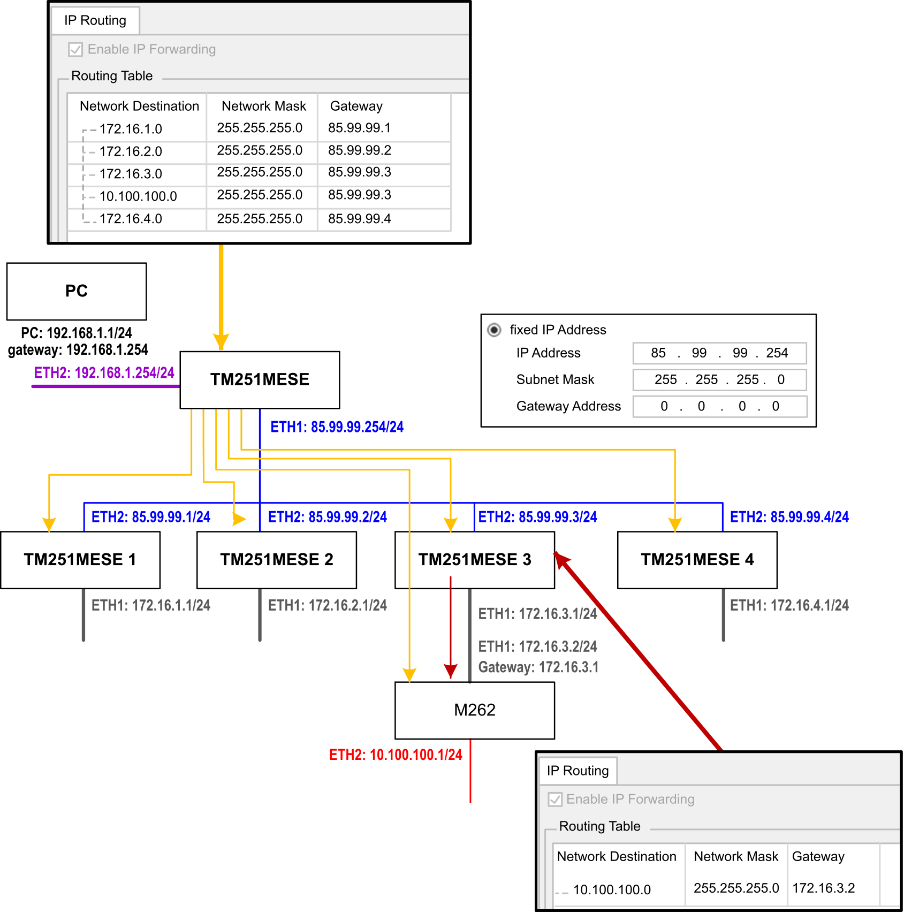
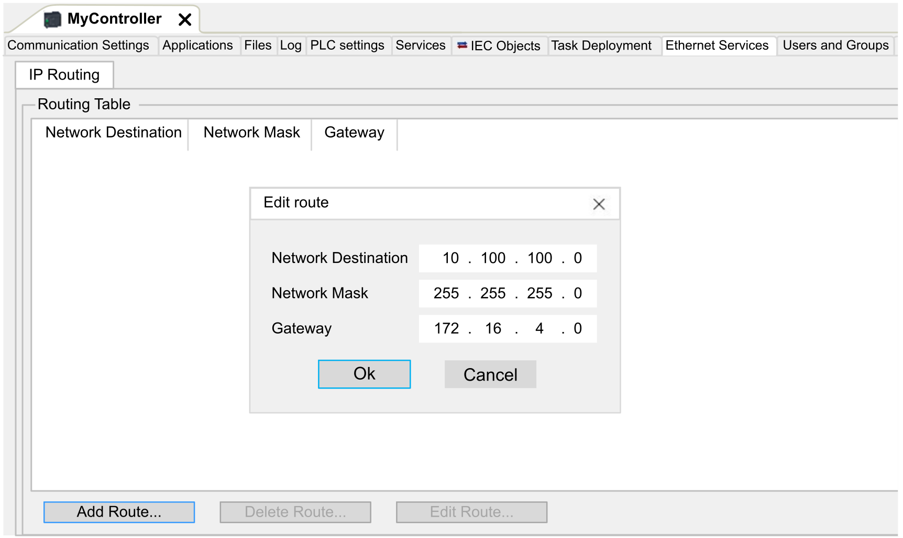

# Ethernet Services

## IP Routing

The IP Routing subtab allows you to configure the IP routes in the controller.

The parameter Enable IP forwarding:

* recalls the option sets or not on the configuration page of the Ethernet network (Ethernet 1) for TM251MESE logic controller.
* is empty as not supported forTM251MESC logic controller.

When deactivated, the communication is not routed from a network to another one. The devices on the device network are no longer accessible from the control network and related features like Web pages access on device or commissioning of device via DTM, EcoStruxure Machine Expert - Safety and so on are not possible.

The M251 Logic Controller can have up to two Ethernet interfaces. Using a routing table is necessary to communicate with remote networks connected to different Ethernet interfaces. The gateway is the IP address used to connect to the remote network, which needs to be in local network of the controller.

This graphic depicts an example network, in which the last two rows of devices (gray and red) need to be added in the routing table:

Use the routing tables to manage the IP forwarding.

To add a route, double click My controller  then click Ethernet Services  > IP Routing  > Add Route.

For reasons of network security, TCP/IP forwarding is disabled by default. Therefore, you must manually enable TCP/IP forwarding if you want to access devices through the controller. However, doing so may expose your network to possible cyberattacks if you do not take additional measures to protect your enterprise. In addition, you may be subject to laws and regulations concerning cybersecurity.

| WARNING | |
| --- | --- |
|  | UNAUTHENTICATED ACCESS AND SUBSEQUENT NETWORK INTRUSION  * Observe and respect any an all pertinent national, regional and local cybersecurity and/or personal data laws and regulations when enabling TCP/IP forwarding on an industrial network. * Isolate your industrial network from other networks inside your company. * Protect any network against unintended access by using firewalls, VPN, or other, proven security measures.  Failure to follow these instructions can result in death, serious injury, or equipment damage. |

EIO0000003089.10