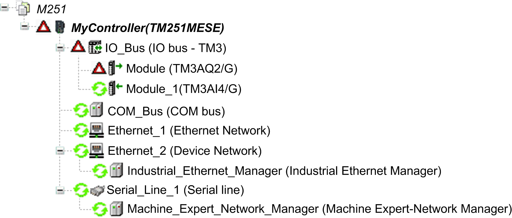

# TM3 I/O Configuration General Description

## Introduction

In your project, you can add I/O expansion modules to your M251 Logic Controller to increase the number of digital and analog inputs and outputs to the controller.

You can add either TM3 or TM2 I/O expansion modules to the logic controller, and further expand the number of I/O via TM3 transmitter and receiver modules to create remote I/O configurations. Special rules apply in all cases when creating local and remote I/O expansions, and when mixing TM2 and TM3 I/O expansion modules (refer to [Maximum Hardware Configuration](../../../../../api/crossBook?lang=en-US&virtualBookName=m251hw&topicID=D_SE_0034417)).

The I/O expansion bus of the M251 Logic Controller is created when you assemble the I/O expansion modules to the logic controller. I/O expansion modules are considered as external devices in the logic controller architecture and, as such, are treated differently than the embedded I/Os of the logic controller.

## I/O Expansion Bus Errors

If the logic controller cannot communicate with one or more I/O expansion modules contained in the program configuration, and those modules are not configured as optional modules (refer to [Optional I/O Expansion Modules](D-SE-0057492.html#D-SE-0057492)), the logic controller detects it as an I/O expansion bus error.

The unsuccessful communication may be detected during the startup of the logic controller or during runtime, and there may be any number of causes. Causes of communication exceptions on the I/O expansion bus include, among other things, disconnection of or physically missing I/O modules, electromagnetic radiation beyond published environmental specifications, or otherwise inoperative modules.

If an I/O expansion bus error is detected:

* The system status LED **I/O** of the logic controller is illuminated indicating an I/O error.
* When EcoStruxure Machine Expert is in online mode, a red triangle appears next to the TM3 expansion module or modules in error and next to the IO\_Bus node on the Devices tree window:

The following diagnostic information is also available:

* Bit 0 and bit 1 of the `PLC_R.i_lwSystemFault_1` system variable are set to 0.
* The `PLC_R.i_wIOStatus1` and `PLC_R.i_wIOStatus2` system variables are set to `PLC_R_IO_BUS_ERROR`.
* The `TM3_MODULE_R[i].i_wModuleState` system variable, where `[i]` identifies the TM3 expansion module in error, is set to TM3\_BUS\_ERROR.
* The `TM3_GetModuleBusStatus` function block returns the TM3\_ERR\_BUS [error code](../../../../../api/crossBook?lang=en-US&virtualBookName=m251sys&topicID=D_SE_0032128).

Refer to [PLC\_R](../../../../../api/crossBook?lang=en-US&virtualBookName=m251sys&topicID=D_SE_0004809) and [TM3\_MODULE\_R](../../../../../api/crossBook?lang=en-US&virtualBookName=m251sys&topicID=D_SE_0032088) structures for details on system variables.

## Active I/O Expansion Bus Error Handling

The `TM3_BUS_W.q_wIOBusErrPassiv` system variable is set to ERR\_ACTIVE by default to specify the use of active I/O error handling. The application can set this bit to ERR\_PASSIVE to use passive I/O error handling instead.

By default, when the logic controller detects a TM3 module in bus communication error, it sets the bus to a "bus off" condition whereby the TM3 expansion module outputs, the input image value and the output image value are set to 0. A TM3 expansion module is considered to be in bus communication error when an I/O exchange with the expansion module has been unsuccessful for at least two consecutive bus task cycles. When a bus communication error occurs, the `TM3_MODULE_R[i].i_wModuleState` system variable, where `[i]` is the expansion module number in error, is set to TM3\_BUS\_ERROR. The other bits are set to TM3\_OK.

Normal I/O expansion bus operation can only be restored after eliminating the source of the error and performing one of the following:

* Power cycle
* New application download
* Restarting the I/O Bus by setting the `TM3_BUS_W.q_wIOBusRestart` system variable to 1. The bus is restarted only if no expansion modules are in error (`TM3_MODULE_R[i].i_wModuleState` = `TM3_BUS_ERROR`). Refer to [Restarting the I/O Expansion Bus](#D-SE-0061767__D-SE-0061767.8).
* Issuing a Reset Warm or Reset Cold [command with the software](D-SE-0008848.html#D-SE-0008848).

## Passive I/O Expansion Bus Handling

The application can set the system variable `TM3_BUS_W.q_wIOBusErrPassiv` to ERR\_PASSIVE to use passive I/O error handling. This error handling is provided to afford compatibility with previous firmware versions.

When passive I/O error handling is in use, the logic controller attempts to continue data bus exchanges with the modules during bus communication errors. While the expansion bus error persists, the logic controller attempts to re-establish communication on the bus with incommunicative modules, depending on the type of I/O expansion module:

* For TM3 I/O expansion modules, the value of the I/O channels is maintained (Keep current values) for approximately 10 seconds while the logic controller attempts to re-establish communication. If the logic controller cannot re-establish communications within that time, the affected TM3 I/O expansion outputs are set to 0.
* For TM2 I/O expansion modules that may be part of the configuration, the value of the I/O channels is maintained indefinitely. That is to say, the outputs of the TM2 I/O expansion modules are set to “Keep current values” until either power is cycled on the logic controller system, or you issue a Reset Warm or Reset Cold [command with the software](D-SE-0008848.html#D-SE-0008848).

In either case, the logic controller continues to solve logic and, if your controller is so equipped, the embedded I/O continues to be managed by the application (“[managed by application program](D-SE-0002679.html#D-SE-0002679__D-SE-0002679.3)”) while it attempts to re-establish communication with the incommunicative I/O expansion modules. If the communication is successful, the I/O expansion modules resume to be managed by the application. If communication with the I/O expansion modules is unsuccessful, you must resolve the reason for the unsuccessful communication, and then cycle power on the logic controller system, or issue a Reset Warm or Reset Cold [command with the software](D-SE-0008848.html#D-SE-0008848).

The value of the incommunicative I/O expansion modules input image is maintained and the output image value is set by the application.

Further, if the incommunicative I/O module(s) disturb the communication with unaffected modules, the unaffected modules are also considered to be in error and the `TM3_MODULE_R[i].i_wModuleState` system variable (where `[i]` is the expansion module number) is set to TM3\_BUS\_ERROR. However, with the ongoing data exchanges that characterize the Passive I/O Expansion Bus Error Handling, the unaffected modules apply the data sent, and do not apply the fallback values as for the incommunicative module.

Therefore, you must monitor within your application the state of the bus and the error state of the module(s) on the bus, and take the appropriate action necessary given your particular application.

| WARNING | |
| --- | --- |
|  | UNINTENDED EQUIPMENT OPERATION  * Include in your risk assessment the possibility of unsuccessful communication between the logic controller and any I/O expansion modules. * If the “Keep current values” option deployed during an I/O expansion module external error is incompatible with your application, use alternate means to control your application for such an event. * Monitor the state of the I/O expansion bus using the dedicated system variables and take appropriate actions as determined by your risk assessment.  Failure to follow these instructions can result in death, serious injury, or equipment damage. |

For more information on the actions taken upon startup of the logic controller when an I/O expansion bus error is detected, refer to [Controller States Description](D-SE-0008844.html#D-SE-0008844).

## Restarting the I/O Expansion Bus

When active I/O error handling is being applied, that is, embedded and TM3 outputs set to 0 when a bus communication error is detected, the application can request a restart of the I/O expansion bus while the logic controller is still running (without the need for a Cold Start, Warm Start, power cycle, or application download).

The `TM3_BUS_W. q_wIoBusRestart` system variable is available to request restarts of the I/O expansion bus. The default value of this bit is 0. Provided at least one TM3 expansion module is in error (`TM3_MODULE_R[i].i_wModuleState` set to TM3\_BUS\_ERROR), the application can set `TM3_BUS_W. q_wIoBusRestart` to 1 to request a restart of the I/O expansion bus. On detection of a rising edge of this bit, the logic controller reconfigures and restarts the I/O expansion bus if all of the following conditions are met:

* The `TM3_BUS_W.q_wIOBusErrPassiv` system variable is set to ERR\_ACTIVE (that is, I/O expansion bus activity is stopped)
* Bit 0 and bit 1 of the `PLC_R.i_lwSystemFault_1` system variable are set to 0 (I/O expansion bus is in error)
* The `TM3_MODULE_R[i].i_wModuleState` system variable is set to `TM3_BUS_ERROR` (at least one expansion module is in bus communication error)

If the `TM3_BUS_W.q_wIoBusRestart` system variable is set to 1 and any of the above conditions is not met, the logic controller takes no action.

## Match Software and Hardware Configuration

The I/O that may be embedded in your controller is independent of the I/O that you may have added in the form of I/O expansion. It is important that the logical I/O configuration within your program matches the physical I/O configuration of your installation. If you add or remove any physical I/O to or from the I/O expansion bus or, depending on the controller reference, to or from the controller (in the form of cartridges), then you must update your application configuration. This is also true for any field bus devices you may have in your installation. Otherwise, there is the potential that the expansion bus or field bus no longer function while the embedded I/O that may be present in your controller continues to operate.

| WARNING | |
| --- | --- |
|  | UNINTENDED EQUIPMENT OPERATION  Update the configuration of your program each time you add or delete any type of I/O expansions on your I/O bus, or you add or delete any devices on your field bus.  Failure to follow these instructions can result in death, serious injury, or equipment damage. |

## Presentation of the Optional Feature for I/O Expansion Modules

I/O expansion modules can be marked as optional in the configuration. The Optional module feature provides a more flexible configuration by the acceptance of the definition of modules that are not physically attached to the logic controller. Therefore, a single application can support multiple physical configurations of I/O expansion modules, allowing a greater degree of scalability without the necessity of maintaining multiple application files for the same application.

You must be fully aware of the implications and impacts of marking I/O modules as optional in your application, both when those modules are physically absent and present when running your machine or process. Be sure to include this feature in your risk analysis.

| WARNING | |
| --- | --- |
|  | UNINTENDED EQUIPMENT OPERATION  Include in your risk analysis each of the variations of I/O configurations that can be realized marking I/O expansion modules as optional, and in particular the establishment of TM3 Safety modules (TM3S…) as optional I/O modules, and make a determination whether it is acceptable as it relates to your application.  Failure to follow these instructions can result in death, serious injury, or equipment damage. |

NOTE: For more details about this feature, refer to [Optional I/O Expansion Modules](D-SE-0057492.html#D-SE-0057492).

EIO0000003089.10