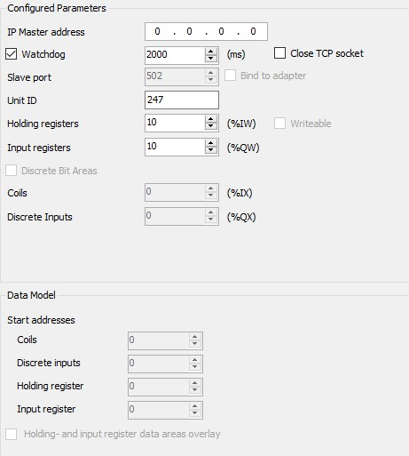
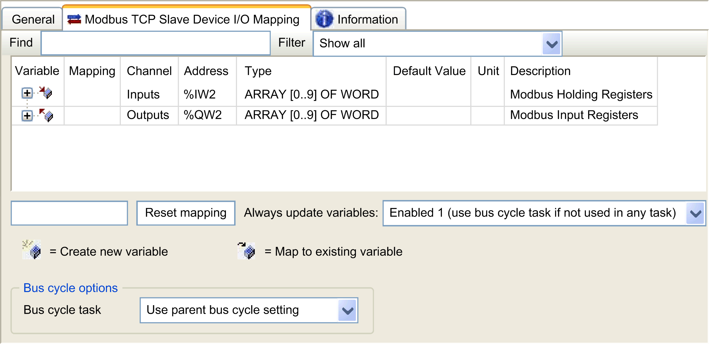

# Controller as a Slave Device on Modbus TCP

## Overview

This section describes the configuration of the M251 Logic Controller as a Modbus TCP Slave Device.

The Modbus TCP Slave Device adds another Modbus server function to the controller. This server is addressed by the Modbus client application by specifying a configured Unit ID (Modbus address) in the range 1...247. The embedded Modbus server of the slave controller needs no configuration, and is addressed by specifying a Unit ID equal to 255. Refer to [Modbus TCP Configuration](#D-SE-0002964__D-SE-0002964.4).

To configure your M251 Logic Controller as a Modbus TCP Slave Device, you must add Modbus TCP Slave Device functionality to your controller (see Adding a Modbus TCP Slave Device thereafter). This functionality creates a specific I/O area in the controller that is accessible with the Modbus TCP protocol. This I/O area is used whenever an external master needs to access the %IW and %QW objects of the controller. This Modbus TCP Slave Device functionality allows you to furnish to this area the controller I/O objects which can then be accessed with a single Modbus read/write registers request.

Only one Modbus TCP Slave Device at a time can be configured on one of the Ethernet ports of the M251 Logic Controller (Ethernet\_1 or Ethernet\_2). Once configured, however, the Modbus TCP slave device can be addressed through both Ethernet ports.

Inputs/outputs are seen from the slave controller: inputs are written by the master, and outputs are read by the master.

The Modbus TCP Slave Device can define a privileged Modbus client application, whose connection is not forcefully closed (embedded Modbus connections may be closed when more than 8 connections are needed).

The watchdog associated to the privileged connection allows you to verify whether the controller is being polled by the privileged master. If no Modbus request is received within the timeout duration, the diagnostic information i\_byMasterIpLost is set to 1 (TRUE). For more information, refer to the [Ethernet Port Read-Only System Variables](../../../../../api/crossBook?lang=en-US&virtualBookName=m251sys&topicID=D_SE_0003394).

For further information about Modbus TCP, refer to the [www.modbus.org](http://www.modbus.org) website.

## Adding a Modbus TCP Slave Device

To configure your M251 Logic Controller as a Modbus TCP slave device, you must:

| Step | Action |
| --- | --- |
| 1 | Select Modbus TCP Slave Device in the Hardware Catalog. |
| 2 | Drag and drop it to the Devices tree on one of the highlighted nodes.  For more information on adding a device to your project, refer to:  • Using the [Hardware Catalog](../../../../../api/crossBook?lang=en-US&virtualBookName=SoMProg&topicID=D_SE_0083368)  • Using the [Contextual Menu or Plus Button](../../../../../api/crossBook?lang=en-US&virtualBookName=SoMProg&topicID=D_SE_0083370) |

## Modbus TCP Configuration

To configure the Modbus TCP slave device, double-click ModbusTCP\_Slave\_Device in the Devices tree.

This dialog box appears:

| Element | Description |
| --- | --- |
| IP Master Address | IP address of the Modbus master  The connections are not closed on this address. |
| Watchdog | Watchdog in 500 ms increments  NOTE: The watchdog applies to the IP master Address unless the address is 0.0.0.0. |
| Close TCP socket | When Close TCP socket is selected, the TCP socket is closed if the Watchdog is enabled and the set time is exceeded. |
| Slave Port | Modbus communication port (502)  NOTE: The port number can be modified using the [changeModbusPort script command](D-SE-0067890.html#D-SE-0067890__D-SE-0067890.7). |
| Unit ID | Sends the requests to the Modbus TCP slave device (1...247), instead of to the embedded Modbus server (255). |
| Holding Registers (%IW) | Number of %IW registers to be used in the exchange (2...120) (each register is 2 bytes) |
| Input Registers (%QW) | Number of %QW registers to be used in the exchange (2...120) (each register is 2 bytes) |

## Modbus TCP Slave Device I/O Mapping Tab

The I/Os are mapped to Modbus registers from the master perspective as follows:

* %IWs are mapped from register 0 to n-1 and are R/W (n = Holding register quantity, each %IW register is 2 bytes).
* %QWs are mapped from register n to n+m -1 and are read only (m = Input registers quantity, each %QW register is 2 bytes).

Once a Modbus TCP Slave Device has been configured, Modbus commands sent to its Unit ID (Modbus address) are handled differently than the same command would be when addressed to any other Modbus device on the network. For example, when the Modbus command 3 (3 hex) is sent to a standard Modbus device, it reads and returns the value of one or more registers. When this same command is sent to the [Modbus TCP](D-SE-0002961.html#D-SE-0002961) Slave, it facilitates a read operation by the external I/O scanner.

Once a Modbus TCP Slave Device has been configured, Modbus commands sent to its Unit ID (Modbus address) access the %IW and %QW objects of the controller instead of the regular Modbus words (accessed when the Unit ID is 255). This facilitates read/write operations by a Modbus TCP IOScanner application.

The Modbus TCP Slave Device responds to a subset of the Modbus commands with the purpose of exchanging data with the external I/O scanner. The following Modbus commands are supported by the Modbus TCP slave device:

| Function Code Dec (Hex) | Function | Comment |
| --- | --- | --- |
| 3 (3) | Read holding register | Allows the master to read %IW and %QW objects of the device |
| 6 (6) | Write single register | Allows the master to write %IW objects of the device |
| 16 (10) | Write multiple registers | Allows the master to write %IW objects of the device |
| 23 (17) | Read/write multiple registers | Allows the master to read %IW and %QW objects of the device and write %IW objects of the device |
| Other | Not supported | – |

NOTE: Modbus requests that attempt to access registers above n+m-1 are answered by the 02 - ILLEGAL DATA ADDRESS exception code.

To link I/O objects to variables, select the Modbus TCP Slave Device I/O Mapping tab:

| Channel | | Type | Description |
| --- | --- | --- | --- |
| Input | IW0 | WORD | Holding register 0 |
| ... | ... | ... |
| IWx | WORD | Holding register x |
| Output | QW0 | WORD | Input register 0 |
| ... | ... | ... |
| QWy | WORD | Input register y |

The number of words depends on the **Holding Registers (%IW)** and **Input Registers (%QW)** parameters of the Modbus TCP tab.

NOTE: Output means OUTPUT from Originator controller (= %IW for the controller). Input means INPUT from Originator controller (= %QW for the controller).

NOTE: The Modbus TCP Slave Device refreshes the `%IW` and `%QW` registers as a single time-consistent unit, synchronized with the IEC tasks (MAST task by default). By contrast, the embedded Modbus TCP server only ensures time-consistency for 1 word (2 bytes). If your application requires time-consistency for more than 1 word (2 bytes), use the Modbus TCP Slave Device.

For the parameter Always update variables, choose one of the following options:

* Use parent device setting
* Enabled 1 (use bus cycle task if not used in any task) (default setting)
* Enabled 2 (always in bus cycle task)

## Bus Cycle Options

In the Modbus TCP Slave Device I/O Mapping tab, select the Bus cycle task to use:

* Use parent bus cycle setting (default setting)
* MAST
* An existing task of the project: you can select an existing task and associate it to the scanner. For more information about the application tasks, refer to the EcoStruxure Machine Expert [Programming Guide](../../../../../api/crossBook?lang=en-US&virtualBookName=SoMProg&topicID=D_SE_0083436).

NOTE: There is a corresponding Bus cycle task parameter in the I/O mapping editor of the device that contains the Modbus TCP Slave Device. This parameter defines the task responsible for refreshing the %IW and %QW registers.

EIO0000003089.10