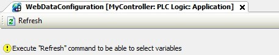
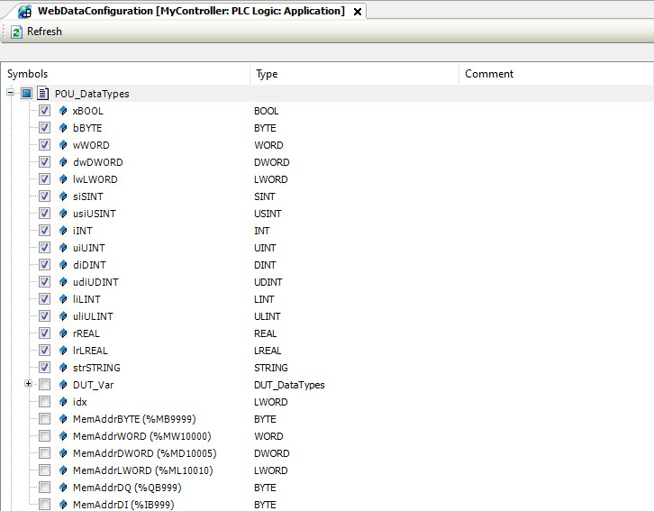
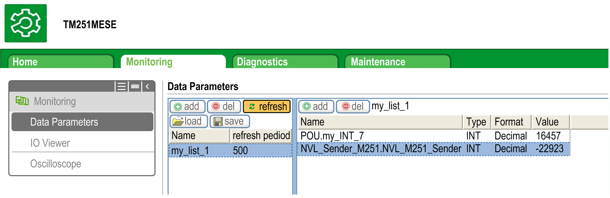
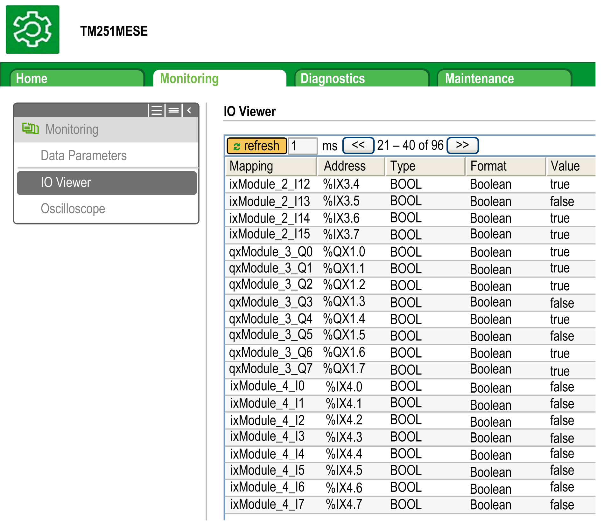
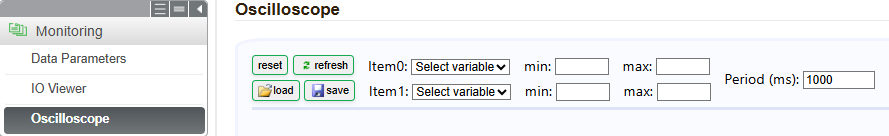

# Monitoring Menu

## Monitoring: Data Parameters

**Monitoring Web Server Variables**

To monitor Web server variables, you must add a Web Data Configuration object to your project. Within this object, you can select all variables you want to monitor.

This table describes how to add a Web Data Configuration object:

| Step | Action |
| --- | --- |
| 1 | Right click the Application node in the Applications tree tab. |
| 2 | Click Add Object > Web Data Configuration....  **Result:** The  Add Web Data Configuration window is displayed. |
| 3 | Click Add.  **Result:** The Web Data Configuration object is created and the Web Data Configuration editor is open.  NOTE: As a Web Data Configuration object is unique for a controller, its name cannot be changed. |

**Web Data Configuration Editor**

Click the Refresh button to be able to select variables, this action will display all the variables defined in the application.

Select the variables you want to monitor in the Web server:

NOTE: The variable selection is possible only in offline mode.

NOTE: The data types supported by the controller are listed in the **IEC variable Base Types** column of this [table](D-SE-0068334.html).

## Monitoring: Data Parameters Submenu

The Data Parameters submenu allows you to create and monitor some lists of variables. You can create several lists of variables (maximum 10 lists), each one containing several variables of the controller application (maximum 20 variables per list).

Each list has a name, and a refresh period. The lists are saved in the non-volatile memory of the controller, so that a created list can be accessed (loaded, modified, saved) from any Web client application accessing this controller.

The Data Parameters submenu allows you to display and modify variable values:

| Element | Description |
| --- | --- |
| Add | Adds a list description or a variable |
| Del | Deletes a list description or a variable |
| Refresh period | Refreshing period of the variables contained in the list description (in ms) |
| Refresh | Enables I/O refreshing:   * Gray button: refreshing disabled * Orange button: refreshing enabled |
| Load | Loads saved lists from the controller non-volatile memory to the Web server page |
| Save | Saves the selected list description in the controller (*/usr/web* directory) |

NOTE: The IEC objects (`%IX`, `%QX`) are not directly accessible. To access IEC objects you must first group their contents in located registers (refer to [Relocation Table](D-SE-0004337.html#D-SE-0004337)).

NOTE: Bit memory variables (`%MX`) cannot be selected.

## Monitoring: IO Viewer Submenu

The IO Viewer submenu allows you to display and modify the I/O values:

| Element | Description |
| --- | --- |
| Refresh | Enables I/O refreshing:   * Gray button: refreshing disabled * Orange button: refreshing enabled |
| Period (ms) | I/O refreshing period in ms |
| << | Goes to previous I/O list page |
| >> | Goes to next I/O list page |

## Monitoring: Oscilloscope Submenu

The Oscilloscope submenu can display up to 2 variables in the form of a recorder time chart:

| Element | Description |
| --- | --- |
| reset | Erases the memorization |
| refresh | Starts/stops refreshing |
| load | Loads parameter configuration of Item0 and Item1 |
| save | Saves parameter configuration of Item0 and Item1 in the controller |
| Item0 | Variable to be displayed |
| Item1 | Variable to be displayed |
| min | Minimum value of the variable axis |
| max | Maximum value of the variable axis |
| Period (ms) | Page refresh period. The value must be in the range 500...10000 ms. |

EIO0000003089.10