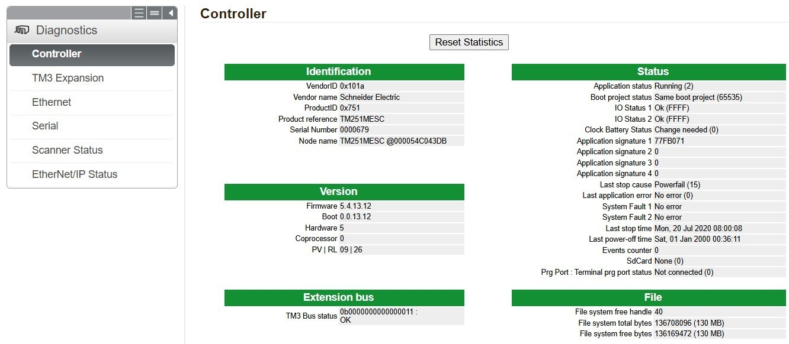
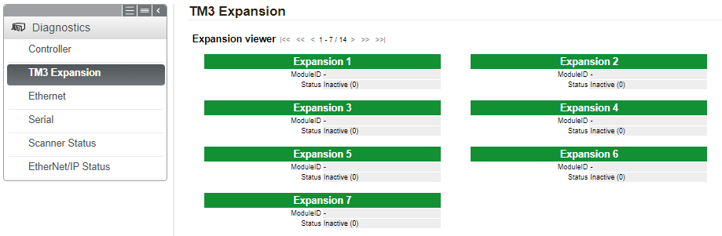
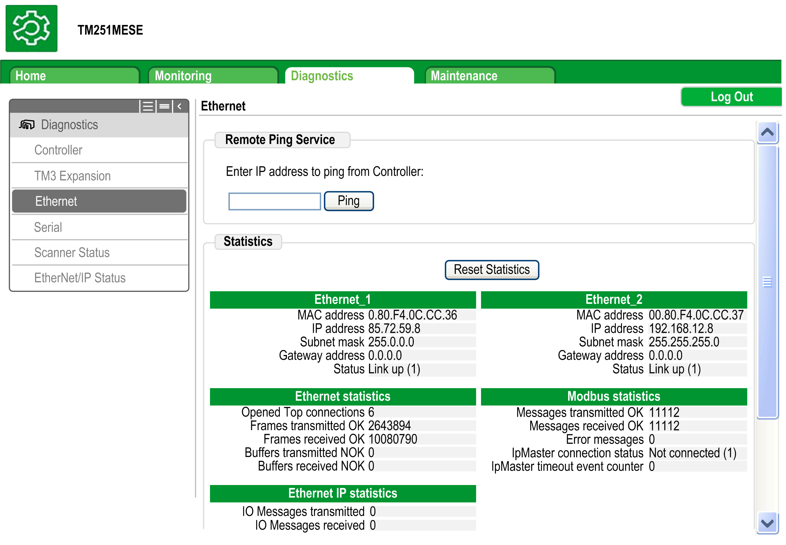
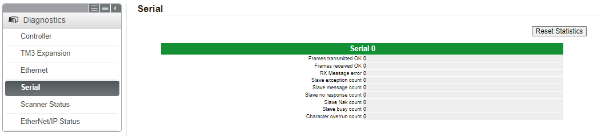
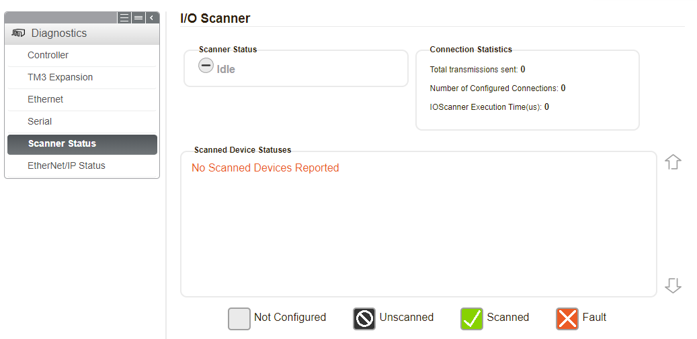
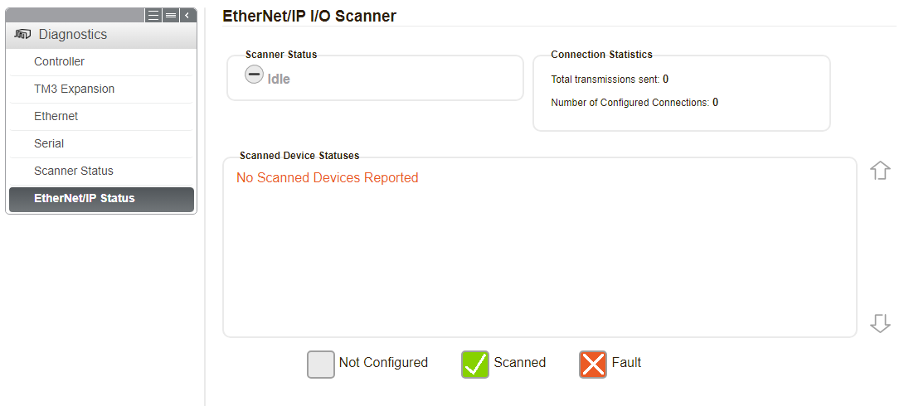

# Diagnostics Menu

## Diagnostics: Controller Submenu

The Controller submenu displays information about the controller:

## Diagnostics: TM3 Expansion Submenu

The TM3 Expansion submenu shows the TM3 expansion modules status:

## Diagnostics: Ethernet Submenu

The Ethernet submenu displays the Ethernet ports status and access to the remote ping service:

## Diagnostics: Serial Submenu

The Serial submenu displays the status of Serial Line connection:

## Diagnostics: Scanner Status Submenu

The Scanner Status submenu displays status of the Modbus TCP I/O Scanner (IDLE, STOPPED, OPERATIONAL) and the health bit of up to 64 Modbus slave devices:

For more information, refer to [Modbus TCP User Guide](../../../../../api/crossBook?lang=en-US&virtualBookName=ESMEModbusTCP&topicID=D_SE_0056614).

## Diagnostics: EtherNet/IP Status Submenu

The EtherNet/IP Status submenu displays the status of the EtherNet/IP Scanner (IDLE, STOPPED, OPERATIONAL) and the health bit of up to 16 EtherNet/IP target devices:

For more information, refer to [EtherNet/IP User Guide](../../../../../api/crossBook?lang=en-US&virtualBookName=ESMEEtherNetIP&topicID=D_SE_0056614).

EIO0000003089.10