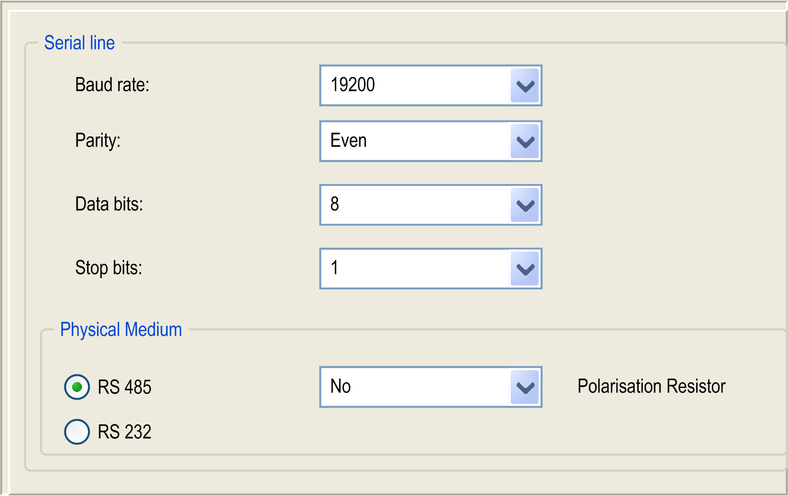

# Serial Line Configuration

## Introduction

The Serial Line configuration window allows you to configure the physical parameters of a serial line (baud rate, parity, and so on).

## Serial Line Configuration

To configure a Serial Line, double-click Serial line in the Devices tree.

The Configuration window is displayed as below:

The following parameters must be identical for each serial device connected to the port.

| Element | Description |
| --- | --- |
| Baud rate | Transmission speed in bits/s |
| Parity | Used for error detection |
| Data bits | Number of bits for transmitting data |
| Stop bits | Number of stop bits |
| Physical Medium | Specify the medium to use:   * RS485 (using polarisation resistor or not) * RS232 |
| Polarization Resistor | Polarization resistors are integrated in the controller. They are switched on or off by this parameter. |

The serial line ports of your controller are configured for the CoDeSys protocol by default when new or when you update the controller firmware. The CoDeSys protocol is incompatible with that of other protocols such as Modbus Serial Line. Connecting a new controller to, or updating the firmware of a controller connected to, an active Modbus configured serial line can cause the other devices on the serial line to stop communicating. Make sure that the controller is not connected to an active Modbus serial line network before first downloading a valid application having the concerned port or ports properly configured for the intended protocol.

| NOTICE | |
| --- | --- |
|  | INTERRUPTION OF SERIAL LINE COMMUNICATIONS  Be sure that your application has the serial line ports properly configured for Modbus before physically connecting the controller to an operational Modbus Serial Line network.  Failure to follow these instructions can result in equipment damage. |

This table indicates the maximum baud rate value of the managers:

| Manager | Maximum Baud Rate (Bits/s) |
| --- | --- |
| Network Manager | 115200 |
| Modbus Manager |
| ASCII Manager |
| Modbus IOScanner |

EIO0000003089.10