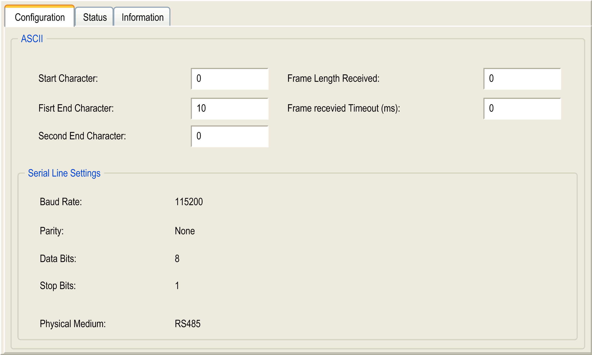

# ASCII Manager

## Introduction

The ASCII manager is used on a Serial Line, to transmit and/or receive data with a simple device.

## Adding the Manager

To add an ASCII manager to your controller, select the ASCII Manager in the Hardware Catalog, drag it to the Devices tree, and drop it on one of the highlighted nodes.

For more information on adding a device to your project, refer to:

• Using the [Hardware Catalog](../../../../../api/crossBook?lang=en-US&virtualBookName=SoMProg&topicID=D_SE_0083368)

• Using the [Contextual Menu or Plus Button](../../../../../api/crossBook?lang=en-US&virtualBookName=SoMProg&topicID=D_SE_0083370)

## ASCII Manager Configuration

To configure the ASCII manager of your controller, double-click ASCII Manager in the Devices tree.

The ASCII Manager configuration window is displayed as below:

Set the parameters as described in this table:

| Parameter | Description |
| --- | --- |
| Start Character | If 0, no start character is used in the frame. Otherwise, in Receiving Mode, the corresponding character in ASCII is used to detect the beginning of a frame. In Sending Mode, this character is added at the beginning of the frame. |
| First End Character | If 0, no first end character is used in the frame. Otherwise, in Receiving Mode, the corresponding character in ASCII is used to detect the end of a frame. In Sending Mode, this character is added at the end of the frame. |
| Second End Character | If 0, no second end character is used in the frame. Otherwise, in Receiving Mode, the corresponding character in ASCII is used to detect the end of a frame. In Sending Mode, this character is added at the end of the frame. |
| Frame Length Received | If 0, this parameter is not used. This parameter allows the system to conclude an end of frame at reception when the controller received the specified number of characters.  **Note:** This parameter cannot be used simultaneously with Frame Received Timeout (ms). |
| Frame Received Timeout (ms) | If 0, this parameter is not used. This parameter allows the system to conclude the end of frame at reception after a silence of the specified number of ms. |
| Serial Line Settings | Parameters specified in the [Serial Line configuration window](D-SE-0005906.html#D-SE-0005906__D-SE-0005906.3). |

NOTE: In the case of using several frame termination conditions, the first condition to be TRUE terminates the exchange.

## Adding a Modem

To add a Modem to the ASCII manager, refer to [Adding a Modem to a Manager](D-SE-0005908.html#D-SE-0005908).

EIO0000003089.10