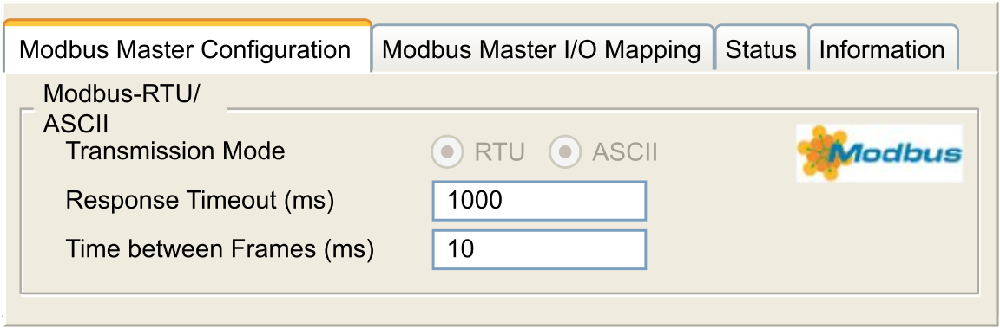
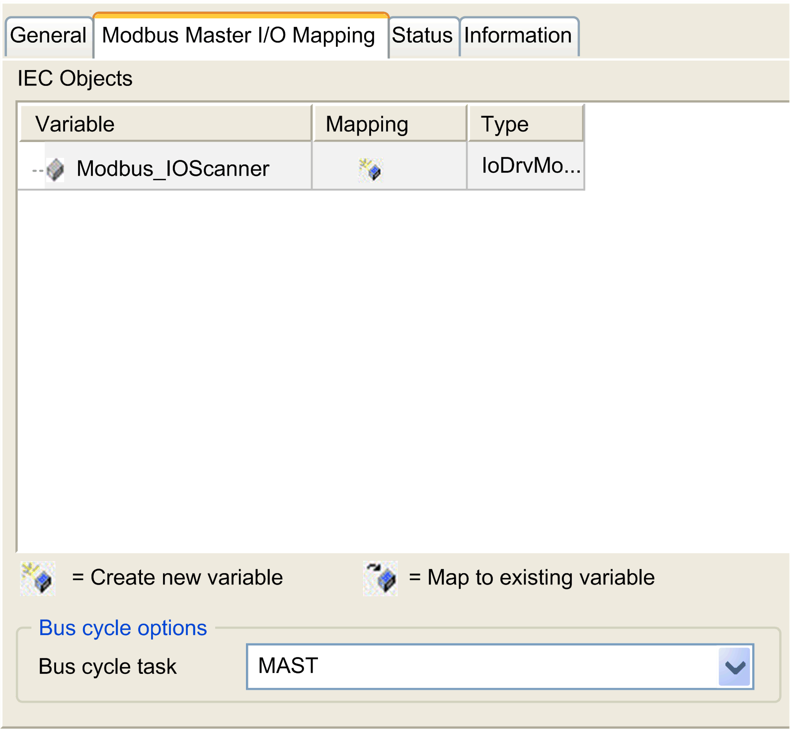

# Modbus Serial IOScanner

## Introduction

The Modbus IOScanner is used to simplify exchanges with Modbus slave devices.

## Add a Modbus IOScanner

To add a Modbus IOScanner on a Serial Line, select the Modbus\_IOScanner in the Hardware Catalog, drag it to the Devices tree, and drop it on one of the highlighted nodes.

For more information on adding a device to your project, refer to:

• Using the [Hardware Catalog](../../../../../api/crossBook?lang=en-US&virtualBookName=SoMProg&topicID=D_SE_0083368)

• Using the [Contextual Menu or Plus Button](../../../../../api/crossBook?lang=en-US&virtualBookName=SoMProg&topicID=D_SE_0083370)

## Modbus IOScanner Configuration

To configure a Modbus IOScanner on a Serial Line, double-click Modbus IOScanner in the Devices tree.

The configuration window is displayed as below:

Set the parameters as described in this table:

| Element | Description |
| --- | --- |
| Transmission Mode | Specifies the transmission mode to use:   * RTU: uses binary coding and CRC error-checking (8 data bits) * ASCII: messages are in ASCII format, LRC error-checking (7 data bits)   Set this parameter identical for each Modbus device on the network. |
| Response Timeout (ms) | Timeout used in the exchanges. |
| Time between Frames (ms) | Delay to reduce data collision on the bus.  Set this parameter identical for each Modbus device on the network. |

NOTE: Do not use function blocks of the PLCCommunication library on a serial line with a Modbus IOScanner configured. This disrupts the Modbus IOScanner exchange.

## Bus Cycle Task Selection

The Modbus IOScanner and the devices exchange data at each cycle of the chosen application task.

To select this task, select the Modbus Master IO Mapping tab. The configuration window is displayed as below:

The Bus cycle task parameter allows you to select the application task that manages the scanner:

* Use parent bus cycle setting: associate the scanner with the application task that manages the controller.
* MAST: associate the scanner with the MAST task.
* Another existing task: you can select an existing task and associate it to the scanner. For more information about the application tasks, refer to the EcoStruxure Machine Expert [Programming Guide](../../../../../api/crossBook?lang=en-US&virtualBookName=SoMProg&topicID=D_SE_0083437).

The scan time of the task associated with the scanner must be less than 500 ms.

EIO0000003089.10