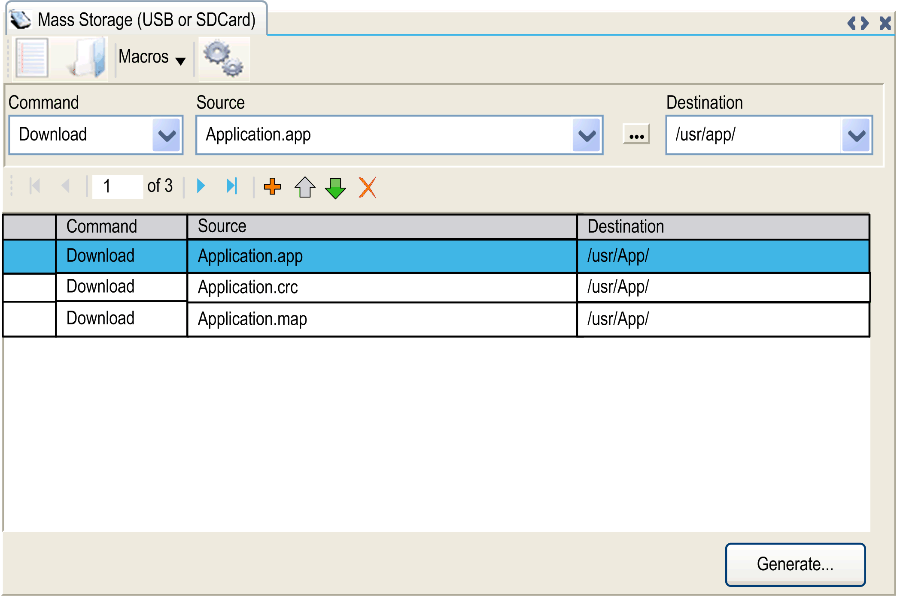

# SD Card Commands

## Introduction

The Modicon M251 Logic Controller allows file transfers with an SD card.

To upload or download files to the controller with an SD card, use one of the following methods:

* The [clone function](#D-SE-0035607__D-SE-0035607.6) (use of an empty SD card)
* A script stored in the SD card

When an SD card is inserted into the SD card slot of the controller, the firmware searches and executes the script contained in the SD card (/sys/cmd/Script.cmd).

NOTE: The controller operation is not modified during file transfer.

For file transfer commands, the Mass Storage (USB or SDCard) editor lets you generate and copy the script and all necessary files into the SD card.

NOTE: The Modicon M251 Logic Controller accepts only SD cards formatted in FAT or FAT32.

The SD card must have a label. To add a label, insert the SD card in your PC, right-click on the drive in Windows Explorer and choose Properties.

| WARNING | |
| --- | --- |
|  | UNINTENDED EQUIPMENT OPERATION  * You must have operational knowledge of your machine or process before connecting this device to your controller. * Ensure that guards are in place so that any potential unintended equipment operation will not cause injury to personnel or damage to equipment.  Failure to follow these instructions can result in death, serious injury, or equipment damage. |

If you remove power to the device, or there is a power outage or communication interruption during the transfer of the application, your device may become inoperative. If a communication interruption or a power outage occurs, reattempt the transfer. If there is a power outage or communication interruption during a firmware update, or if an invalid firmware is used, your device will become inoperative. In this case, use a valid firmware and reattempt the firmware update.

| NOTICE | |
| --- | --- |
|  | INOPERABLE EQUIPMENT  * Do not interrupt the transfer of the application program or a firmware change once the transfer has begun. * Re-initiate the transfer if the transfer is interrupted for any reason. * Do not attempt to place the device into service until the file transfer has completed successfully.  Failure to follow these instructions can result in equipment damage. |

## Clone Function

The clone function allows you to upload the application from one controller and to download it only to a same controller reference.

This function clones every parameter of the controller (for example applications, firmware, data file, post configuration). Refer to [Memory Mapping](D-SE-0002056.html#D-SE-0002056).

NOTE: User access rights can only be copied if the Include User Rights button has previously been clicked on the Clone Management subpage of the [Web server](MaintenanceMenu-0B989E57.html#MaintenanceMenu-0B989E57__D-SE-0002960.38).

By default, clone is allowed without using the function block FB\_ControlClone. If you want to restrict access to the clone feature, you can remove the access rights of the `ExternalCmd` object on ExternalMedia group. Refer to [Default Users and Groups](D-SE-0095294.html#D-SE-0095294__D-SE-0095294.5). As a result, cloning will be not allowed without using FB\_ControlClone.

For more details about this function block, refer to the [Modicon M251 Logic Controller, System Functions and Variables, PLCSystem Library Guide](../../../../../api/crossBook?lang=en-US&virtualBookName=m251sys&topicID=D_SE_0085973).

If you wish to control access to the cloned application in the target controller, you must use the Include users rights button (on the Clone Management subpage of the [Web server](MaintenanceMenu-0B989E57.html#MaintenanceMenu-0B989E57__D-SE-0002960.38)) of the source controller before doing the clone operation.

For more details about Access Rights, refer to the EcoStruxure Machine Expert [Programming Guide](../../../../../api/crossBook?lang=en-US&virtualBookName=SoMProg&topicID=D_SE_0083877).

This procedure describes how to upload the application stored in the source controller to your SD card:

| Step | Action |
| --- | --- |
| 1 | Erase an SD card and set the card label as follows:  **CLONExxx**  NOTE: The label must begin with ‘**CLONE**’ (not case sensitive), optionally followed by up to 6 unaccented alphanumeric characters (a...z, A...Z, 0...9). |
| 2 | Select if you want to clone the Users Rights. Refer to the Clone Management subpage of the [Web server](MaintenanceMenu-0B989E57.html#MaintenanceMenu-0B989E57__D-SE-0002960.38). |
| 3 | Remove power from the controller. |
| 4 | Insert the prepared SD card in the controller. |
| 5 | Restore power to the controller.  **Result:** The clone procedure starts automatically. During the clone procedure, the PWR and I/O LEDs are ON and the SD LED flashes regularly.  NOTE: The clone procedure lasts 2 or 3 minutes.  **Result:** At the end of the clone procedure, the SD LED is ON and the controller starts in normal application mode. If an error was detected, the ERR LED is ON and the controller is in STOPPED state. |
| 6 | Remove the SD card from the controller. |

This procedure describes how to download the application stored in the SD card to your target controller:

| Step | Action |
| --- | --- |
| 1 | Remove power from the controller. |
| 2 | Insert the SD card into the controller. |
| 3 | Restore power to the controller.  **Result:** The download procedure starts and the SD LED is flashing during this procedure. |
| 4 | Wait until the end of the download:   * If the **SD** LED (green) is ON, and the **ERR** LED (red) flashes regularly, the download ended successfully. * If the **SD** LED (green) is OFF, and the **ERR** and **I/O** LEDs (red) flash regularly, an error is detected. |
| 5 | Remove the SD card to restart the controller. |

NOTE: If you wish to control access to the cloned application in the target controller, you will need to enable and establish user access-rights, and any Web Server/FTP passwords, which are controller-specific. For more details about Access Rights, refer to the EcoStruxure Machine Expert [Programming Guide](../../../../../api/crossBook?lang=en-US&virtualBookName=SoMProg&topicID=D_SE_0083877).

NOTE: Downloading a cloned application to the controller will first remove the existing application from controller memory, regardless of any user access-rights that may be enabled in the target controller.

## Script and Files Generation with Mass Storage

Click Project > Mass Storage (USB or SDCard) in the main menu:

| Element | Description |
| --- | --- |
| New | Create a new script. |
| Open | Open a script. |
| Macros | Insert a Macro.  A macro is a sequence of unitary commands. A macro helps to perform many common operations such as upload application, download application, and so on. |
| Generate | Generate the script and all necessary files on the SD card. |
| Command | Basic instructions. |
| Source | Source file path on the PC or the controller. |
| Destination | Destination directory on the PC or the controller. |
| Add New | Add a script command. |
| Move Up/Down | Change the script commands order. |
| Delete | Delete a script command. |

Commands descriptions:

| Command | Description | Source | Destination | Syntax |
| --- | --- | --- | --- | --- |
| Download | Downloads a file from the SD card to the controller. | Select the file to download. | Select the controller destination directory. | `'Download "/usr/Cfg/*"'` |
| SetNodeName | Sets the node name of the controller. | New node name. | Controller node name | `'SetNodeName "Name_PLC"'` |
| Resets the node name of the controller. | Default node name. | Controller node name | `'SetNodeName ""'` |
| Upload | Uploads files contained in a controller directory to the SD card. | Select the directory. | - | `'Upload "/usr/*"'` |
| Delete | Deletes files contained in a controller directory.  NOTE: Delete "\*" does not delete system files. | Select the directory and enter a specific file name.  **Important:** By default, all directory files are selected. | - | `'Delete "/usr/SysLog/*"'` |
| Removes the User Rights from the controller. | - | - | `'Delete "/usr/*"'` |
| Deletes the files contained in the SD card or a folder of the SD card | - | - | `'Delete "/sd0/*"'`  or  `'Delete "/sd0/folder name"'` |
| Reboot | Restarts the controller (only available at the end of the script). | - | - | `'Reboot'` |

NOTE: When User Rights are activated on a controller and if the user is not allowed to read/write/delete file system, scripts used to Upload/Download/Delete files are disabled. It includes the clone operation.

This table describes the macros:

| Macros | Description | Directory/Files |
| --- | --- | --- |
| Download App | Download the application from the SD card to the controller. | `/usr/App/*.app`  `/usr/App/*.crc`  `/usr/App/*.map`  `/usr/App/*.conf` (1) |
| Upload App | Upload the application from the controller to the SD card. |
| Download Sources | Download the project archive from the SD card to the controller. | `/usr/App/*.prj` |
| Upload Sources | Upload the project archive from the controller to the SD card. |
| Download Multi-files | Download multiple files from the SD card to a controller directory. | Defined by user |
| Upload Log | Upload the log files from the controller to the SD card. | `/usr/Log/*.log` |
| **(1)** If [OPC UA](D-SE-0068333.html#D-SE-0068333) is configured. | | |

## Reset the User Rights to Default

You can manually create a script to remove the user rights, along with the application, from the controller. This script must contain this command:

`Format "/usr"`

`Reboot`

NOTE: This command also removes user application and data.

| Step | Action |
| --- | --- |
| 1 | Remove power from the controller. |
| 2 | Insert the prepared SD card in the source controller. |
| 3 | Restore power to the source controller.  **Result:** The operation starts automatically. During the operation, the PWR and I/O LEDs are ON and the SD LED flashes regularly. |
| 4 | Wait until the operation is completed.  **Result:**  * The SD LED is ON if the operation is successful. * The ERR LED is ON and the controller does not start if an error is detected. |
| 5 | Remove the SD card from the controller.  NOTE: The controller reboots with the default user rights. |

## Transfer Procedure

| WARNING | |
| --- | --- |
|  | UNINTENDED EQUIPMENT OPERATION  * You must have operational knowledge of your machine or process before connecting this device to your controller. * Ensure that guards are in place so that any potential unintended equipment operation will not cause injury to personnel or damage to equipment.  Failure to follow these instructions can result in death, serious injury, or equipment damage. |

| Step | Action |
| --- | --- |
| 1 | Create the script with the Mass Storage (USB or SDCard) editor. |
| 2 | Click Generate... and select the SD card root directory.  **Result:** The script and files are transferred on the SD card. |
| 3 | Insert the SD card into the controller.  **Result:** The transfer procedure starts and the **SD** LED is flashing during this procedure. |
| 4 | Wait until the end of the download:   * If the **SD** LED (green) is ON, and the **ERR** LED (red) flashes regularly, the download ended successfully. * If the **SD** LED (green) is OFF, and the **ERR** and **I/O** LEDs (red) flash regularly, an error is detected. |
| 5 | Remove the SD card from the controller.  NOTE: Changes will be applied after next restart. |

When the controller has executed the script, the result is logged on the SD card (file `/sys/cmd/Cmd.log`).

| WARNING | |
| --- | --- |
|  | UNINTENDED EQUIPMENT OPERATION  Consult the controller state and behavior diagram in this document to understand the state that will be assumed by the controller after you cycle power.  Failure to follow these instructions can result in death, serious injury, or equipment damage. |

EIO0000003089.10