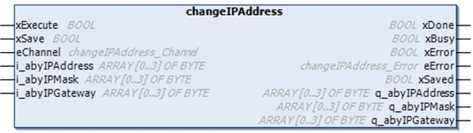

# changeIPAddress: Change the IP Address of the Controller

## Function Block Description

The `changeIPAddress` function block provides the capability to change dynamically a controller IP address, its subnet mask and its gateway address. The function block can also save the IP address so that it is used in subsequent reboots of the controller.

NOTE: Changing the IP addresses is only possible if the IP mode is configured to fixed IP address. For more details, refer to [IP Address Configuration](D-SE-0003075.html#D-SE-0003075).

NOTE: For more information on the function block, use the Documentation tab of the Library Manager Editor. For the use of this editor, refer to [Functions and Libraries User Guide](../../../../../api/crossBook?lang=en-US&virtualBookName=SoLibref&topicID=D_SE_0081233).

## Graphical Representation

## Parameter Description

| **Input** | **Type** | **Comment** |
| --- | --- | --- |
| `xExecute` | `BOOL` | * Rising edge: action starts. * Falling edge: resets outputs. If a falling edge occurs before the function block has completed its action, the outputs operate in the usual manner and are only reset if either the action is completed or in the event that an error is detected. In this case, the corresponding output values (`xDone`, `xError`, `iError`) are present at the outputs for exactly one cycle. |
| `xSave` | `BOOL` | TRUE: save configuration for subsequent reboots of the controller. |
| `eChannel` | `changeIPAddress_Channel` | The input `eChannel` is the Ethernet port to be configured. Depending on the number of the ports available on the controller in `changeIPAddress_Channel` (0 or 1).See [changeIPAddress\_Channel: Ethernet Port to be Configured](#D-SE-0037016__D-SE-0037016.22). |
| `i_abyIPAddress` | `ARRAY[0..3] OF BYTE` | The new IP Address to be configured. Format: 0.0.0.0.  NOTE: If this input is set to 0.0.0.0 then the controller [default IP addresses](D-SE-0003075.html#D-SE-0003075__D-SE-0003075.5) is configured. |
| `i_abyIPMask` | `ARRAY[0..3] OF BYTE` | The new subnet mask. Format: 0.0.0.0 |
| `i_abyIPGateway` | `ARRAY[0..3] OF BYTE` | The new gateway IP address. Format: 0.0.0.0 |

| **Output** | **Type** | **Comment** |
| --- | --- | --- |
| `xDone` | `BOOL` | TRUE: if IP Addresses have been successfully configured or if default IP Addresses have been successfully configured because input `i_abyIPAddress` is set to 0.0.0.0. |
| `xBusy` | `BOOL` | Function block active. |
| `xError` | `BOOL` | * TRUE: error detected, function block aborts action. * FALSE: no error has been detected. |
| `eError` | `changeIPAddress_Error` | [Error code of the detected error](#D-SE-0037016__D-SE-0037016.21). |
| `xSaved` | `BOOL` | Configuration saved for the subsequent reboots of the controller. |
| `q_abyIPAddress` | `ARRAY[0..3] OF BYTE` | Current controller IP address. Format: 0.0.0.0. |
| `q_abyIPMask` | `ARRAY[0..3] OF BYTE` | Current subnet mask. Format: 0.0.0.0. |
| `q_abyIPGateway` | `ARRAY[0..3] OF BYTE` | Current gateway IP address. Format: 0.0.0.0. |

## `changeIPAddress_Channel`: Ethernet Port to be Configured

The `changeIPAddress_Channel` enumeration data type contains the following values:

| Enumerator | Value | Description |
| --- | --- | --- |
| `CHANNEL_ETHERNET_NETWORK` | 0 | M241, M251MESC, M258, LMC058, LMC078: Ethernet port  M251MESE: Ethernet\_2 port |
| `CHANNEL_DEVICE_NETWORK` | 1 | M241: TM4ES4 Ethernet port  M251MESE: Ethernet\_1 port |

## `changeIPAddress_Error`: Error Codes

The `changeIPAddress_Error` enumeration data type contains the following values:

| Enumerator | Value | Description |
| --- | --- | --- |
| `ERR_NO_ERROR` | 00 hex | No error detected. |
| `ERR_UNKNOWN` | 01 hex | Internal error detected. |
| `ERR_INVALID_MODE` | 02 hex | IP address is not configured as a fixed IP address. |
| `ERR_INVALID_IP` | 03 hex | Invalid IP address. |
| `ERR_DUPLICATE_IP` | 04 hex | The new IP address is already used in the network. |
| `ERR_WRONG_CHANNEL` | 05 hex | Incorrect Ethernet communication port. |
| `ERR_IP_BEING_SET` | 06 hex | IP address is already being changed. |
| `ERR_SAVING` | 07 hex | IP addresses not saved due to a detected error or no non-volatile memory present. |
| `ERR_DHCP_SERVER` | 08 hex | A DHCP server is configured on this Ethernet communication port. |

EIO0000003089.10