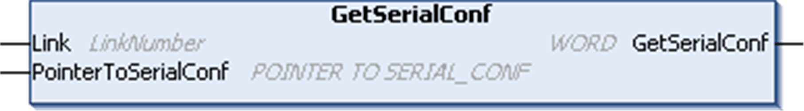

# GetSerialConf: Get the Serial Line Configuration

## Function Description

`GetSerialConf` returns the configuration parameters for a specific serial line communication port.

## Graphical Representation

## Parameter Description

|  |  |  |
| --- | --- | --- |
| **Input** | **Type** | **Comment** |
| `Link` | [`LinkNumber`](LinkNumberCommunicationPortNumber-86C51C0A.html#LinkNumberCommunicationPortNumber-86C51C0A) | `Link` is the communication port number. |
| `PointerToSerialConf` | [`PointerToSerialConf`](D-RU-0004875.html#D-RU-0004875) | `PointerToSerialConf` is the address of the configuration structure (variable of `SERIAL_CONF` type) in which the configuration parameters are stored. The `ADR` standard function must be used to define the associated pointer. Refer to the `SetSerialConf` example. |

|  |  |  |
| --- | --- | --- |
| **Output** | **Type** | **Comment** |
| `GetSerialConf` | `WORD` | This function returns:   * 0: The configuration parameters are returned * 255: The configuration parameters are not returned because:    + the function was not successful   + the function is in progress |

EIO0000003089.10