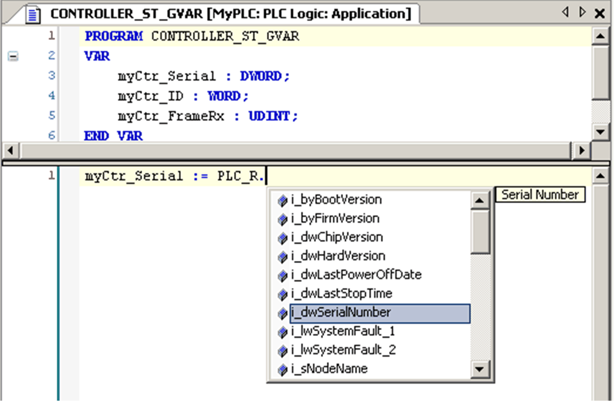

# Using System Variables

## Introduction

This section describes the steps required to program and to use system variables in EcoStruxure Machine Expert.

System variables are global in the application scope, and you can use them in all the Program Organization Units (POUs) of the application.

System variables do not need to be declared in the Global Variable List (GVL). They are automatically declared from the controller system library.

## Using System Variables in a POU

EcoStruxure Machine Expert has an auto-completion feature. In a POU, start by entering the system variable structure name (PLC\_R, PLC\_W...) followed by a dot. The system variables are displayed in the Input Assistant. You can select the desired variable or enter the full name manually.



NOTE: In the example above, after you type the structure name `PLC_R.`, EcoStruxure Machine Expert offers a pop-up menu of possible component names/variables.

## Example

The following example shows the use of some system variables:

```
VAR
	myCtr_Serial : DWORD;
	myCtr_ID : WORD;
	myCtr_FramesRx : UDINT;
END_VAR
```

```
myCtr_Serial := PLC_R.i_dwSerialNumber;
myCtr_ID := PLC_R.i_wVendorID;
myCtr_FramesRx := SERIAL_R[0].i_udiFramesReceivedOK;
```

EIO0000003095.07