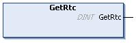

# GetRtc: Get Real Time Clock

## Function Description

This function returns RTC time in seconds in UNIX format (time expired in seconds since January 1, 1970 at 00:00 UTC).

## Graphical Representation



## IL and ST Representation

To see the general representation in IL or ST language, refer to the chapter [*Function and Function Block Representation*](D-SE-0002384_1.html#D-SE-0002384).

## I/O Variable Description

The following table describes the I/O variable:

| Output | Type | Comment |
| --- | --- | --- |
| GetRtc | DINT | RTC in seconds in UNIX format. |

## Example

The following example describes how to get the RTC value:

```
VAR
	MyRTC : DINT := 0;
END_VAR
```

```
MyRTC := GetRtc();
```

EIO0000003095.07