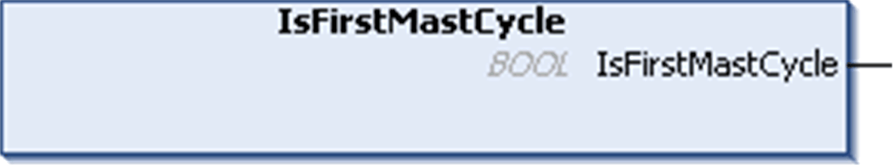

# IsFirstMastCycle: Indicate if this Cycle is the First MAST Cycle

## Function Description

This function returns TRUE during the first MAST cycle after a start.

## Graphical Representation



## IL and ST Representation

To see the general representation in IL or ST language, refer to the chapter [*Function and Function Block Representation*](D-SE-0002384_1.html#D-SE-0002384).

## I/O Variable Description

| Output | Type | Comment |
| --- | --- | --- |
| IsFirstMastCycle | BOOL | TRUE during the first MAST task cycle after a start. |

## Example

This example describes the three functions IsFirstMastCycle, IsFirstMastColdCycle and IsFirstMastWarmCycle used together.

Use this example in MAST task. Otherwise, it may run several times or possibly never (an additional task might be called several times or not called during 1 MAST task cycle):

```
VAR
MyIsFirstMastCycle : BOOL;
MyIsFirstMastWarmCycle : BOOL;
MyIsFirstMastColdCycle : BOOL;
END_VAR
```

```
MyIsFirstMastWarmCycle := IsFirstMastWarmCycle();
MyIsFirstMastColdCycle := IsFirstMastColdCycle();
MyIsFirstMastCycle := IsFirstMastCycle();
```

```
IF (MyIsFirstMastWarmCycle) THEN
```

```
(*This is the first Mast Cycle after a Warm Start: all variables are set to their initialization values except the Retain variables*)
```

```
(*=> initialize the needed variables so that your application runs as expected in this case*)
```

```
END_IF;
```

```
IF (MyIsFirstMastColdCycle) THEN
```

```
(*This is the first Mast Cycle after a Cold Start: all variables are set to their initialization values including the Retain Variables*)
```

```
(*=> initialize the needed variables so that your application runs as expected in this case*)
```

```
END_IF;
```

```
IF (MyIsFirstMastCycle) THEN
```

```
(*This is the first Mast Cycle after a Start, i.e. after a Warm or Cold Start as well as STOP/RUN commands*)
```

```
(*=> initialize the needed variables so that your application runs as expected in this case*)
```

```
END_IF;
```

EIO0000003095.07