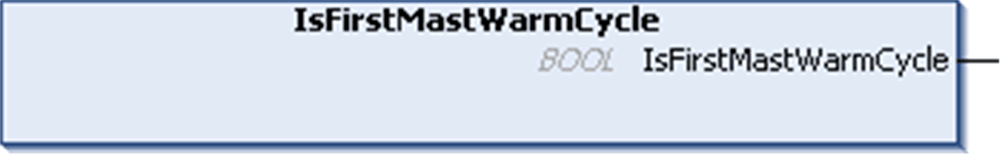

# IsFirstMastWarmCycle: Indicate if this Cycle is the First MAST Warm Start Cycle

## Function Description

This function returns TRUE during the first MAST cycle after a warm start.

## Graphical Representation

## IL and ST Representation

To see the general representation in IL or ST language, refer to the chapter [*Function and Function Block Representation*](D-SE-0002384_1.html#D-SE-0002384).

## I/O Variable Description

This table describes the output variable:

| Output | Type | Comment |
| --- | --- | --- |
| IsFirstMastWarmCycle | BOOL | TRUE during the first MAST task cycle after a warm start. |

## Example

Refer to the function [IsFirstMastCycle](D-RU-0004847.html#D-RU-0004847).

EIO0000003095.07