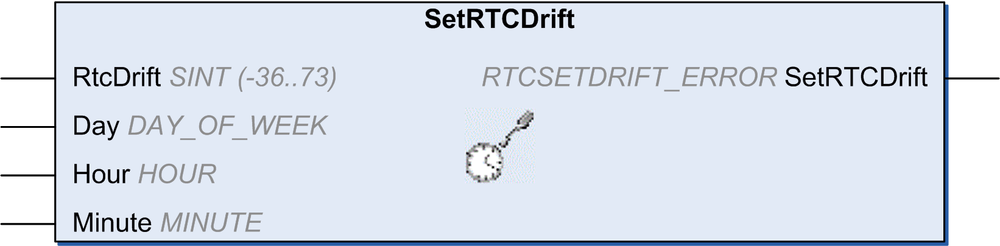

# SetRTCDrift: Set Compensation Value to the RTC

## Function Description

This function accelerates or slows down the frequency of the RTC to give control to the application for RTC compensation, depending on the operating environment (temperature, …). The compensation value is given in seconds per week. It can be positive (accelerate) or negative (slow down).

NOTE: The SetRTCDrift function must be called only once. Each new call replaces the compensation value by the new one. The value is kept in the controller hardware while the RTC is powered by the main supply or by the battery. If both battery and power supply are removed, the RTC compensation value is not available.

## Graphical Representation



## IL and ST Representation

To see the general representation in IL or ST language, refer to the chapter [*Function and Function Block Representation*](D-SE-0002384_1.html#D-SE-0002384).

## I/O Variables Description

This table describes the input parameters:

| Inputs | Type | Comment |
| --- | --- | --- |
| RtcDrift | SINT (-36..73) | Correction in seconds per week (-36...+73). |

NOTE: The parameters Day, Hour, and Minute are used only to ensure backwards compatibility.

NOTE: If the value entered for RtcDrift exceeds the limit value, the controller firmware sets the value to its maximum value.

This table describes the output variable:

| Output | Type | Comment |
| --- | --- | --- |
| SetRTCDrift | [RTCSETDRIFT\_ERROR](D-SE-0003391.html#D-SE-0003391) | Returns `RTC_OK` (00 hex) if command is correct otherwise returns the ID code of the detected error. |

## Example

In this example, the function is called only once during the first MAST task cycle. It accelerates the RTC by 4 seconds a week (18 seconds a month).

```
VAR
	MyRTCDrift : SINT (-36..+73) := 0;
	MyDay : sec.DAY_OF_WEEK;
	MyHour : sec.HOUR;
	MyMinute : sec.MINUTE;
END_VAR	
```

```
IF IsFirstMastCycle() THEN
	MyRTCDrift := 4;
	MyDay := 0;
	MyHour := 0;
	MyMinute := 0;
	SetRTCDrift(MyRTCDrift, MyDay, MyHour, MyMinute);
END_IF
```

EIO0000003095.07