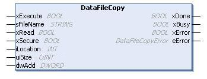

# DataFileCopy: Copy File Commands

## Function Block Description

This function block copies memory data to a file and vice versa. The file is located either within the internal file system or an external file system (SD card).

The DataFileCopy function block can:

* Read data from a formatted file or
* Copy data from memory to a formatted file. For further information, refer to [Non-Volatile Memory Organization](../../../../../api/crossBook?lang=en-US&virtualBookName=m251prg&topicID=D_SE_0004156).

## Graphical Representation



## IL and ST Representation

To see the general representation in IL or ST language, refer to the chapter [*Function and Function Block Representation*](D-SE-0002384_1.html#D-SE-0002384).

## I/O Variable Description

This table describes the input variables:

| Input | Type | Comment |
| --- | --- | --- |
| xExecute | BOOL | On rising edge, starts the function block execution.  On falling edge, resets the outputs of the function block when any ongoing execution terminates.  NOTE: With the falling edge, the function continues until it concludes its execution and updates its outputs. The outputs are retained for one cycle and reset. |
| sFileName | STRING | File name without extension (the extension .DTA is automatically added). Use only a...z, A...Z, 0...9 alphanumeric characters. |
| xRead | BOOL | TRUE: copy data from the file identified by sFileName to the internal memory of the controller.  FALSE: copy data from the internal memory of the controller to the file identified by sFileName. |
| xSecure | BOOL | TRUE: The MAC address is always stored in the file. Only a controller with the same MAC address can read from the file.  FALSE: Another controller with the same type of memory can read from the file. |
| iLocation | INT | 0: the file location is /usr/DTA in internal file system.  1: the file location is /usr/DTA in external file system (SD card).  NOTE: If the file does not already exist in the directory, the file is created. |
| uiSize | UINT | Indicates the size in bytes. Maximum is 65534 bytes.  Only use addresses of variables conforming to IEC 61131-3 (variables, arrays, structures), for example:  `Variable : int;`  `uiSize := SIZEOF (Variable);` |
| dwAdd | DWORD | Indicates the address in the memory that the function will read from or write to.  Only use addresses of variables conforming to IEC 61131-3 (variables, arrays, structures), for example:  `Variable : int;`  `dwAdd := ADR (Variable);` |

| WARNING | |
| --- | --- |
|  | UNINTENDED EQUIPMENT OPERATION  Verify that the memory location is of the correct size and the file is of the correct type before copying the file to memory.  Failure to follow these instructions can result in death, serious injury, or equipment damage. |

This table describes the output variables:

| Output | Type | Comment |
| --- | --- | --- |
| xDone | BOOL | `TRUE` = indicates that the action is successfully completed. |
| xBusy | BOOL | `TRUE` = indicates that the function block is running. |
| xError | BOOL | `TRUE` = indicates that an error is detected and the function block aborted the action. |
| eError | [DataFileCopyError](D-SE-0020629.html#D-SE-0020629) | Indicates the type of the data file copy detected error. |

NOTE: If you modify data within the memory (variables, arrays, structures) used to write the file, a CRC integrity error results.

## Example

This example describes how to copy file commands:

```
VAR
LocalArray : ARRAY [0..29] OF BYTE;
myFileName: STRING := 'exportfile';
EXEC_FLAG: BOOL;
DataFileCopy: DataFileCopy;
END_VAR
DataFileCopy(
xExecute:= EXEC_FLAG,
sFileName:= myFileName,
xRead:= FALSE,
xSecure:= FALSE,
iLocation:= DFCL_INTERNAL,
uiSize:= SIZEOF(LocalArray),
dwAdd:= ADR(LocalArray),
xDone=> ,
xBusy=> ,
xError=> ,
eError=> );
```

EIO0000003095.07