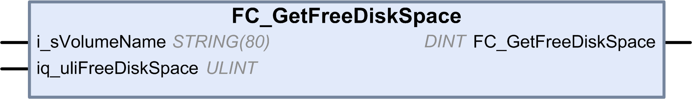

# FC\_GetFreeDiskSpace: Gets the Free Memory Space

## Function Description

This function retrieves the amount of free memory space of a memory medium (user disk, system disk, SD card) in bytes.

The name of the memory medium is transferred:

* User disk = “/usr”
* System disk = “/sys”
* SD card = “/sd0”

The free memory space of a remote device cannot be accessed. If a remote device is specified as parameter, then the function returns "-1".

## Graphical Representation

## IL and ST Representation

To see the general representation in IL or ST language, refer to the chapter [*Function and Function Block Representation*](D-SE-0002384_1.html#D-SE-0002384).

## I/O Variable Description

This table describes the input variables:

| Input | Data type | Description |
| --- | --- | --- |
| i\_sVolumeName | STRING[80] | Name of the device whose free memory space must be accessed |
| iq\_uliFreeDiskSpace | ULINT | Free memory space in bytes |

This table describes the output variables:

| Output | Data type | Description |
| --- | --- | --- |
| FC\_GetFreeDiskSpace | DINT | 0: The amount of free memory space was retrieved successfully  -1: Error when attempting to access the amount of free memory. For example, an invalid device or remote device was selected  -318: Invalid parameter (i\_sVolumeName) |

EIO0000003095.07