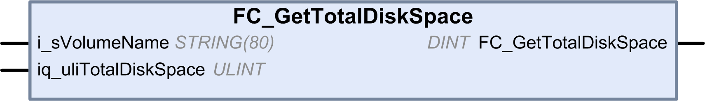

# FC\_GetTotalDiskSpace: Gets the Size of Memory

## Function Description

This function retrieves the size of a memory medium (user disk, system disk, SD card) in bytes.

The name of the memory medium is transferred:

* User disk = “/usr”
* System disk = “/sys”
* SD card = “/sd0”

The size of a remote device cannot be accessed. If a remote device is specified as parameter, then the function returns "-1".

## Graphical Representation

## IL and ST Representation

To see the general representation in IL or ST language, refer to the chapter [*Function and Function Block Representation*](D-SE-0002384_1.html#D-SE-0002384).

## I/O Variable Description

This table describes the input variables:

| Input | Data type | Description |
| --- | --- | --- |
| i\_sVolumeName | STRING[80] | Name of the device whose memory size must be accessed |
| iq\_uliTotalDiskSpace | ULINT | Size of the memory medium in byte |

This table describes the output variables:

| Output | Data type | Description |
| --- | --- | --- |
| FC\_GetTotalDiskSpace | DINT | 0: Size was retrieved successfully  -1: Error when reading the size  -318: At least one of the parameters is invalid |

EIO0000003095.07