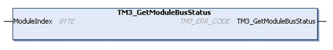

# TM3\_GetModuleBusStatus: Get TM3 Module Bus Status

## Function Description

This function returns the bus status of the module. The index of the module is given as an input parameter.

## Graphical Representation

## IL and ST Representation

To see the general representation in IL or ST language, refer to the chapter [*Function and Function Block Representation*](D-SE-0002384_1.html#D-SE-0002384).

## I/O Variable Description

The following table describes the input variable:

| Input | Type | Comment |
| --- | --- | --- |
| ModuleIndex | BYTE | Index of the module (0 for the first expansion, 1 for the second, and so on). |

The following table describes the output variable:

| Output | Type | Comment |
| --- | --- | --- |
| TM3\_GetModuleBusStatus | [TM3\_ERR\_CODE](D-SE-0032128.html#D-SE-0032128) | Returns `TM3_OK` (00 hex) if command is correct otherwise returns the ID code of the detected error. |

EIO0000003095.07