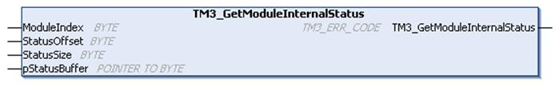

# TM3\_GetModuleInternalStatus: Get TM3 Module Internal Status

## Function Description

This function selectively reads the I/O channel status of a TM3 analog or temperature module, indicated by ModuleIndex. The function block writes the status for each requested channel starting at the memory location pointed to by pStatusBuffer.

NOTE: This function block is intended to be used with analog and temperature I/O modules. To get status information for digital I/O modules, see [TM3\_GetModuleBusStatus](D-SE-0034332.html#D-SE-0034332).

NOTE: It is possible to update the value of the diagnostic bytes by calling the TM3\_GetModuleInternalStatus function only if the Status Enabled parameter in the I/O Configuration tab is deactivated.

## Graphical Representation



## IL and ST Representation

To see the general representation in IL or ST language, refer to the chapter [*Function and Function Block Representation*](D-SE-0002384_1.html#D-SE-0002384).

## I/O Variable Description

Each analog/temperature I/O channel of the requested module requires one byte of memory. If there is not sufficient memory allocated to the buffer for the number of I/O module channel statuses requested, it is possible that the function will overwrite memory allocated for other purposes, or perhaps attempt to overwrite a restricted area of memory.

| WARNING | |
| --- | --- |
|  | UNINTENDED EQUIPMENT OPERATION  Ensure that pStatusBuffer is pointing to a memory area that has been sufficiently allocated for the number of channels to be read.  Failure to follow these instructions can result in death, serious injury, or equipment damage. |

The following table describes the input variables:

| Input | Type | Comment |
| --- | --- | --- |
| ModuleIndex | BYTE | Index of the expansion module (0 for the module closest to the controller, 1 for the second closest, and so on). |
| StatusOffset | BYTE | Offset of the first status to be read in the status table. |
| StatusSize | BYTE | Number of bytes to be read in the status table. |
| pStatusBuffer | POINTER TO BYTE | Buffer containing the read status table ([IBStatusIWx / IBStatusQWx](../../../../../api/crossBook?lang=en-US&virtualBookName=tm3ioprg&topicID=D_SE_0038125)). |

The following table describes the output variable:

| Output | Type | Comment |
| --- | --- | --- |
| TM3\_GetModuleInternalStatus | [TM3\_ERR\_CODE](D-SE-0032128.html#D-SE-0032128) | Returns `TM3_NO_ERR` (00 hex) if command is correct otherwise returns the ID code of the error. For the purposes of this function block, any returned value other than zero indicates that the module is not compatible with the status request, or that the module has other communication issues. |

## Example

The following examples describe how to get the module internal status:

```
VAR
TM3AQ2_Channel_0_Output_Status: BYTE;
END_VAR
```

```
TM3AQ2 is on position 1
```

```
Status of channel 0 is at offset 0
```

```
We read 1 channel
```

```
TM3_GetModuleInternalStatus(1, 0, 1, ADR(TM3AQ2_Channel_0_Output_Status));
```

```
status of channel 0 is in TM3AQ2_Channel_0_Output_Status
```

TM3AQ2 module (2 outputs)

Getting the status of first output QW0

* StatusOffset = 0 (0 inputs x 2)
* StatusSize = 1 (1 status to read)
* pStatusBuffer needs to be at least 1 byte

  

```
VAR
TM3AM6_Channels_1_2_Input_Status: ARRAY[1..2] OF BYTE;
END_VAR
```

```
TM3AM6 is on position 1
```

```
Status of channel 1 is at offset 1
```

```
We read 2 consecutive channels
```

```
TM3_GetModuleInternalStatus(1, 1, 2, ADR(TM3AM6_Channels_1_2_Input_Status));
```

```
status of channel 1 is in TM3AM6_Channels_1_2_Input_Status[1]
```

```
status of channel 2 is in TM3AM6_Channels_1_2_Input_Status[2]
```

TM3AM6 module (4 inputs, 2 outputs)

Getting the status of input IW1 & IW2 (IW0 being the first one)

* StatusOffset = 1 (1 to skip IW0 status)
* StatusSize = 2 (2 statuses to read)
* pStatusBuffer needs to be at least 2 bytes

EIO0000003095.07