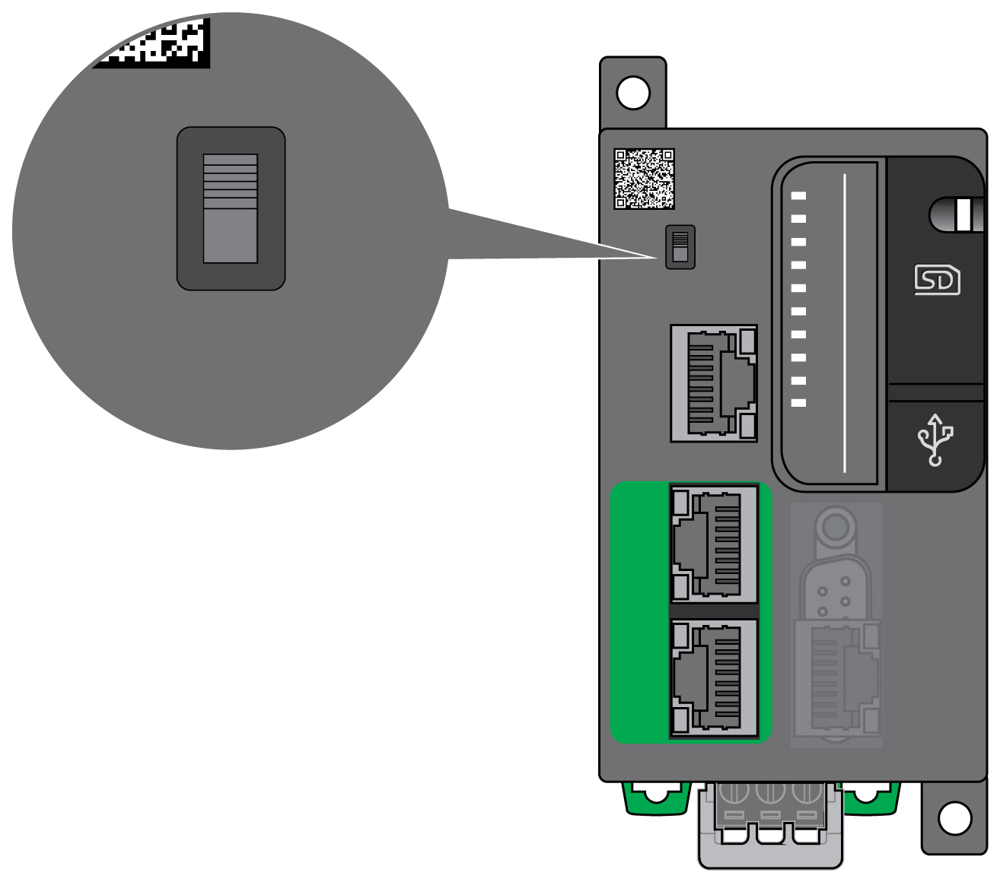

# Run/Stop

## Overview

The M251 Logic Controller can be operated externally by the following:

* A hardware Run/Stop switch.
* A software command.
* The system variable PLC\_W in a [Relocation Table](../../../../../api/crossBook?lang=en-US&virtualBookName=m251prg&topicID=D_SE_0004337).
* The [Web server](../../../../../api/crossBook?lang=en-US&virtualBookName=m251prg&topicID=D_SE_0002960).

The M251 Logic Controller has a Run/Stop hardware switch, which puts the controller in a RUNNING or STOPPED state.

EIO0000003101.08