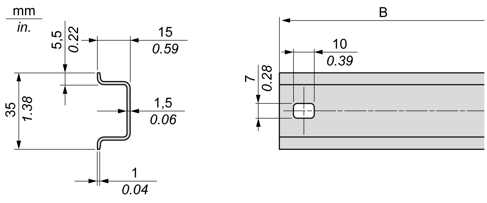
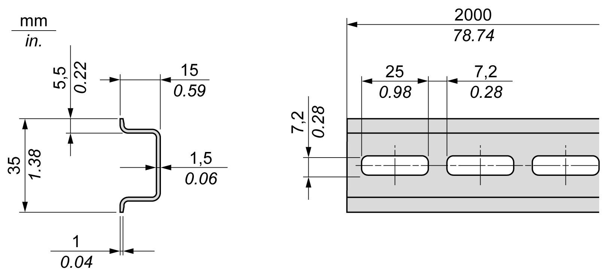
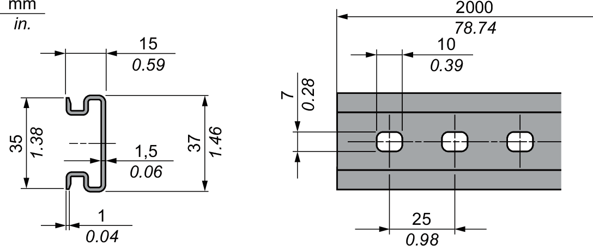

# Top Hat Section Rail (DIN rail)

## Dimensions of Top Hat Section Rail DIN Rail

You can mount the controller or receiver and their expansions on a 35 mm (1.38 in.) top hat section rail (DIN rail). The DIN rail can be attached to a smooth mounting surface or suspended from an EIA rack or mounted in a NEMA cabinet.

## Symmetric Top Hat Section Rails (DIN Rail)

The following illustration and table indicate the references of the top hat section rails (DIN rail) for the wall-mounting range:

| Reference | Type | Perforated | Rail Length (B) |
| --- | --- | --- | --- |
| NSYSDR50A | A | At each end | 450 mm (17.71 in.) |
| NSYSDR60A | A | At each end | 550 mm (21.65 in.) |
| NSYSDR80A | A | At each end | 750 mm (29.52 in.) |
| NSYSDR100A | A | At each end | 950 mm (37.40 in.) |

The following illustration and table indicate the references of the symmetric top hat section rails (DIN rail) of 2000 mm (78.74 in.):

| Reference | Type | Perforated | Rail Length |
| --- | --- | --- | --- |
| NSYSDR200 | A | No | 2000 mm (78.74 in.) |
| NSYSDR200D | A | Yes |

## Double-Profile Top Hat Section Rails (DIN rail)

The following illustration and table indicate the references of the double-profile top hat section rails (DIN rail) of 2000 mm (78.74 in.):

| Reference | Type | Perforated | Rail Length |
| --- | --- | --- | --- |
| NSYDPR200 | – | No | 2000 mm (78.74 in.) |
| NSYDPR200D | – | Yes |

EIO0000003101.08