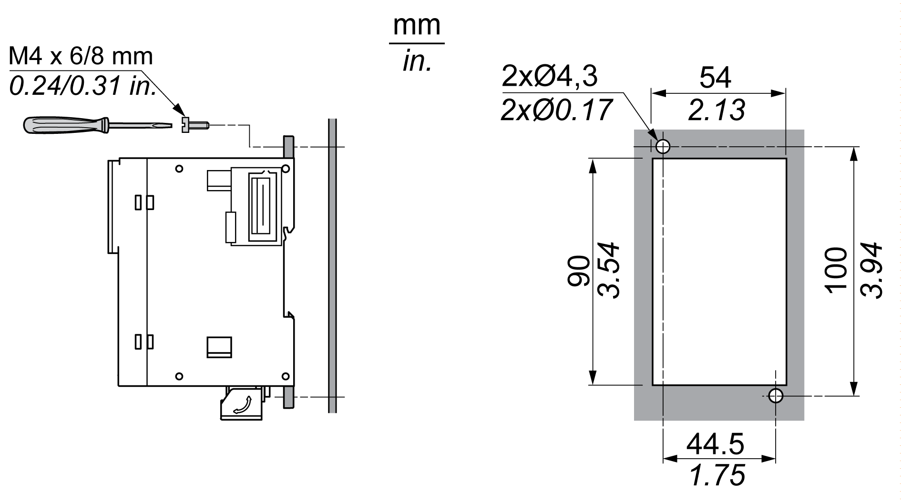

# Direct Mounting on a Panel Surface

## Overview

This section shows how to install M251 Logic Controller on a panel surface using the mounting holes.

## Mounting Hole Layout

This diagram shows the mounting hole layout for M251 Logic Controller:

EIO0000003101.08