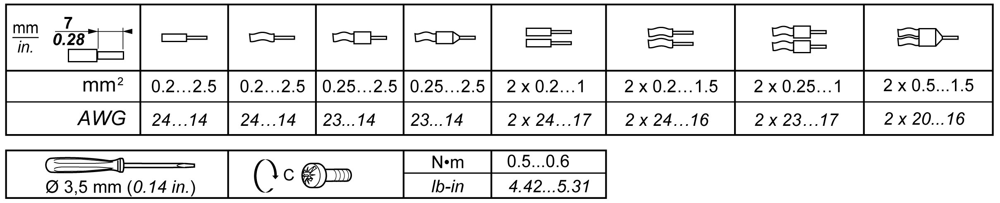

# Wiring Best Practices

## Overview

This section describes the wiring guidelines and associated best practices to be respected when using the M251 Logic Controller system.

| DANGER | |
| --- | --- |
|  | HAZARD OF ELECTRIC SHOCK, EXPLOSION OR ARC FLASH  * Disconnect all power from all equipment including connected devices prior to removing any covers or doors, or installing or removing any accessories, hardware, cables, or wires except under the specific conditions specified in the appropriate hardware guide for this equipment. * Always use a properly rated voltage sensing device to confirm the power is off where and when indicated. * Replace and secure all covers, accessories, hardware, cables, and wires and confirm that a proper ground connection exists before applying power to the unit. * Use only the specified voltage when operating this equipment and any associated products.  Failure to follow these instructions will result in death or serious injury. |

| WARNING | |
| --- | --- |
|  | LOSS OF CONTROL  * Perform a Failure Mode and Effects Analysis (FMEA), or equivalent risk analysis, of your application, and apply preventive and detective controls before implementation. * Provide a fallback state for undesired control events or sequences. * Provide separate or redundant control paths wherever required. * Supply appropriate parameters, particularly for limits. * Review the implications of transmission delays and take actions to mitigate them. * Review the implications of communication link interruptions and take actions to mitigate them. * Provide independent paths for control functions (for example, emergency stop, over-limit conditions, and error conditions) according to your risk assessment, and applicable codes and regulations. * Apply local accident prevention and safety regulations and guidelines.1 * Test each implementation of a system for proper operation before placing it into service.  Failure to follow these instructions can result in death, serious injury, or equipment damage. |

1 For additional information, refer to NEMA ICS 1.1 (latest edition), *Safety Guidelines for the Application, Installation, and Maintenance of Solid State Control* and to NEMA ICS 7.1 (latest edition), *Safety Standards for Construction and Guide for Selection, Installation and Operation of Adjustable-Speed Drive Systems* or their equivalent governing your particular location.

## Wiring Guidelines

This rules must be applied when wiring an M251 Logic Controller system:

* Communication wiring must be kept separate from the power wiring. Route these 2 types of wiring in separate cable ducting.
* Verify that the operating conditions and environment are within the specification values.
* Use proper wire sizes to meet voltage and current requirements.
* Use copper conductors (required).
* Use twisted pair, shielded cables for networks, and fieldbus.

Use shielded, properly grounded cables for all communication connections. If you do not use shielded cable for these connections, electromagnetic interference can cause signal degradation. Degraded signals can cause the controller or attached modules and equipment to perform in an unintended manner.

| WARNING | |
| --- | --- |
|  | UNINTENDED EQUIPMENT OPERATION  * Use shielded cables for all communication signals. * Ground cable shields for all communication signals at a single point1. * Route communication separately from power cables.  Failure to follow these instructions can result in death, serious injury, or equipment damage. |

1Multipoint grounding is permissible if connections are made to an equipotential ground plane dimensioned to help avoid cable shield damage in the event of power system short-circuit currents.

For more details, refer to [Grounding Shielded Cables](D-SE-0036986.html#D-SE-0036986__D-SE-0036986.5).

NOTE: Surface temperatures may exceed 60 °C (140 °F).

To conform to IEC 61010 standards, route primary wiring (wires connected to power mains) separately and apart from secondary wiring (extra low voltage wiring coming from intervening power sources). If that is not possible, double insulation is required such as conduit or cable gains.

## Rules for Removable Screw Terminal Block

The following tables show the cable types and wire sizes for a **5.08 pitch** removable screw terminal block (power supply):

The use of copper conductors is required.

| DANGER | |
| --- | --- |
|  | LOOSE WIRING CAUSES ELECTRIC SHOCK  Tighten connections in conformance with the torque specifications.  Failure to follow these instructions will result in death or serious injury. |

| DANGER | |
| --- | --- |
|  | FIRE HAZARD  Use only the correct wire sizes for the maximum current capacity of the power supplies.  Failure to follow these instructions will result in death or serious injury. |

EIO0000003101.08