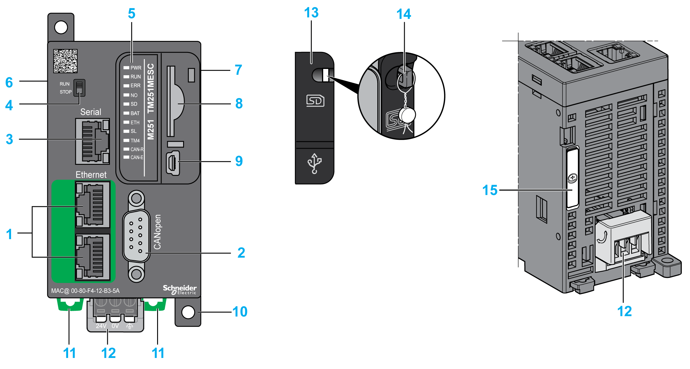
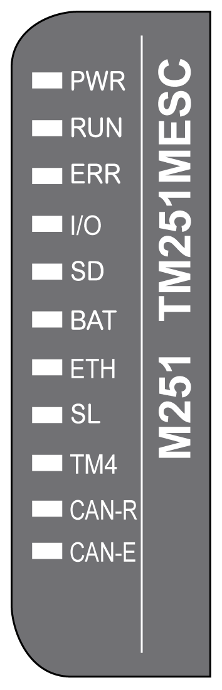
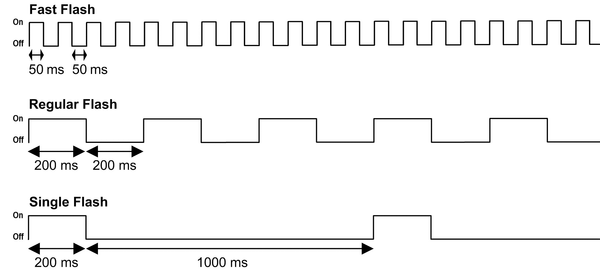
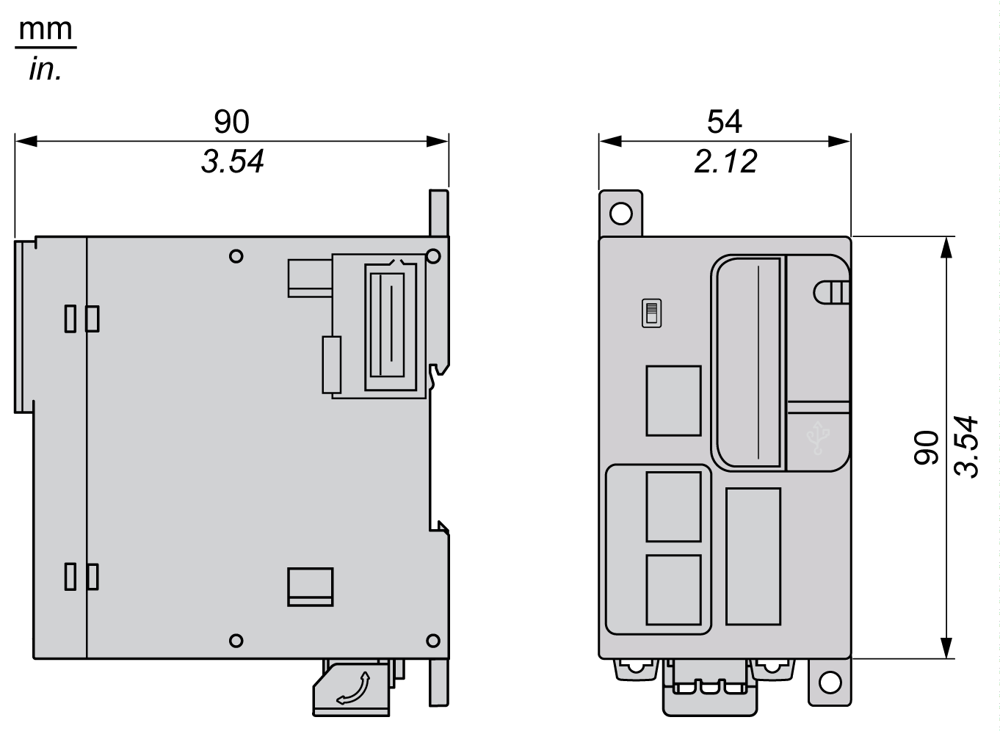

# TM251MESC Presentation

## Description

This figure shows the different components of the TM251MESC logic controller:

| N° | Description | Refer to |
| --- | --- | --- |
| 1 | Dual port Ethernet switch | [Ethernet port](D-SE-0036226.html#D-SE-0036226) |
| 2 | CANopen port | [CANopen port](D-SE-0032568.html) |
| 3 | Serial line port (type RJ45 (RS-232 or RS-485)) | [Serial Line](D-SE-0036135.html#D-SE-0036135) |
| 4 | Run/Stop switch | [Run/Stop](D-SE-0034418.html#D-SE-0034418) |
| 5 | Status LEDs | [Status LEDs](D-SE-0036049.html#D-SE-0036049__D-SE-0036049.5) |
| 6 | TM4 bus connector | [TM4 Expansion Modules](D-SE-0036324.html#D-SE-0036324) |
| 7 | TM3 / TM2 bus connector | [TM3 Expansion Modules](D-SE-0025087.html#D-SE-0025087) |
| 8 | SD card slot | [SD Card](D-SE-0027501.html#D-SE-0027501) |
| 9 | USB mini-B programming port (for terminal connection to a programming PC) | [USB Mini-B Programming Port](D-SE-0029629.html#D-SE-0029629) |
| 10 | Surface mounting lugs | – |
| 11 | Clip-on lock for 35 mm (1.38 in.) top hat section rail (DIN-rail) | [Top Hat Section Rail (DIN rail)](TopHatSectionRailDINRail-8CC2B316.html) |
| 12 | 24 Vdc power supply | [DC Power supply Characteristics and Wiring](D-SE-0036366.html#D-SE-0036366) |
| 13 | Protective cover (SD card slot and USB mini-B programming port) | – |
| 14 | Locking hook (optional lock not included) | – |
| 15 | Battery holder | [Real Time Clock (RTC)](D-SE-0025710.html#D-SE-0025710) |

## Status LEDs

This figure shows the status LEDs:

The following table describes the system status LEDs:

| Label | Function Type | Color | Status | Description | | |
| --- | --- | --- | --- | --- | --- | --- |
| PWR | Power | Green | On | Indicates that power is applied. | | |
| Off | Indicates that power is removed. | | |
| RUN | Machine status | Green | On | Indicates that the controller is running a valid application. | | |
| Regular flash | Indicates that the controller has a valid application that is stopped. | | |
| Single flash | Indicates that the controller has paused at BREAKPOINT. | | |
| Off | Indicates that the controller is not programmed. | | |
| ERR | Internal Error | Red | On | Indicates that an operating system error has been detected. | | |
| Fast flash | Indicates that the controller has detected an internal error. | | |
| Regular flash | Indicates either that a minor error has been detected if **RUN** is ON, or that no application has been detected. | | |
| I/O | I/O error | Red | On | Indicates device errors on the serial line, SD card, TM4 bus, TM3 bus, Ethernet port(s) or CANopen port. | | |
| SD | SD card access | Green | On | Indicates that the SD card is being accessed. | | |
| BAT | Battery | Red | On | Indicates that the battery needs to be replaced. | | |
| Regular flash | Indicates that the battery charge is low. | | |
| ETH | Ethernet port status | Green | On | Indicates that the Ethernet port is connected and the IP address is defined. | | |
| 3 flashes | Indicates that the Ethernet port is not connected. | | |
| 4 flashes | Indicates that the IP address is already in used. | | |
| 5 flashes | Indicates that the module is waiting for BOOTP or DHCP sequence. | | |
| 6 flashes | Indicates that the configured IP address is not valid. | | |
| SL | Serial line | Green | Flashing | Indicates the [status of serial line](D-SE-0036135.html#D-SE-0036135__D-SE-0036135.8). | | |
| Off | Indicates no serial communication. | | |
| TM4 | Error on TM4 bus | Red | On | Indicates that an error has been detected on the TM4 bus. | | |
| Off | Indicates that no error has been detected on the TM4 bus. | | |
| CAN-R | CANopen running status | Green | On | Indicates that the CANopen bus is operational. | | |
| Off | Indicates that the CANopen master is configured. | | |
| Regular flash | Indicates that the CANopen bus is being initialized. | | |
| 1 flash per second | Indicates that the CANopen bus is stopped. | | |
| CAN-E | CANopen error | Red | On | Indicates that the CANopen bus is stopped (BUS OFF). | | |
| Off | Indicates that no error has been detected on the CANopen bus. | | |
| Regular flash | Indicates that the CANopen bus is not valid. | | |
| 1 flash per second | Indicates that the controller has detected that the maximum number of error frames has been reached or exceeded. | | |
| 2 flashes per second | Indicates that the controller has detected either a Node Guarding or a Heartbeat event. | | |

NOTE: All the LEDs flash when the logic controller is being identified.

This timing diagram shows the difference between the fast flash, regular flash and single flash:

## Dimensions

This figure shows the external dimensions of the TM251MESC logic controller:

EIO0000003101.08