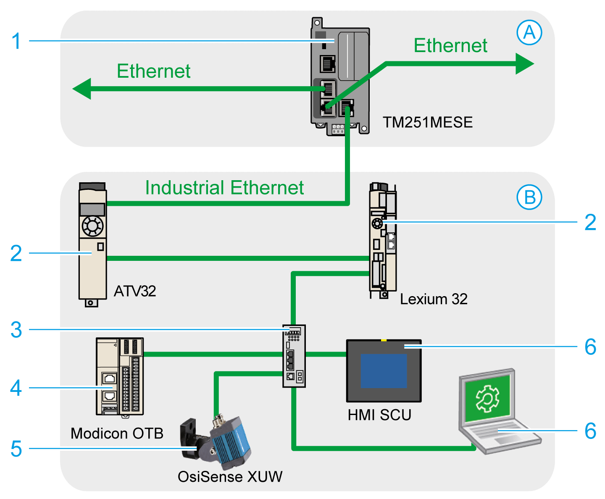
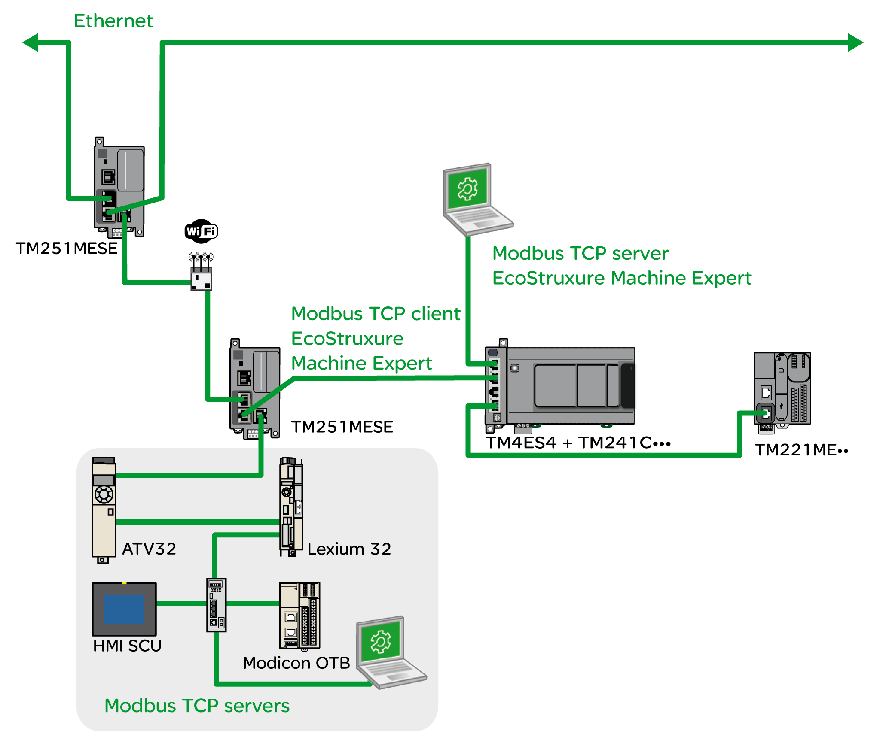

# TM251MESE Specific Considerations

## Ethernet Ports

The TM251MESE has two different Ethernet networks. Each has its own unique IP and MAC addresses.

The two Ethernet networks are called Ethernet 1 and Ethernet 2:

* Ethernet 1 is made of two switched Ethernet ports dedicated to communication between machines or with the control network.
* Ethernet 2 is made of one Ethernet port dedicated to the device network and supporting industrial Ethernet connections.

## Industrial Ethernet Architecture

This figure presents a typical industrial Ethernet architecture:

| A | Control network |
| B | Device network |
| 1 | [Logic controller](../../../../../api/crossBook?lang=en-US&virtualBookName=ESMEIndEthOverview&topicID=D_SE_0056503) |
| 2 | Daisy-chained slaves |
| 3 | Ethernet switch |
| 4 | I/O island (Modbus TCP) |
| 5 | Vision sensor (EtherNet/IP) |
| 6 | PC and HMI (TCP/UDP) |
| 2, 4, and 5 | Industrial Ethernet slave devices (EtherNet/IP / Modbus TCP) |

## Industrial Ethernet Connections with Modbus TCP IOScanner Architecture

For example, you can:

* Connect your PC to Ethernet 1.
* Use a Modbus TCP IOScanner or EtherNet/IP Scanner with the Ethernet 2.

This figure is an example of an industrial Ethernet architecture with the TM251MESE.

EIO0000003101.08