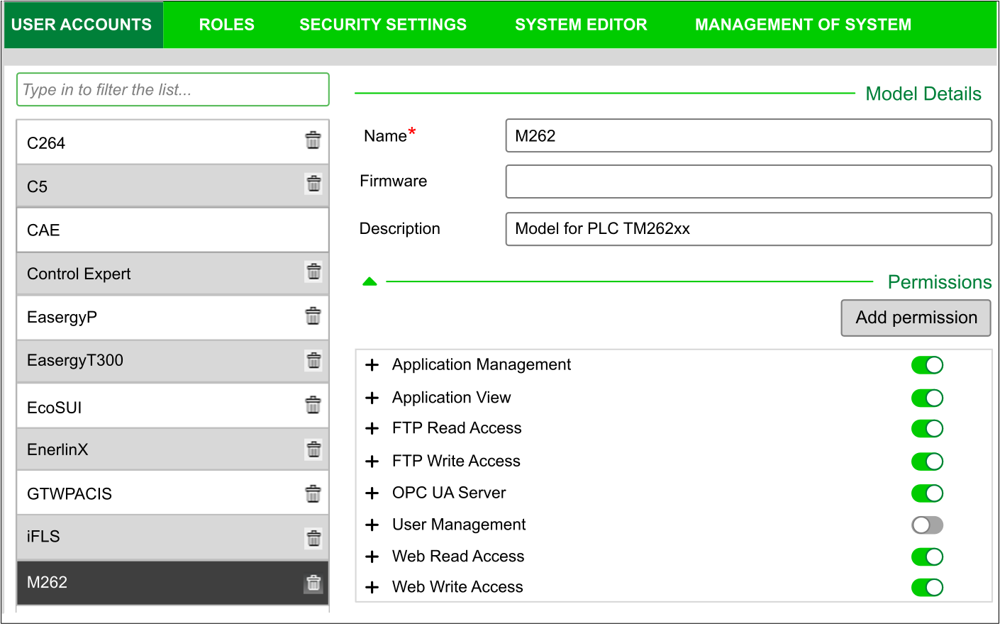
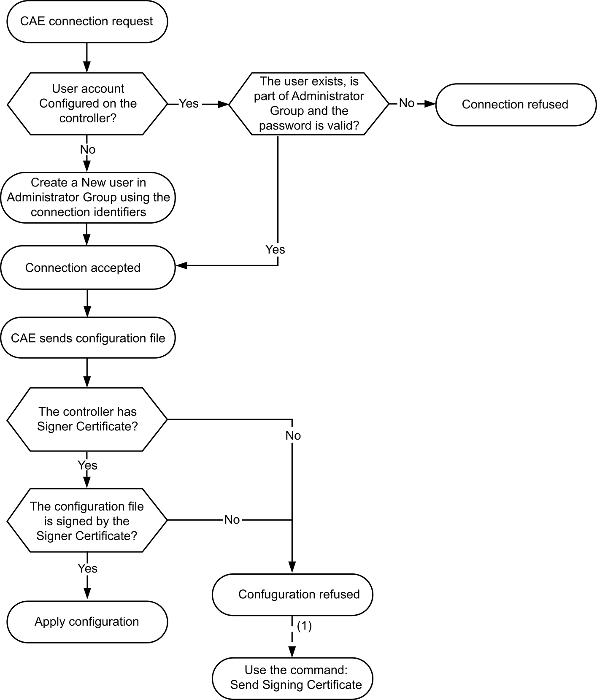

# Security Settings Configuration with Cybersecurity Admin Expert Software

## Introduction

CAE (Cybersecurity Admin Expert) is a software-based tool for building and managing the security configuration and policy of the Operational Technology (OT) within the communication network of control systems. It allows centralized administration of user accounts, roles and permissions for devices such as: network devices (switches, firewalls), PCs and IED/Protection relays. CAE is used for multiple purposes:

* Creating a cybersecurity and security policy
* Configuring the security of devices
* Managing the system definition
* Retrieving security logs of a whole substation, plant or industrial environment

CAE is a Schneider Electric software you can download from [https://www.se.com/ww/en/all-products](https://www.se.com/ww/en/product-range/63515-ecostruxure-cybersecurity-admin-expert/#overview).

Prior to apply any modification to the CAE settings, refer to the [Cybersecurity Admin Expert User Manual](https://www.se.com/ww/en/download/document/CAE_User_Guide/).

The M262 Logic/Motion Controller device model encompasses two features:

* Role-Based Access Control (RBAC)
* Device Specific Settings (DSS)

## Role-Based Access Control (RBAC)

This feature consists in controlling access to a system’s resources based on the roles and permissions of the users. The list of permission covers common use cases, as displayed in the following graphic:

The following table describes each permission, the concerned M262 objects and the corresponding access rights:

| CAE Permissions | M262 Object Name | M262 Access Rights |
| --- | --- | --- |
| Application Management | Device | USERDB\_RIGHT\_ALL |
| Device.PlcLogic | USERDB\_RIGHT\_ALL |
| Device.PlcLogic.Application | USERDB\_RIGHT\_ALL |
| Device.Settings | USERDB\_RIGHT\_ALL |
| Device.ExternalCmd | USERDB\_RIGHT\_ALL |
| "/" | USERDB\_RIGHT\_ALL |
| Application View | Device | USERDB\_RIGHT\_VIEW |
| Device.PlcLogic | USERDB\_RIGHT\_VIEW |
| Device.PlcLogic.Application | USERDB\_RIGHT\_VIEW |
| Device.Settings | USERDB\_RIGHT\_VIEW |
| Device.ExternalCmd | USERDB\_RIGHT\_VIEW |
| "/" | USERDB\_RIGHT\_VIEW |
| FTP Read Access | Device.FTP | USERDB\_RIGHT\_VIEW |
| FTP Write Access | Device.FTP | USERDB\_RIGHT\_ALL |
| OPC UA Server | Device.OPC | USERDB\_RIGHT\_ALL |
| User Management | Device.UserManagement | USERDB\_RIGHT\_ALL |
| Web Read Access | Device.WEB | USERDB\_RIGHT\_VIEW |
| Web Write Access | Device.WEB | USERDB\_RIGHT\_ALL |

## Roles and Rights

Up to 20 users are supported by the M262 Logic/Motion Controller. Each user may have several roles. The following table describes the default rights for each user role:

| Role | Access Rights |
| --- | --- |
| ENGINEER | Application Management  Application View  FTP Read Access  FTP Write Access  OPC UA Server  Web Read Access  Web Write Access |
| INSTALLER | OPC UA Server  Web Read Access |
| OPERATOR | Application View  FTP Read Access  FTP Write Access  OPC UA Server  Web Read Access |
| SECADM | User Management |
| VIEWER | Application View  FTP Read Access  Web Read Access |

## Device Specific Settings (DSS)

This parameter allows you to configure the device specific settings. This table describes the M262 Logic/Motion Controller MODELS > Specific Settings parameters:

| Key | Type | Default Value | Description |
| --- | --- | --- | --- |
| Discovery Protocols | INTEGER | Decimal: 255  Binary: 1111 1111 | Allows you to enable or disable the protocol DPWS and NetManage in each communication port:   * TCP port: 5357 * UDP ports: 3702, 5353, 27126, 27127   Bit value: 0 = Disable, 1 = Enable   * Bit 0: USB * Bit 1: ETH1 * Bit 2: ETH2 * Bit 3 to 5: TMSES4 1 to 3 * Bit 6 to 7: reserved   For further information, refer to the example below (1) .  NOTE: Disabling these protocols prevents the device to be discovered by the software CAE. |
| EtherNet/IP | INTEGER | Decimal: 255  Binary: 1111 1111 | Allows you to enable or disable EtherNet/IP in each communication port:   * TCP port: 44818 * UDP ports: 2222, 44818   Bit value: 0 = Disable, 1 = Enable   * Bit 0: USB * Bit 1: ETH1 * Bit 2: ETH2 * Bit 3 to 5: TMSES4 1 to 3 * Bit 6 to 7: reserved   For further information, refer to the example below (1) . |
| FTP Server | INTEGER | Decimal: 255  Binary: 1111 1111 | Allows you to enable or disable the protocol in each communication port:   * TCP ports: 20, 21   Bit value: 0 = Disable, 1 = Enable   * Bit 0: USB * Bit 1: ETH1 * Bit 2: ETH2 * Bit 3 to 5: TMSES4 1 to 3 * Bit 6 to 7: reserved   For further information, refer to the example below (1) . |
| CoDeSys Protocol | INTEGER | Decimal: 255  Binary: 1111 1111 | Allows you to enable or disable the protocol in each communication port:   * UDP ports: 1740 to 1743   Bit value: 0 = Disable, 1 = Enable   * Bit 0: USB * Bit 1: ETH1 * Bit 2: ETH2 * Bit 3 to 5: TMSES4 1 to 3 * Bit 6 to 7: reserved   For further information, refer to the example below (1) . |
| Modbus Server | INTEGER | Decimal: 255  Binary: 1111 1111 | Allows you to enable or disable the protocol in each communication port:   * TCP port: 502   Bit value: 0 = Disable, 1 = Enable   * Bit 0: USB * Bit 1: ETH1 * Bit 2: ETH2 * Bit 3 to 5: TMSES4 1 to 3 * Bit 6 to 7: reserved   For further information, refer to the example below (1) . |
| OPC UA Server | INTEGER | Decimal: 255  Binary: 1111 1111 | Allows you to enable or disable the protocol in each communication port:   * TCP port: 4840   Bit value: 0 = Disable, 1 = Enable   * Bit 0: USB * Bit 1: ETH1 * Bit 2: ETH2 * Bit 3 to 5: TMSES4 1 to 3 * Bit 6 to 7: reserved   For further information, refer to the example below (1) . |
| Remote Connection (Fast TCP) | INTEGER | Decimal: 255  Binary: 1111 1111 | Allows you to enable or disable the protocol in each communication port:   * TCP port: 11740   Bit value: 0 = Disable, 1 = Enable   * Bit 0: USB * Bit 1: ETH1 * Bit 2: ETH2 * Bit 3 to 5: TMSES4 1 to 3 * Bit 6 to 7: reserved   For further information, refer to the example below (1) . |
| Clone Application Enabled | BOOL | TRUE | Enable or disable the cloning of the device via the SD card. |
| SD Card Script Execution Enable | BOOL | TRUE | Enable or disable the execution of scripts via the SD card. Refer to [Operation Functions](D-SE-0095294.html#D-SE-0095294__OperationFunctions-77D0E961). |
| Secure Web Server (HTTPS) | INTEGER | Decimal: 255  Binary: 1111 1111 | Allows you to enable or disable the protocol in each communication port:   * TCP ports: 80, 443   Bit value: 0 = Disable, 1 = Enable   * Bit 0: USB * Bit 1: ETH1 * Bit 2: ETH2 * Bit 3 to 5: TMSES4 1 to 3 * Bit 6 to 7: reserved   For further information, refer to the example below (1) .  NOTE: Disabling this protocol prevents the device to receive data from the software CAE. |
| SNMP Agent | INTEGER | Decimal: 255  Binary: 1111 1111 | Allows you to enable or disable the protocol in each communication port:   * UDP ports: 161, 162   Bit value: 0 = Disable, 1 = Enable   * Bit 0: USB * Bit 1: ETH1 * Bit 2: ETH2 * Bit 3 to 5: TMSES4 1 to 3 * Bit 6 to 7: reserved   For further information, refer to the example below (1) . |
| TFTP Server | INTEGER | Decimal: 255  Binary: 1111 1111 | Allows you to enable or disable the protocol in each communication port:   * UDP port: 69   Bit value: 0 = Disable, 1 = Enable   * Bit 0: USB * Bit 1: ETH1 * Bit 2: ETH2 * Bit 3 to 5: TMSES4 1 to 3 * Bit 6 to 7: reserved   For further information, refer to the example below (1) . |
| WebVisualisation Protocol | INTEGER | Decimal: 255  Binary: 1111 1111 | Allows you to enable or disable the protocol in each communication port:   * TCP port: 8080, 8089   Bit value: 0 = Disable, 1 = Enable   * Bit 0: USB * Bit 1: ETH1 * Bit 2: ETH2 * Bit 3 to 5: TMSES4 1 to 3 * Bit 6 to 7: reserved   For further information, refer to the example below (1) . |
| **(1)** In this example, the chosen protocol is allowed on ETH1 and the first TMSES4. It is blocked on the other interfaces. The related binary value 00001010 corresponds to 10 in decimal, so the related parameter value must be set to 10. | | | |

## Operating Modes

The control of the device security settings via the CAE is enabled by default on the M262 Logic/Motion Controller. To disable CAE, refer to [Post Configuration Presentation](D-SE-0010301.html#D-SE-0010301).

Once the connection between the CAE and the controller is accepted, the CAE is allowed to send the RBAC or the DSS configurations. After receiving a valid RBAC configuration, the existing users and groups are deleted, and new groups and users are created based on the RBAC configuration.

If you have used CAE to manage security, and then modify the security settings with EcoStruxure Machine Expert, groups and/or user accounts may be deleted, and inconsistencies may occur.

| WARNING | |
| --- | --- |
|  | LOSS OF DATA  Do not create the user accounts and groups with EcoStruxure Machine Expert if the security settings are managed by the Cybersecurity Admin Expert (CAE) software.  Failure to follow these instructions can result in death, serious injury, or equipment damage. |

Any DSS configuration received from the CAE is applied immediately.

The following diagram describes the connection between the CAE tool and the controller:

**(1)** In the case of the first CAE certificate has not been sent yet, use the command Send Signing Certificate. Subsequent operation will be proceed automatically.

## CAE Options Supported by the M262 Logic/Motion Controller

This table describes the different CAE commands you can use with the M262 Logic/Motion Controller:

| Commands | Description |
| --- | --- |
| Discover device(s) over the network | Displays the controller in the list of the discovered devices. |
| Send Signing Certificate | Saves the CAE signing certificate inside the file system. Any configuration received is rejected if the signing certificate is not provisioned. Only one signing certificate is supported. |
| Send Security Configuration | Sends the RBAC and DSS configuration files and apply the configuration. |
| Log on | Connects manually the controller when automatic connection did not succeed. |
| Send DSS | Sends the DSS and to apply the configuration, once it has been validated by the CAE tool, using the CAE signing certificate. |
| Reset | Resets the security configuration to default. RBAC (users, roles, permissions) and DSS are reset. |
| Locate | Locates the device by flashing its LED. |
| Certificate Management > Whitelist | Adds or removes certificate(s) in the whitelist (allowlist). |
| Certificate Management > Signers | Adds or removes the CAE certificate that can be used to verify the configuration signature. Only one Signer certificate is supported. |
| Certificate Management > Trusted Chain Certificates | Add a root or intermediate certificate to the controller trusted list.  Manages root CA and intermediate CA certificates, so that the controller can verify the certificates chain of trust. |
| PKI Management > Get CSR | Allows the controller to generate and send the CSR (certificate sign request) for OPC UA certificate. |
| PKI Management > Send signed device certificate | Allows you to replace the self signed certificate by the certificate signed by the Certificate Authority (CA) and provided to CAE. The certificate requires a Reset Cold, a Reset Warm or a Reboot of the application to apply. |

If a command is not active (in grey in the software), refer to the [Cybersecurity Admin Expert User Manual](https://www.se.com/ww/en/download/document/CAE_User_Guide/).

This table describes the Public Key Infrastructure (PKI) shared between the M262 Logic/Motion Controller and the CAE. It provides the folder list and their usage.

| M262 File System Folders | Description |
| --- | --- |
| /usr/pki/cae/castore | Stores working certificate received from CAE. |
| /usr/pki/cae/csr | Stores the signed certificate request. |

EIO0000003651.14