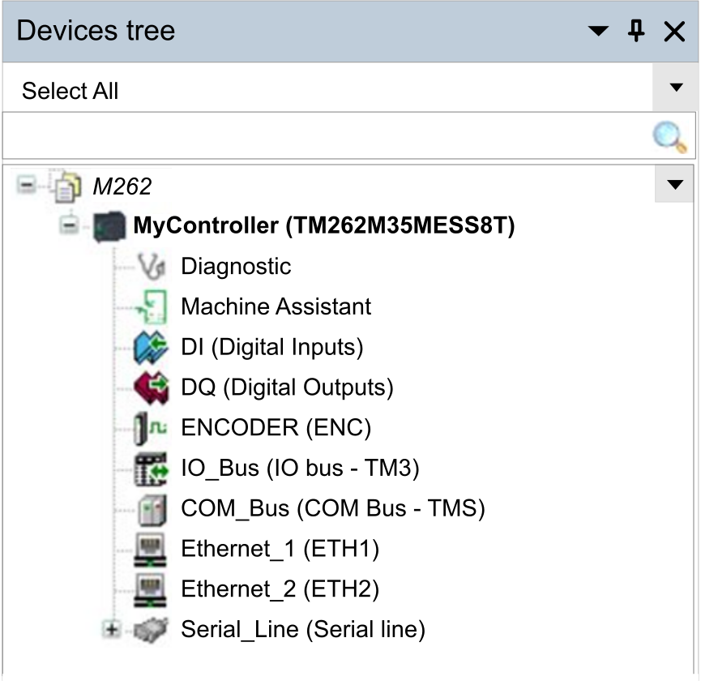

# Configuring the Controller

## Introduction

First, create a new project or open an existing project in the EcoStruxure Machine Expert software.

Refer to the EcoStruxure Machine Expert [Programming Guide](../../../../../api/crossBook?lang=en-US&virtualBookName=SoMProg&topicID=D_SE_0083364) for information on how to:

* Add a controller to your project
* Add expansion modules to your controller
* Replace an existing controller
* Convert a controller to a different but compatible device

## Devices Tree

The Devices tree presents a structured view of the hardware configuration. When you add a controller to your project, a number of nodes are added to the Devices tree, depending on the functions the controller provides.

| Item | Use to Configure... |
| --- | --- |
| Diagnostic | Diagnostic messages and status. |
| Machine Assistant | Devices discovery and configuration. |
| DI | Embedded digital inputs of the controller. |
| DQ | Embedded digital outputs of the controller. |
| ENCODER | Incremental or SSI Encoder interface of the controller. |
| IO\_Bus | Expansion modules connected to the controller. |
| COM\_Bus | Communication modules connected to the controller. |
| Ethernet\_1 | Embedded Ethernet dedicated to Motion Bus Sercos on TM262M•, dedicated to devices on TM262L•. |
| Ethernet\_2 | Embedded Ethernet communication. |
| Serial\_Line | Serial line communication interface. |

## Applications Tree

The Applications tree allows you to manage project-specific applications as well as global applications, POUs, and tasks.

## Tools Tree

The Tools tree allows you to configure the HMI part of your project and to manage libraries.

The Tools tree allows you to:

* Configure the HMI part of your project.
* Access to the [**Library Manager** tool](../../../../../api/crossBook?lang=en-US&virtualBookName=SoLibref&topicID=D_SE_0081233).
* Access to the [**Message logger** tool](MaintenancePage-6CE89C28.html#MaintenancePage-6CE89C28__D-SE-0002960.41).

EIO0000003651.14