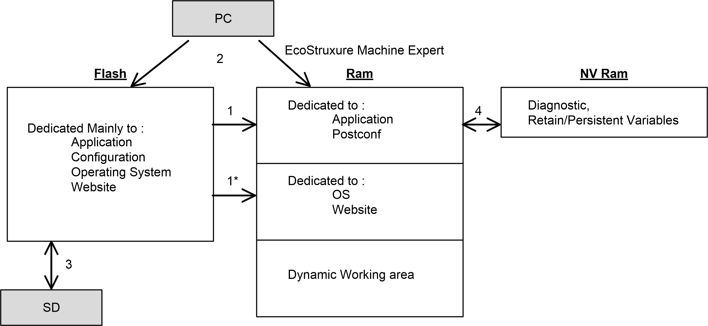

# Controller Memory Organization

## Introduction

The controller memory is composed of three types of physical memory:

* The [Non-Volatile Memory (NVM)](D-SE-0004156.html#D-SE-0004156) contains files (application, configuration files, and so on).
* The [Random Access Memory (RAM)](D-SE-0081016.html) is used for application execution.
* The [Non-Volatile Random Access Memory (NVRAM)](D-SE-0081710.html) is used to save the retain-persistent variables and diagnostic information.

## Files Transfers in Memory

| Item | Controller State | File Transfer Events | Connection | Description |
| --- | --- | --- | --- | --- |
| 1 | – | Initiated automatically at Power ON and Reboot | Internal | Files transfer from non-volatile memory to RAM.  The content of the RAM is overwritten. |
| 1\* | – | Initiated automatically at Power ON and Reboot | Internal | Operating system files transfer. |
| 2 | All states except INVALID\_OS (1) | Initiated by user | Ethernet or USB programming port | Files can be transferred via:   * [Web Server](D-SE-0002960.html) * [FTP server](D-SE-0002958.html#D-SE-0002958) * Controller Assistant * [The software](../../../../../api/crossBook?lang=en-US&virtualBookName=SoMProg&topicID=D_SE_0083390) |
| 3 | All states | Initiated automatically by script (data transfer) or by power cycle (cloning) when an SD card is inserted | SD card | Up/download with SD card(1). |
| 4 | All states | Initiated by system | Internal | Save of modified retain-persistent variables and the context on power OFF. |
| **(1)** If the controller is in the INVALID\_OS state, the only accessible memory is the SD card and only for firmware upgrades. | | | | |

NOTE: The modification of files in non-volatile memory does not affect a running application. Any changes to files in non-volatile memory are taken into account at the next reboot, except for the user files directly used by the application.

EIO0000003651.14