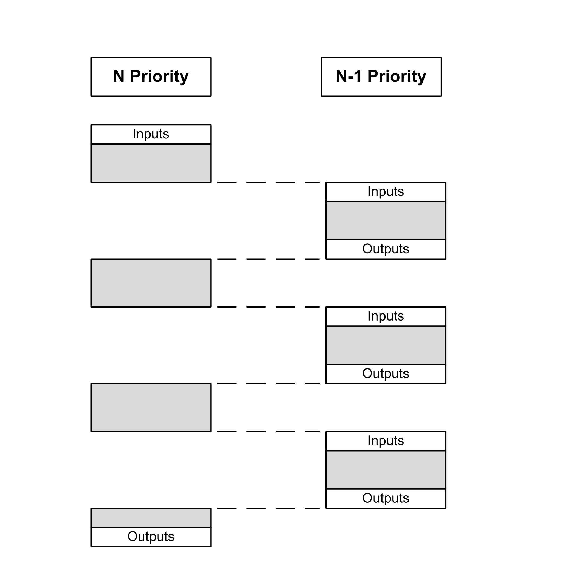

# Task Priorities

## Task Priority Configuration

You can configure the priority of each task between 0 and 31 (0 is the highest priority, 31 is the lowest). Each task must have a unique priority. Assigning the same priority to more than one task leads to a build error.

## Task Priority Suggestions

* Priority 0 to 24: Controller tasks. Assign these priorities to tasks with a high availability requirement.
* Priority 25 to 31: Background tasks. Assign these priorities to tasks with a low availability requirement.

## Task Priorities of Embedded I/Os

When a task cycle starts, it can interrupt any task with lower priority (task preemption). The interrupted task resumes when the higher priority task cycle is finished.

NOTE: If the same input is used in different tasks the input image may change during the task cycle of the lower priority task.

To improve the likelihood of proper output behavior during multitasking, a build error message is displayed if outputs in the same byte are used in different tasks.

| WARNING | |
| --- | --- |
|  | UNINTENDED EQUIPMENT OPERATION  Map your inputs so that tasks do not alter the input images in an unexpected manner.  Failure to follow these instructions can result in death, serious injury, or equipment damage. |

## Task Priorities of TM3 Modules and CANopen I/Os

You can select the task that drives TM3 I/Os and CANopen physical exchanges. In the PLC settings, select Bus cycle task to define the task for the exchange. By default, the task is set to MAST. This definition at the controller level can be overridden by the [I/O bus configuration](D-SE-0035575.html#D-SE-0035575). During the read and write phases, all physical I/Os are refreshed at the same time. TM3 and CANopen data is copied into a virtual I/O image during a physical exchanges phase, as shown in this figure:

Inputs are read from the I/O image table at the beginning of the task cycle. Outputs are written to the I/O image table at the end of the task.

NOTE: TM3 influence the application execution time. You can configure the Bus cycle options using I/O mapping tab. Refer to the Modicon TM3 Expansion Modules – [Programming Guide](../../../../../api/crossBook?lang=en-US&virtualBookName=tm3ioprg&topicID=D_SE_0032099).

EIO0000003651.14