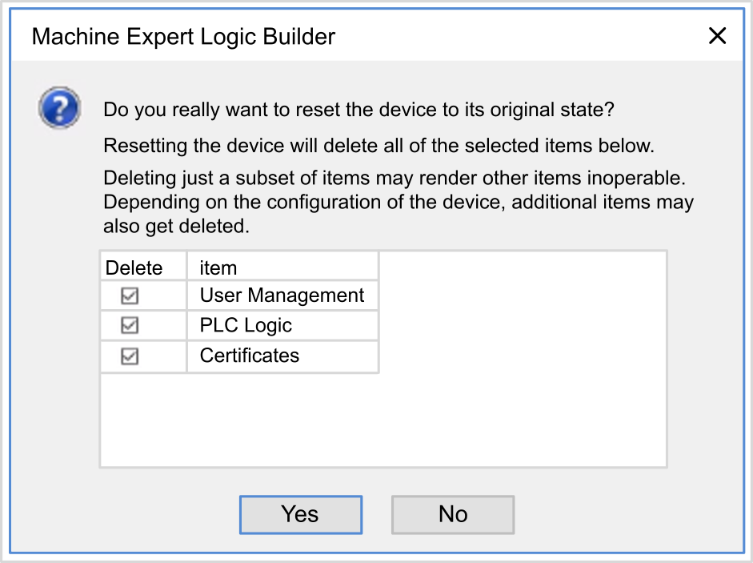

# Commanding State Transitions

## Run Command

Effect: Commands a transition to the RUNNING controller state.

Starting Conditions: BOOTING or STOPPED state.

Methods for Issuing a Run Command:

* Refer to [Run/Stop Input](D-RU-0004567.html#D-RU-0004567__D-RU-0004567.8) for more information.
* Software Online menu: Select the Start command.
* RUN command from Web server.
* By an external call via Modbus request using the PLC\_W.q\_wPLCControl and PLC\_W.q\_uiOpenPLCControl system variables of the [M262 System library](../../../../../api/crossBook?lang=en-US&virtualBookName=m262sys&topicID=D_SE_0002619).
* Login with online change option: An online change (partial download) initiated while the controller is in the RUNNING state returns the controller to the RUNNING state if successful.
* Multiple Download Command: sets the controllers into the RUNNING state if the Start all applications after download or online change option is selected, irrespective of whether the targeted controllers were initially in the RUNNING, STOPPED or EMPTY state.
* The controller is restarted into the RUNNING state automatically under certain conditions.

Refer to [Controller State Diagram](D-SE-0033981.html#D-SE-0033981) for further details.

## Stop Command

Effect: Commands a transition to the STOPPED controller state.

Starting Conditions: BOOTING, EMPTY, or RUNNING state.

Methods for Issuing a Stop Command:

* Run/Stop Input: If configured, command a value of 0 to the Run/Stop input. Refer to [Run/Stop Input](D-RU-0004567.html#D-RU-0004567__D-RU-0004567.8) for more information.
* Software Online menu: Select the Stop command.
* STOP command from Web server
* By an internal call by the application or an external call via Modbus request using the PLC\_W. q\_wPLCControl and PLC\_W. q\_uiOpenPLCControl system variables of the [M262 System library](../../../../../api/crossBook?lang=en-US&virtualBookName=m262sys&topicID=D_SE_0002619).
* Login with online change option: An online change (partial download) initiated while the controller is in the STOPPED state returns the controller to the STOPPED state if successful.
* Download Command: implicitly sets the controller into the STOPPED state.
* Multiple Download Command: sets the controllers into the STOPPED state if the Start all applications after download or online change option is not selected, irrespective of whether the targeted controllers were initially in the RUNNING, STOPPED or EMPTY state.
* REBOOT by Script: The file transfer script on an SD card can issue a REBOOT as its final command. The controller is rebooted into the STOPPED state provided the other conditions of the boot sequence allow this to occur. Refer to [Reboot](#D-SE-0008848__D-SE-0008848.9) for further details.
* The controller is restarted into the STOPPED state automatically under certain conditions.

Refer to [Controller State Diagram](D-SE-0033981.html#D-SE-0033981) for further details.

## Reset Warm

Effect: Resets the variables, except for the remanent variables, to their default values. Places the controller into the STOPPED state.

Starting Conditions: RUNNING, STOPPED, or HALT states.

Methods for Issuing a Reset Warm Command:

* Software Online menu: Select the Reset warm command.
* By an internal call by the application or an external call via Modbus request using the PLC\_W. q\_wPLCControl and PLC\_W. q\_uiOpenPLCControl system variables of the [M262 System library](../../../../../api/crossBook?lang=en-US&virtualBookName=m262sys&topicID=D_SE_0002619).

Effects of the Reset Warm Command:

1. The application stops.
2. Forcing is erased.
3. Diagnostic indications for errors are reset.
4. The values of the retain variables are maintained.
5. The values of the retain-persistent variables are maintained.
6. The non-located and non-remanent variables are reset to their initialization values.
7. The values of the 0...59999 `%MW` registers are reset to 0.
8. The fieldbus communications are stopped and then restarted after the reset is complete.
9. The inputs are reset to their initialization values. The outputs are reset to their software initialization values or their default values if no software initialization values are defined.
10. The Post Configuration file is [read](D-SE-0010304.html#D-SE-0010304).

For details on variables, refer to [Remanent Variables](D-SE-0008846.html#D-SE-0008846).

## Reset Cold

Effect: Resets the variables, except for the retain-persistent type of remanent variables, to their initialization values. Places the controller into the STOPPED state.

Starting Conditions: RUNNING, STOPPED, or HALT states.

Methods for Issuing a Reset Cold Command:

* Software Online menu: Select the Reset cold command.
* By an internal call by the application or an external call via Modbus request using the PLC\_W. q\_wPLCControl and PLC\_W. q\_uiOpenPLCControl system variables of the [M262 System library](../../../../../api/crossBook?lang=en-US&virtualBookName=m262sys&topicID=D_SE_0002619).

Effects of the Reset Cold Command:

1. The application stops.
2. Forcing is erased.
3. Diagnostic indications for errors are reset.
4. The values of the retain variables are reset to their initialization value.
5. The values of the retain-persistent variables are maintained.
6. The non-located and non-remanent variables are reset to their initialization values.
7. The values of `%MW0` to `%MW59999` registers are reset to 0.
8. The fieldbus communications are stopped and then restarted after the reset is complete.
9. The inputs are reset to their initialization values. The outputs are reset to their software initialization values or their default values if no software initialization values are defined.
10. The Post Configuration file is [read](D-SE-0010304.html#D-SE-0010304).

For details on variables, refer to [Remanent Variables](D-SE-0008846.html#D-SE-0008846).

## Reset Origin

Effect: Resets all variables, including the remanent variables, to their initialization values. Erases all user files on the controller, including user rights and certificates. Reboots and places the controller into the EMPTY state.

Starting Conditions: RUNNING, STOPPED, or HALT states.

Methods for Issuing a Reset Origin Command:

* Software Online menu: Select the Reset origin command.

Effects of the Reset Origin Command:

1. The application stops.
2. Forcing is erased.
3. The WebVisualisation files are erased.
4. The user files (Boot application, Post Configuration, App, App/MFW, Cfg) are erased, except CodesysLateConf.cfg.
5. Diagnostic indications for errors are reset.
6. Nodename of the controller is reset to the default value.
7. The values of the retain variables are reset.
8. The values of the retain-persistent variables are reset.
9. The non-located and non-remanent variables are reset.
10. The fieldbus communications are stopped.
11. The other inputs are reset to their initialization values.

    The other outputs are reset to their hardware initialization values.

    Security certificates are erased.
12. The controller reboots.
13. FwLog.txt is maintained and all other System Log files are erased.

For details on variables, refer to [Remanent Variables](D-SE-0008846.html#D-SE-0008846).

## Reset Origin Device

Effect: Resets all variables, including the remanent variables, to their initialization values. Places the controller into the EMPTY state if PLC Logic is selected.

Starting Conditions: RUNNING, STOPPED, or HALT states.

Methods for Issuing a Reset Origin Device Command:

* In the software: Right-click My controller > Reset Origin Device command. **Result:** a dialog box allows you to select the items to remove:

  + User Management
  + PLC Logic
  + Certificates

  

When User Management is selected, user and groups are reset to default value.

NOTE: If the controller User rights are disabled before this command is used, you can connect to the controller without login prompt afterwards. Use the dedicated command in Online menu: Security > Reset user rights management to default to enforce again the use of user management.

When PLC Logic is selected:

1. The application stops.
2. Forcing is erased.
3. The WebVisualisation files are erased.
4. Diagnostic indications for errors are reset.
5. The values of the retain variables are reset.
6. The values of the retain-persistent variables are reset.
7. The non-located and non-remanent variables are reset.
8. The fieldbus communications are stopped.
9. Embedded Expert I/O are reset to their previous user-configured default values.
10. The other inputs are reset to their initialization values.

    The other outputs are reset to their hardware initialization values.
11. System Logs are maintained.

When Certificates is selected:

* Certificate used for encrypted communication is reset.
* Certificates used for Web server, FTP server and OPC UA server/client are not reset.

For details on variables, refer to [Remanent Variables](D-SE-0008846.html#D-SE-0008846).

## Reboot

Effect: Commands a reboot of the controller.

Starting Conditions: Any state.

Methods for Issuing the Reboot Command:

* Power cycle
* REBOOT by Script

Effects of the Reboot:

1. The state of the controller depends on a number of conditions:

   1. The controller state is RUNNING if:

      The Reboot was provoked by a power cycle and:

      - the Starting Mode is set to Start in run, and if the Run/Stop input is not configured, and if the controller was not in HALT state before the power cycle, and if the remanent variables are valid.

      - the Starting Mode is set to Start in run, and if the Run/Stop input is configured and set to RUN, and if the controller was not in HALT state before the power cycle, and if the remanent variables are valid.

      - the Starting Mode is set to Start as previous state, and Controller state was RUNNING before the power cycle, and if the Run/Stop input is not configured and the boot application has not changed and the remanent variables are valid.

      - the Starting Mode is set to Start as previous state, and Controller state was RUNNING before the power cycle, and if the Run/Stop input is configured and is set to RUN and the remanent variables are valid.

      The Reboot was provoked by a script and:

      - the Starting Mode is set to Start in run, and if the Run/Stop input is configured and set to RUN, or the switch is set to RUN, and if the controller was not in HALT state before the power cycle, and if the remanent variables are valid.
   2. The controller state is STOPPED if:

      The Reboot was provoked by a power cycle and:

      - the Starting Mode is set to Start in stop.

      - the Starting Mode is set to Start as previous state and the controller state was not RUNNING before the power cycle.

      - the Starting Mode is set to Start as previous state and the controller state was RUNNING before the power cycle, and if the Run/Stop input is not configured, and if the boot application has changed.

      - the Starting Mode is set to Start as previous state and the controller state was RUNNING before the power cycle, and if the Run/Stop input is not configured, and if the boot application has not changed, and if the remanent variables are not valid.

      - the Starting Mode is set to Start as previous state and the controller state was RUNNING before the power cycle, and if the Run/Stop input is configured and is set to STOP.

      - the Starting Mode is set to Start in run and if the controller state was HALT before the power cycle.

      - the Starting Mode is set to Start in run, and if the controller state was not HALT before the power cycle, and if the Run/Stop input is configured and is set to STOP.

      - the Starting Mode is set to Start as previous state, and if the Run/Stop input is configured and set to RUN, or the switch is set to RUN, and if the controller was not in HALT state before the power cycle.

      - the Starting Mode is set to Start as previous state, and if the Run/Stop input is configured and set to RUN, or the switch is set to RUN,HALT state before the power cycle.
   3. The controller state is EMPTY if:

      - There is no boot application or the boot application is invalid, or

      - The reboot was provoked by specific System Errors.
   4. The controller state is INVALID\_OS if there is no valid firmware.
2. Forcing is maintained if the boot application is loaded successfully. If not, forcing is erased.
3. Diagnostic indications for errors are reset.
4. The values of the retain variables are restored if saved context is valid.
5. The values of the retain-persistent variables are restored if saved context is valid.
6. The non-located and non-remanent variables are reset to their initialization values.
7. The values of `%MW0` to `%MW59999` registers are reset to 0.
8. The fieldbus communications are stopped and restarted after the boot application is loaded successfully.
9. The inputs are reset to their initialization values. The outputs are reset to their hardware initialization values and then to their software initialization values or their default values if no software initialization values are defined.
10. The Post Configuration file is [read](D-SE-0010304.html#D-SE-0010304).
11. The controller file system is initialized and its resources (sockets, file handles, and so on) are deallocated.

    The performance of the boot-up time of the controller depends on the number of files stored in its file system. Reducing their number as much as possible allows you to obtain better performance.

    The file system employed by the controller needs to be periodically re-established by a power cycle of the controller. If you do not perform regular maintenance of your machine, or if you are using an Uninterruptible Power Supply (UPS), you must force a power cycle (removal and reapplication of power) to the controller at least once a year.

    | NOTICE | |
    | --- | --- |
    |  | DEGRADATION OF PERFORMANCE  Reboot your controller at least once a year by removing and then reapplying power.  Failure to follow these instructions can result in equipment damage. |

For details on variables, refer to [Remanent Variables](D-SE-0008846.html#D-SE-0008846).

NOTE: The Check context test concludes that the context is valid when the application and the remanent variables are the same as defined in the Boot application.

NOTE: If you provide power to the Run/Stop input from the same source as the controller, the loss of power to this input is detected immediately, and the controller behaves as if a STOP command was received. Therefore, if you provide power to the controller and the Run/Stop input from the same source, your controller reboots normally into the STOPPED state after a power interruption when Starting Mode is set to Start as previous state.

NOTE: If you make an online change to your application program while your controller is in the RUNNING or STOPPED state but do not manually update your Boot application, the controller detects a difference in context at the next reboot, the remanent variables are reset as per a Reset cold command, and the controller enters the STOPPED state.

## Download Application

Effect: Loads your application executable into the RAM memory. Optionally, creates a Boot application in the non-volatile memory.

Starting Conditions: RUNNING, STOPPED, HALT, and EMPTY states.

Methods for Issuing the Download Application Command:

* In the software: 2 options exist for downloading a full application:

  + Download command.
  + Multiple Download command.

  For important information on the application download commands, refer to [Controller State Diagram](D-SE-0033981.html).
* FTP: Load Boot application file to the non-volatile memory using FTP. The updated file is applied at the next reboot.
* SD card: Load Boot application file using an SD card in the controller. The updated file is applied at the next reboot. Refer to File Transfer with SD Card for further details.

Effects of the Download Command:

1. The existing application stops and then is erased.
2. If valid, the new application is loaded and the controller assumes a STOPPED state.
3. Forcing is erased.
4. Diagnostic indications for errors are reset.
5. The values of the retain variables are reset to their initialization values.
6. The values of any existing retain-persistent variables are maintained.
7. The non-located and non-remanent variables are reset to their initialization values.
8. The values of `%MW0` to `%MW59999` registers are reset to 0.
9. The fieldbus communications are stopped and then the configured fieldbus of the new application is started after the download is complete.
10. Embedded Expert I/O are reset to their previous user-configured default values and then set to the new user-configured default values after the download is complete.
11. The inputs are reset to their initialization values. The outputs are reset to their hardware initialization values and then to their software initialization values or their default values if no software initialization values are defined, after the download is complete.
12. The Post Configuration file is [read](D-SE-0010304.html#D-SE-0010304).

For details on variables, refer to [Remanent Variables](D-SE-0008846.html#D-SE-0008846).

Effects of the FTP or SD Card Download Command:

There are no effects until the next reboot. At the next reboot, the effects are the same as a reboot with an invalid context. Refer to [Reboot](#D-SE-0008848__D-SE-0008848.9).

EIO0000003651.14