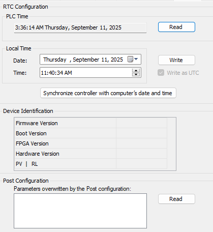

# Services

## Services Tab

The Services tab is divided in three parts:

* RTC Configuration
* Device Identification
* Post Configuration

The figure below shows the Services tab:

NOTE: To have controller information, you must be connected to the controller.

NOTE: RTC information can be configured by Web server or using the SysTimeRtcSet function block. For more information, refer to the Modicon M262 Logic/Motion Controller, System Functions and Variables, System Library Guide.

| Element | | Description |
| --- | --- | --- |
| RTC Configuration | PLC Time | Displays the date and time read from the controller when you click the Read button. This read-only field is initially empty. PLC Time is returned in controller local time. The timezone of the controller can be found with the Web server. |
| Read | Reads the date and time from the controller and displays them in the PLC Time field without any conversion. |
| Local Time | Defines a date and time that are sent to the controller when you click the Write button. If necessary, modify the default values before clicking the Write button. A message box informs you about the result of the command. The date and time fields are initially filled with the computer date and time. |
| Write | Writes to the controller the date and time of the Local time fields. The values are converted to UTC format before being written. |
| Synchronize controller with computer’s date/time | Writes to the controller the date and time of the computer. The values are converted to UTC format before being written. |
| Device Identification | Firmware Version | Displays the Firmware Version of the selected controller, if connected. |
| Boot Version | Displays the Boot Version of the selected controller, if connected. |
| FPGA Version | Displays the FPGA Version of the selected controller, if connected. |
| Hardware Version | Displays the Hardware Version of the selected controller, if connected. |
| PV | RL | Displays the Product Version (PV) and the Release Level (RL) of the selected controller, if connected. |
| Post Configuration | | Displays the application parameters overwritten by the [Post configuration](D-SE-0010304.html#D-SE-0010304). |

EIO0000003651.14