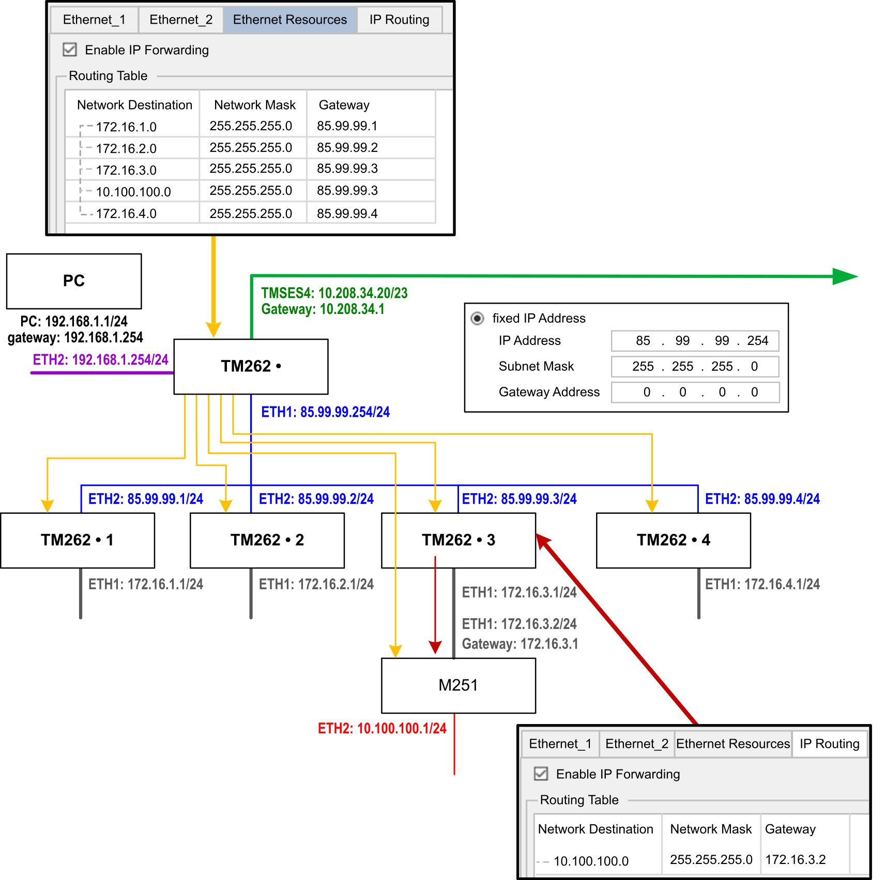
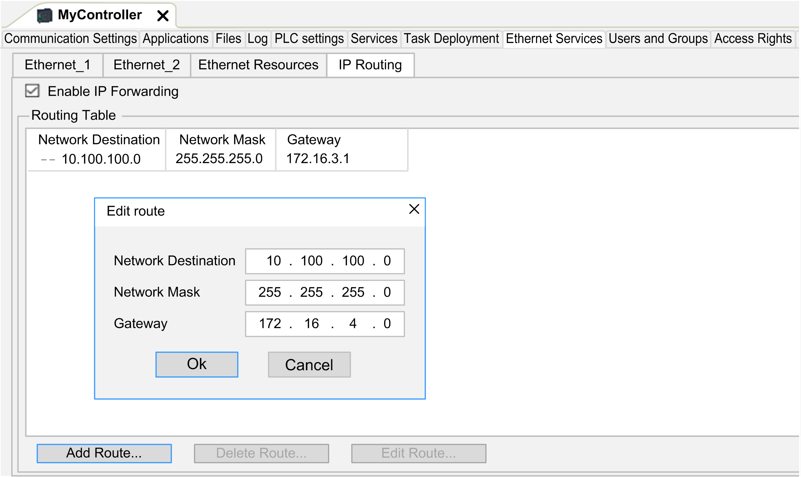
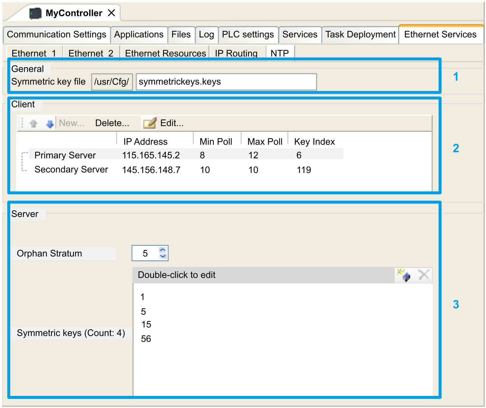

# Ethernet Services

## Presentation

This tab displays the list of Ethernet or Sercos devices which are configured to be controlled by Modicon M262 Logic/Motion Controller.

* Ethernet\_1
* Ethernet\_2
* Ethernet Resources
* IP Routing
* NTP

## Ethernet\_1 and Ethernet\_2 Toolbar

The following table describes the toolbar:

| Element | Description |
| --- | --- |
| Generate IP address | Allows you to generate the configurations of each device configured in the Devices tree. |
| Filter Options | Allows you to display more information on the configured devices. |
| Discover devices | Start the Machine Assistant which allows you to discover and to configure the devices. |

## Network Settings

To view the configuration of a device, click the tab above the toolbar. The following information displays:

* IP Address
* Subnet Mask
* Gateway
* Subnet Address

## Configured Devices in the Project

| Element | Description | Restriction |
| --- | --- | --- |
| Device Name | Name of the device from the Devices tree.  Click the device name to access the device configuration. | Cannot be edited. |
| Device Type | Type of the device. | Cannot be edited. |
| IP Address | IP Address of the device.  Can be left blank for Sercos devices. | – |
| MAC Address | MAC address of the target device.  Can be left blank for Sercos devices. | Can be edited if IP Address by BOOTP selected in the configuration of the device. |
| DHCP Device Name | Hostname of the target device | Can be edited if IP Address by DHCP selected in the configuration of the device. |
| Subnet Mask | Subnet mask of the device | Visible if Expert Mode selected in Filter Options. |
| Gateway Address | Gateway address of the device | Visible if Expert Mode selected in Filter Options. |
| Identified by | Four identification modes are possible:   * None * Fixed * BOOTP * DHCP | – |
| Protocol | Protocol used | Cannot be edited. |
| Identifier | Identifier of the device | Can be edited for Sercos device. |
| Identification Mode | Identification mode of the device | Can be edited for Sercos device. |
| Operating Mode | Three operating modes are possible:   * Activated * Simulated * Optional | Can be edited for Sercos device. |

## Ethernet Resources

The Ethernet Resources subtab:

* Displays the number of configured connections and channels.
* Displays the number of input words.
* Displays the number of output words.
* Displays the scanner load.

## IP Routing

The IP Routing subtab allows you to configure the IP routes in the controller. The Modicon M262 Logic/Motion Controller can support up to 30 IP routes.

The parameter Enable IP forwarding allows you to deactivate the IP forwarding service of the controller. When deactivated, the communication is not routed from a network to another one. The devices on the device network are no longer accessible from the control network and related features like Web pages access on device or commissioning of device via DTM, EcoStruxure Machine Expert - Safety and so on are not possible.

The Modicon M262 Logic/Motion Controller can have up to three Ethernet interfaces. Using a routing table is necessary to communicate with remote networks connected to different Ethernet interfaces. The gateway is the IP address used to connect to the remote network, which needs to be in local network of the controller.

This graphic depicts an example network, in which the last two rows of devices (gray and red) need to be added in the routing table:



Use the routing tables to manage the IP forwarding.

To add a route, double click My controller  then click Ethernet Services  > IP Routing  > Add Route.



For reasons of network security, TCP/IP forwarding is disabled by default. Therefore, you must manually enable TCP/IP forwarding if you want to access devices through the controller. However, doing so may expose your network to possible cyberattacks if you do not take additional measures to protect your enterprise. In addition, you may be subject to laws and regulations concerning cybersecurity.

| WARNING | |
| --- | --- |
|  | UNAUTHENTICATED ACCESS AND SUBSEQUENT NETWORK INTRUSION  * Observe and respect any an all pertinent national, regional and local cybersecurity and/or personal data laws and regulations when enabling TCP/IP forwarding on an industrial network. * Isolate your industrial network from other networks inside your company. * Protect any network against unintended access by using firewalls, VPN, or other, proven security measures.  Failure to follow these instructions can result in death, serious injury, or equipment damage. |

## NTP

The NTP Protocol synchronizes the clock of device and resists the effects of variable latency (jitter).

The NTP subtab is divided in three parts:

* General (1)
* Client (2)
* Server (3)

The figure below shows the NTP subtab:



General section

| Element | | Description |
| --- | --- | --- |
| /usr/Cfg\* | | Folder to which the trusted key file is to be uploaded. Not editable. |
| Empty\* | | File name of the Symmetric keys file. Editable. Can be left empty if no key index is defined.   * Maximum length: 22 characters * File extension: .keys * Allowed characters: a...z, A...Z, 0...9, -, \_   NOTE: You must enter a valid file name or leave the field empty.  NOTE: The only authentication method for the key algorithm is MD5 for NTP. |

**Client section**

You can define a maximum of two servers: Primary Server and Secondary Server. You must specify the following information for each server defined:

| Element | | Description | Value | Constraint | | |
| --- | --- | --- | --- | --- | --- | --- |
| IP Address | | The server IP Address. | Default value: 0.0.0.0 | * The address must be used by another server * First byte must be between 1 and 223 * Loopback address is forbidden | | |
| Min Poll | | The minimum poll value. | Default value: 6  Value range: 3...17 (1) | Minimum poll value must be inferior to maximum poll value. | | |
| Max Poll | | The maximum poll value. | Default value: 10  Value range: 3...17 (1) | Maximum poll value must be superior to minimum poll value. | | |
| Key Index | | The key index value. | Default value: 0  Value range: 0...65535 | 0 means “no key index”. | | |
| **(1)**: 3 corresponds to 8 seconds (23), 17 corresponds to 131072 seconds (217). | | | | | | |

Server section

| Element | | Description | Value | Constraint | | | |
| --- | --- | --- | --- | --- | --- | --- | --- |
| Enable NTP Server | | Allows you to enable/disable the NTP Server. | Checked/unchecked | You must define stratum for orphan mode or NTP Client Primary Server if NTP Server is enabled. | | | |
| Orphan Stratum | | The orphan stratum level. | Default value: 0  Value range: 0...15 | 0 means: no Orphan Stratum. See [Orphan Stratum](#D-SE-0081018__OrphanStratum-28840034). | | | |
| Symmetric Keys | | The list of key indexes. | Value range: 1...65535 | Maximum of 32 key indexes, including Primary Server and Secondary Server key indexes. | | | |

NOTE: If you are using the default NTPv3 server of Microsoft Windows, the following configuration should be done on the server: [Configuring Systems for High Accuracy](https://docs.microsoft.com/en-us/windows-server/networking/windows-time-service/configuring-systems-for-high-accuracy).

## Orphan Stratum

NTP uses a hierarchical system where each level is called a stratum. These levels are assigned a number starting at 0 for the reference at the top level.

When the controller is both client and server, the stratum is calculated automatically from the NTP server it is connected to. When the Orphan Stratum is 0, if the NTP server used by the controller becomes unreachable, the controller indicates to its NTP client that its clock is not synchronized. Otherwise, the value selected is used.

If the controller is only configured as NTP server, it will use the selected value in Orphan Stratum. You should select an appropriate stratum value according to the NTP hierarchy of your architecture.

## NTP Keys File Syntax Usage

* NTP keys file only supports MD5 hash algorithm.
* The keys file must not have a header.
* No spaces allowed at the beginning line of a key.
* If you insert a comment at the end of a key line, you must add two spaces between the end of the key and the beginning of the comment.

Key file syntax:

```
<key_id> MD5 <password>  #<comment>
```

Examples:

```
1 MD5 key_1MD5  # MD5 hash algorithm
```

```
14 MD5 serverPassword  # MD5 hash algorithm
```

```
25 MD5 test25Keys  # MD5 key comment
```

## NTP Diagnostics

The NTP feature for the Modicon M262 Logic/Motion Controller incorporates diagnostic events, which are represented by three bits within the PLC\_GVL.PLC\_R.i\_lwSystemFault\_1 system variable:

* Bit 23 (NTP Error Detected): This bit is set to zero upon detecting an error during the initialization of the controller as an NTP server or client.
* Bit 25 (NTP Primary Server Error Detected): Indicates the availability status of the primary NTP server for time synchronization. It is set to zero when the primary server is unreachable.
* Bit 26 (NTP Secondary Server Error Detected): Indicates the availability status of the secondary NTP server for time synchronization. It is set to zero when the secondary server is unreachable.

These error indications can be viewed in the Web server under the [Diagnostics: Controller Submenu](../../../../../api/crossBook?lang=en-US&virtualBookName=DiagnosticMenu-6CE5F84F.html#DiagnosticMenu-6CE5F84F__D-SE-0002960.13), Status > System Fault 1. The message logger can provide more information on the detected error: refer to [Controller Read-Only System Variables](../../m262sys&topicID=D_SE_0004809).

NOTE: Delays in updating the error bits 25 and 26 may occur under the following conditions:

* Transition from 1 (Server Reachable) to 0 (Server Unreachable) is subject to the minimum and maximum poll settings. Typically, this transition takes an average time ranging from 8 times the minimum poll duration to 8 times the maximum poll duration.
* Transition from 0 (Server Unreachable) to 1 (Server Reachable) occurs, on average, within 5 to 10 minutes when the server is being initialized, for example, during server reboot or initial setup.

EIO0000003651.14