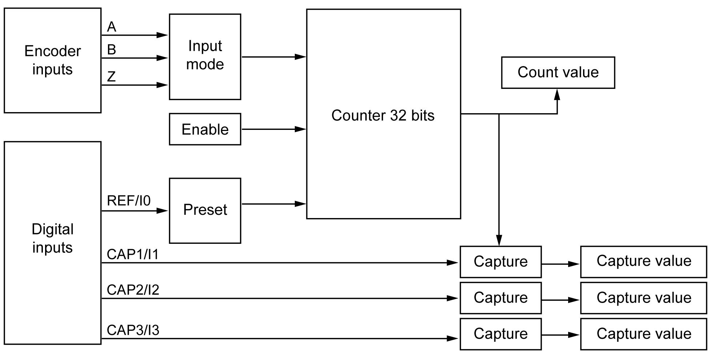
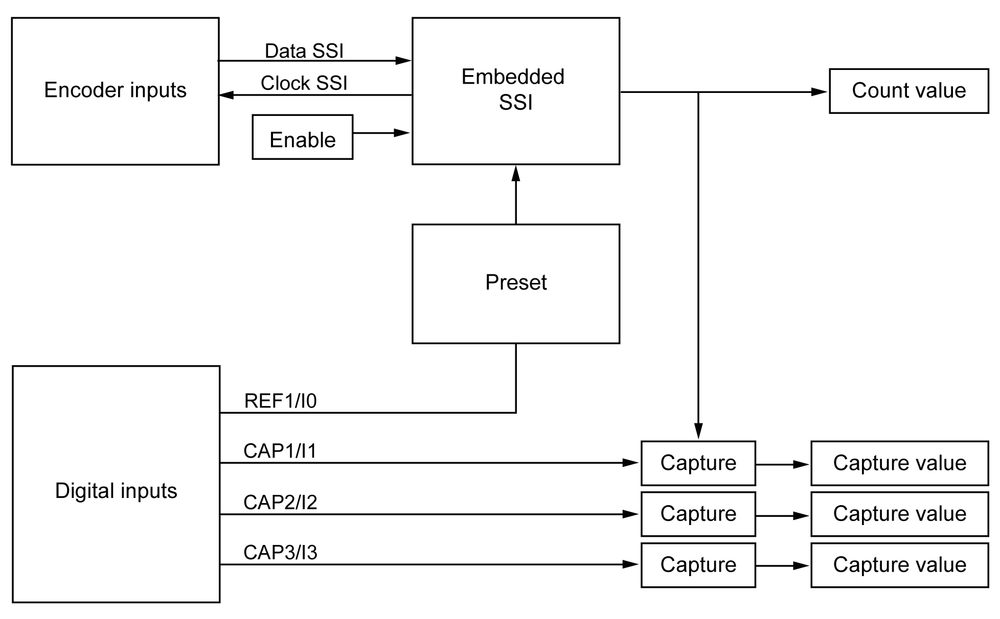

# Hardware Encoder Interface

## Introduction

The controller has a specific hardware encoder interface that can support:

* Incremental encoder
* SSI absolute encoder

## Incremental Mode Principle Description

The incremental mode behaves like a standard up/down counter, using pulses and counting these pulses.

Positions must be preset and counting must be initialized to implement and manage the incremental mode.

The counter value can be stored in the capture register by configuring an external event.

## Incremental Mode Principle Diagram

The following diagram provides an overview of the encoder in incremental mode:

## SSI Mode Principle Description

The SSI (Synchronous Serial Interface) mode allows the connection of an absolute encoder.

The position of the absolute encoder is read by an SSI link.

## SSI Mode Principle Diagram

The following diagram provides an overview of the encoder in SSI mode:

## I/O mapping

This variable is used by the library to identify the encoder, incremental or SSI, to which the function block applies.

EIO0000003651.14