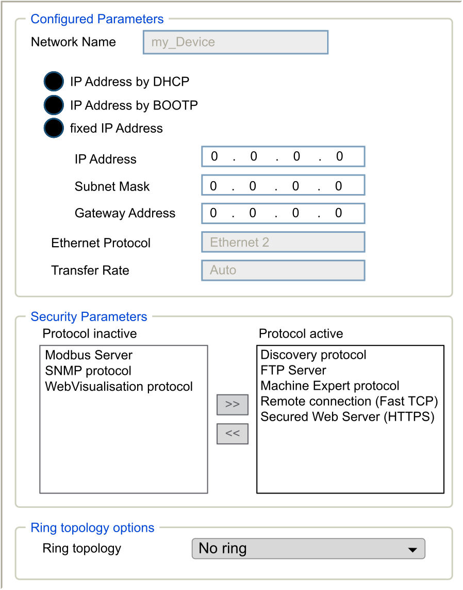

# IP Address Configuration

## Introduction

There are different ways to assign the IP address to the added Ethernet interface of the controller:

* Address assignment by DHCP server based on the Network Name of the Ethernet interface
* Address assignment by BOOTP server based on the MAC address of the Ethernet interface
* Fixed IP address
* [Post configuration file](D-SE-0010304.html#D-SE-0010304). If a post configuration file exists, this assignment method has priority over the others.

The IP address can also be changed dynamically through the:

* [Communication Settings tab](D-SE-0081732.html#D-SE-0081732)
* changeIPAddress [function block](D-SE-0037016.html#D-SE-0037016)

NOTE: If the attempted addressing method is unsuccessful, the link uses a [default IP address](#D-SE-0003075__D-SE-0003075.5) derived from the MAC address.

Carefully manage the IP addresses because each device on the network requires a unique address. Having multiple devices with the same IP address can cause unintended operation of your network and associated equipment.

| WARNING | |
| --- | --- |
|  | UNINTENDED EQUIPMENT OPERATION  * Verify that there is only one master controller configured on the network or remote link. * Verify that all devices have unique addresses. * Obtain your IP address from your system administrator. * Confirm that the IP address of the device is unique before placing the system into service. * Do not assign the same IP address to any other equipment on the network. * Update the IP address after cloning any application that includes Ethernet communications to a unique address.  Failure to follow these instructions can result in death, serious injury, or equipment damage. |

NOTE: Verify that your system administrator maintains a record of assigned IP addresses on the network and subnetwork, and inform the system administrator of any configuration changes performed.

## Address Management

This diagram shows the different types of address systems for the controller:

NOTE: If a device programmed to use the DHCP or BOOTP addressing methods is unable to contact its respective server, the controller uses the default IP address. It repeats its request constantly.

The IP process restarts in the following cases:

* Controller reboot
* Ethernet cable reconnection
* Application download (if IP parameters change)
* DHCP or BOOTP server detected after a prior addressing attempt was unsuccessful.

## Ethernet Configuration

In the Devices tree, double-click Ethernet\_1 or Ethernet\_2:

NOTE:

* If you are in offline mode, you see the Configured Parameters window and, for Ethernet\_2 the Ring topology options window. You can edit them.
* If you are in online mode, you see the Configured Parameters and Current Settings windows. You cannot edit them.

This table describes the configured parameters:

| Configured Parameters | | Description |
| --- | --- | --- |
| Interface Name | | Name of the network link. Visible in online mode. |
| Network Name | | Used as device name to retrieve IP address through DHCP, maximum 15 characters.  NOTE: The network name modification is applied at next power ON. |
| IP Address by DHCP | | IP address is obtained by DHCP server. |
| IP Address by BOOTP | | IP address is obtained by BOOTP server.  MAC address is located on the front of the controller. |
| Fixed IP Address | | IP address, Subnet Mask, and Gateway Address are defined by the user. |
| Ethernet Protocol | | Protocol type used: Ethernet 2 |
| Transfer Rate | | Speed and Duplex are in auto-negotiation mode. |

## Default IP Address

The default IP addresses are:

* 10.10.x.y. for Ethernet\_1
* 10.11.x.y. for Ethernet\_2

When TM262• is not configured, TMSES4 boots and automatically gets its default IP address:

* 10.12.x.z for the first module
* 10.13.x.z for the second module
* 10.14.x.z for the third module

x represents the 5th and y or z represent the 6th bytes of interface MAC address. For example, with a MAC address of 00:80:F4:4E:02:5D, the IP address will be 10.12.2.93

NOTE: The IP addresses must not be in the same IP network.

The MAC address of the Ethernet port can be retrieved on the label placed on the front side of the controller. The MAC address of the TMSES4 port can be calculated with the controller MAC address port Ethernet\_2.

NOTE: For EcoStruxure Machine Expert versions prior to V1.2.4, the MAC address is determined by the value on the left side of the controller. See the [Compatibility and Migration User Guide](../../../../../api/crossBook?lang=en-US&virtualBookName=CompMigr&topicID=D_SE_0094606).

The default subnet masks are:

* 255.255.0.0 for Ethernet\_1
* 255.255.0.0 for Ethernet\_2

NOTE: A MAC address is written in hexadecimal format and an IP address in decimal format. Convert the MAC address to decimal format.

Example of conversion:

| Port | MAC address | IP address |
| --- | --- | --- |
| Ethernet\_1 | **MAC@Eth1**:00.80.F4.4E.24.10 | 10.10.36.16 |
| Ethernet\_2 | **MAC@Eth2**:00.80.F4.4E.24.0B | 10.11.36.11 |
| TMS\_1 | **MAC@TMS**:00.80.F4.50.24.0B | 10.12.36.11 |
| TMS\_2 | **MAC@TMS**:00.80.F4.50.24.0C | 10.13.36.12 |
| TMS\_3 | **MAC@TMS**:00.80.F4.50.24.0D | 10.14.36.13 |

NOTE: The TMSES4 MAC address is calculated as follows: *MAC@TMS\_x = MAC@Ethernet2 + 0x20000 + (x-1)*.

## Prohibited IP Addresses

USB Network address (192.168.200.0) and TMS Network address (192.168.2.0) are prohibited.

## Subnet Mask

The subnet mask is used to address several physical networks with a single network address. The mask is used to separate the subnetwork and the device address in the host ID.

The subnet address is obtained by retaining the bits of the IP address that correspond to the positions of the mask containing 1, and replacing the others with 0.

Conversely, the subnet address of the host device is obtained by retaining the bits of the IP address that correspond to the positions of the mask containing 0, and replacing the others with 1.

Example of a subnet address:

|  |  |  |  |  |
| --- | --- | --- | --- | --- |
| IP address | 192 (11000000) | 1 (00000001) | 17 (00010001) | 11 (00001011) |
| Subnet mask | 255 (11111111) | 255 (11111111) | 240 (11110000) | 0 (00000000) |
| Subnet address | 192 (11000000) | 1 (00000001) | 16 (00010000) | 0 (00000000) |

NOTE: The device can communicate only on its subnetwork when there is no gateway.

## Gateway Address

The gateway allows a message to be routed to a device that is not on the same network.

If there is no gateway, the gateway address is 0.0.0.0.

The default gateway address can be defined on any interface. You can only configure the default gateway on one interface. The traffic to unknown networks is sent through this interface. Please refer to [IP Routing](D-SE-0081018.html#D-SE-0081018__D-SE-0081018.6) if you need to configure more than one interface.

## Security Parameters

This table describes the different security parameters:

| Security Parameters | Description | Default settings |
| --- | --- | --- |
| Discovery protocol | This parameter activates/deactivates Discovery protocol. When deactivated, Discovery requests are ignored. | Active |
| FTP Server | This parameter activates/deactivates the FTP server of the controller. When deactivated, FTP requests are ignored. | Active |
| CoDeSys protocol | This parameter activates/deactivates the CoDeSys protocol on Ethernet interfaces. When deactivated, any programming software request is rejected. Therefore, no connection is possible on Ethernet from a programming PC, from an HMI target that wants to exchange variables with this controller, from an OPC server, or from Controller Assistant. | Active |
| Modbus Server | This parameter activates/deactivates the Modbus server of the controller. When deactivated, any Modbus request to the controller is ignored. | Inactive |
| Remote connection (Fast TCP) | This parameter activates/deactivates the remote connection. When deactivated, Fast TCP requests are ignored. | Active |
| Secured Web Server (HTTPS) | This parameter activates/deactivates the secured Web server of the controller. When deactivated, HTTPS requests to the controller secured Web server are ignored. | Active |
| SNMP protocol | This parameter activates/deactivates the SNMP server of the controller. When deactivated, SNMP requests are ignored. | Inactive |
| WebVisualisation protocol | This parameter activates/deactivates the WebVisualisation pages of the controller. When deactivated, HTTP requests to the controller WebVisualisation protocol are ignored. | Inactive |

## Ring Topology Options

This parameter is only available on the Ethernet\_2 network.

This table describes the Ring topology options:

| Options | Description |
| --- | --- |
| No ring | If selected, verify that no ring is wired. |
| Root | First device of the ring topology. |
| Participant | One of the devices in the ring topology. |

Each device in the ring topology must support the Rapid Spanning Tree Protocol (RSTP).

You can have up to 40 devices in the ring topology.

NOTE: For a network topology that has RSTP enabled, verify that the RPI/timeout combination respects the minimum convergence time of 100 ms that is required for RSTP.

EIO0000003651.14