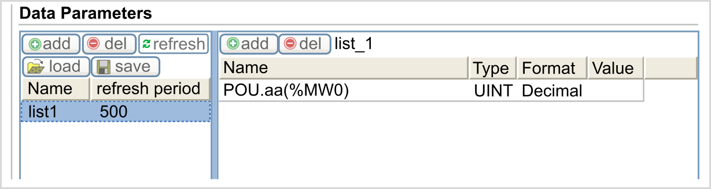
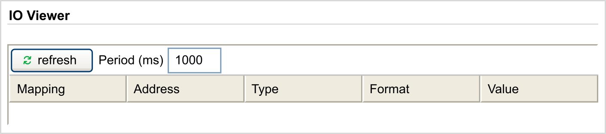
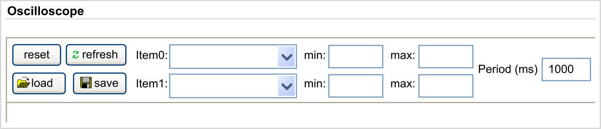

# Monitoring Menu

## Monitoring: Data Parameters

**Monitoring Web Server Variables**

To monitor Web server variables, you must select the variables in the [Symbol Configuration Editor](D-SE-0095055.html#D-SE-0095055).

**Monitoring: Data Parameters Submenu**

The Data Parameters submenu allows you to display and modify variable values:

| Element | Description |
| --- | --- |
| Add | Adds a list description or a variable |
| Del | Deletes a list description or a variable |
| Refresh period | Refreshing period of the variables contained in the list description (in ms) |
| Refresh | Enables I/O refreshing:   * Gray button: refreshing disabled * Orange button: refreshing enabled   NOTE: Without enabling Refresh, when a variable's value is changed in the table the modification is directly sent to the controller. |
| Load | Loads saved lists from the controller internal Flash to the Web server page |
| Save | Saves the selected list description in the controller (*/usr/web* directory) |

NOTE: The IEC objects (`%MX`, `%IX`, `%QX`) are not directly accessible. To access IEC objects you must first group their contents in located registers (refer to [Relocation Table](D-SE-0004337.html#D-SE-0004337)).

## Monitoring: IO Viewer Submenu

You must add the I/Os in the Symbol Configuration Editor to get them visible in the IO Viewer. Refer to [Symbol Configuration Editor](D-SE-0095055.html#D-SE-0095055).

The IO Viewer submenu allows you to display the I/O values:

| Element | Description |
| --- | --- |
| Refresh | Enables I/O refreshing:   * Gray button: refreshing disabled * Orange button: refreshing enabled |
| Period (ms) | I/O refreshing period in ms |
| << | Goes to previous I/O list page |
| >> | Goes to next I/O list page |

## Monitoring: Oscilloscope Submenu

The Oscilloscope submenu can display up to 2 variables in the form of a recorder time chart:

| Element | Description |
| --- | --- |
| Reset | Erases the memorization |
| Refresh | Starts/stops refreshing |
| Load | Loads parameter configuration of Item0 and Item1 |
| Save | Saves parameter configuration of Item0 and Item1 in the controller |
| Item0 | Variable to be displayed |
| Item1 | Variable to be displayed |
| Min | Minimum value of the variable axis |
| Max | Maximum value of the variable axis |
| Period (ms) | Page refresh period in milliseconds |

EIO0000003651.14