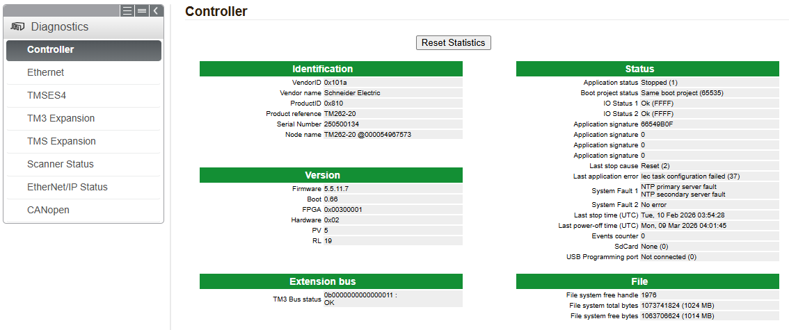
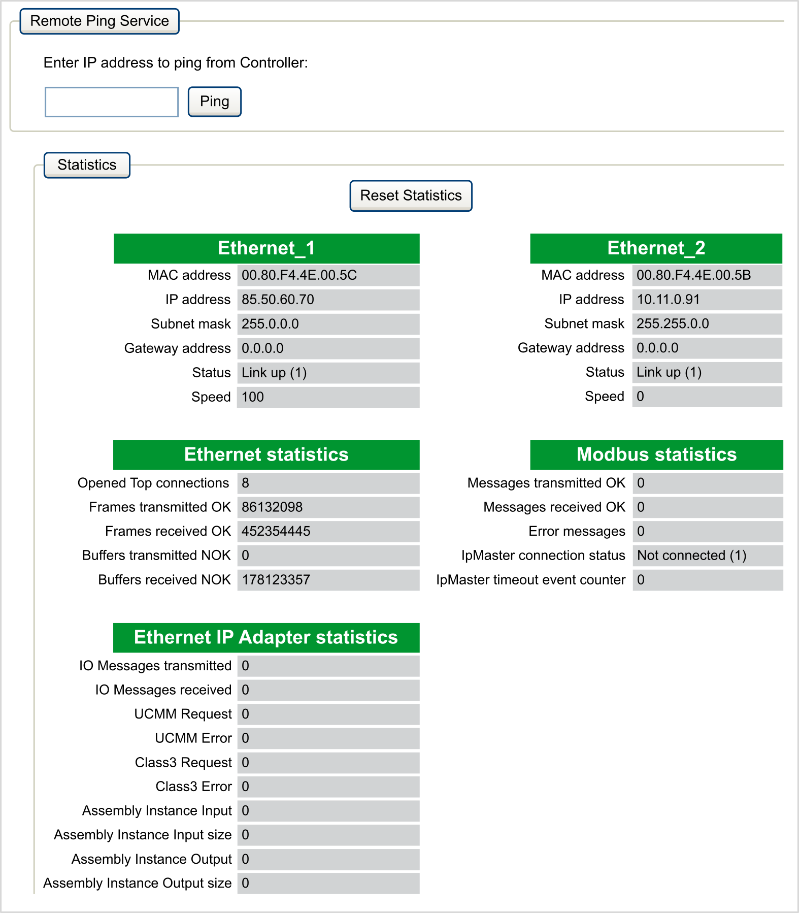
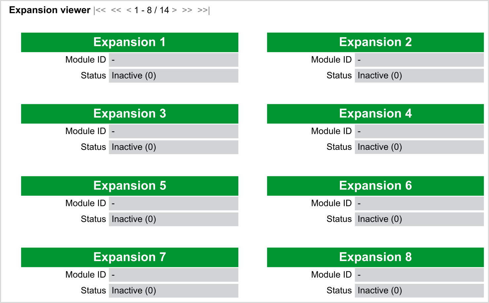
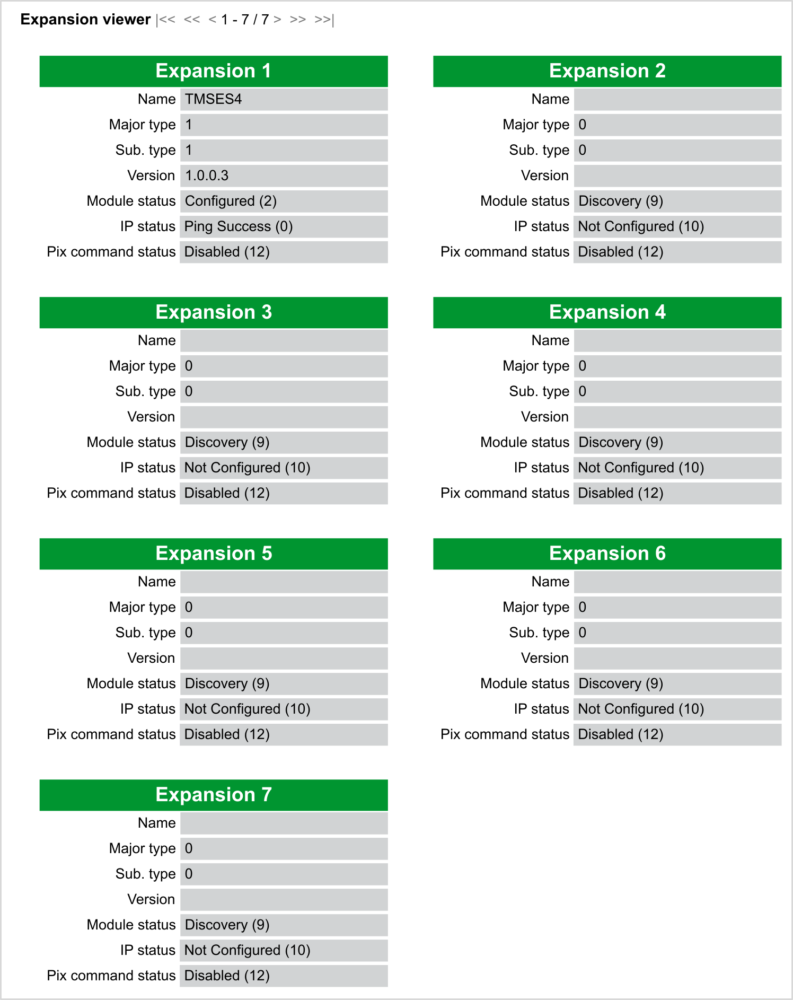
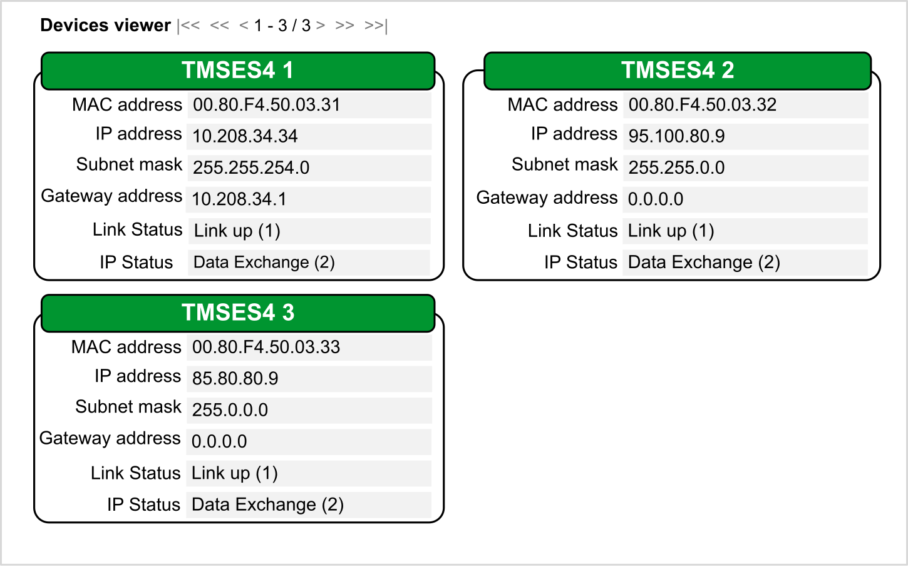
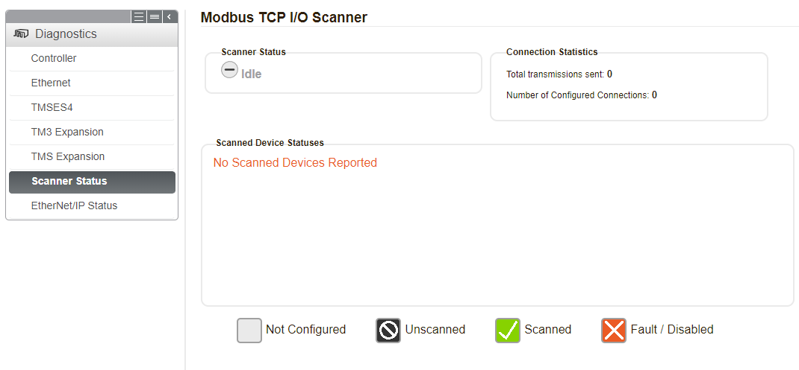
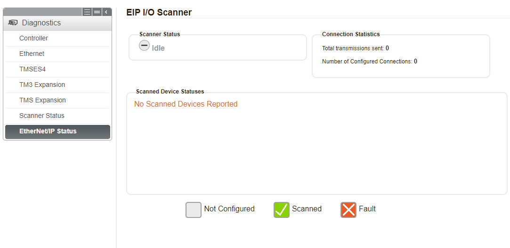
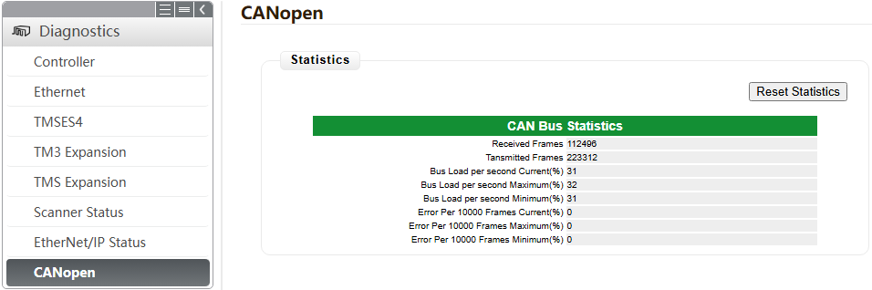

# Diagnostics Menu

## Diagnostics: Controller Submenu

The Controller submenu displays information about the controller:

## Diagnostics: Ethernet Submenu

The Ethernet submenu displays the Ethernet ports status and access to the remote ping service:

## Diagnostics: TM3 Expansion Submenu

The TM3 Expansion submenu shows the TM3 expansion modules status:

## Diagnostics: TMS Expansion Submenu

The TMS Expansion submenu shows the TMS expansion modules status:

## Diagnostics: TMSES4 Submenu

The TMSES4 submenu shows the status of the TMSES4 Ethernet ports:

## Diagnostics: Scanner Status Submenu

The Scanner Status submenu displays status of the Modbus TCP I/O Scanner (IDLE, STOPPED, OPERATIONAL) and the health bit of up to 64 Modbus slave devices:

For more information, refer to [Modbus TCP User Guide](../../../../../api/crossBook?lang=en-US&virtualBookName=ESMEModbusTCP&topicID=D_SE_0056614).

## Diagnostics: EtherNet/IP Status Submenu

The EtherNet/IP Status submenu displays the status of the EtherNet/IP Scanner (IDLE, STOPPED, OPERATIONAL) and the health bit of up to 64 EtherNet/IP target devices:

For more information, refer to [EtherNet/IP User Guide](../../../../../api/crossBook?lang=en-US&virtualBookName=ESMEEtherNetIP&topicID=D_SE_0056614).

## Diagnostics: CANopen Submenu

The CANopen submenu displays information about the CAN bus and the CANopen connection:

| Element | Description |
| --- | --- |
| Received Frames | Number of received CAN frames since CAN connection establishment |
| Transmitted Frames | Number of transmitted CAN frames since CAN connection establishment |
| Bus Load per second Current (%) | CAN bus load ratio in percentage during the last second  NOTE: If the CAN bus load exceeds 50% for at least 10 seconds, a message indicating this event appears in the log messages. This message cannot be triggered again unless the Reset Statistics button is clicked. |
| Bus Load per second Maximum (%) | Maximum CAN bus load ratio in percentage since CAN connection establishment |
| Bus Load per second Minimum (%) | Minimum CAN bus load ratio in percentage since CAN connection establishment |
| Error Per 10000 Frames Current (%) | Error frames ratio in percentage during the last 10000 exchanged frames  NOTE: The value is 0 as long as the number of exchanged frames remains lower than 10000. The value is updated when the number of exchanged frames reaches 10000. |
| Error Per 10000 Frames Maximum (%) | Maximum error frames ratio per 10000 frames in percentage since CAN connection establishment |
| Error Per 10000 Frames Minimum (%) | Minimum error frames ratio per 10000 frames in percentage since CAN connection establishment |

EIO0000003651.14