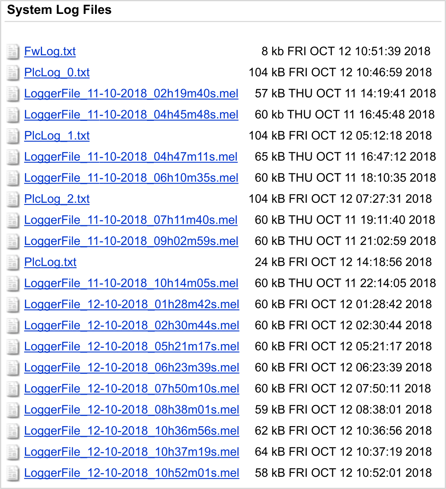
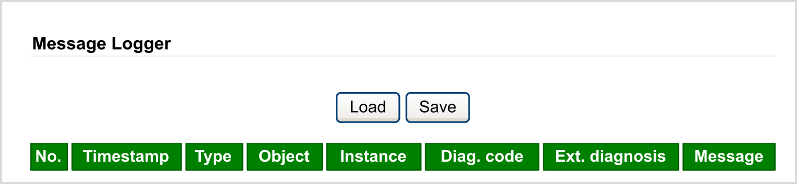
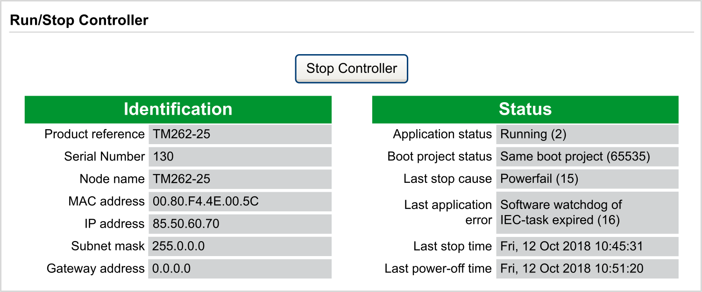
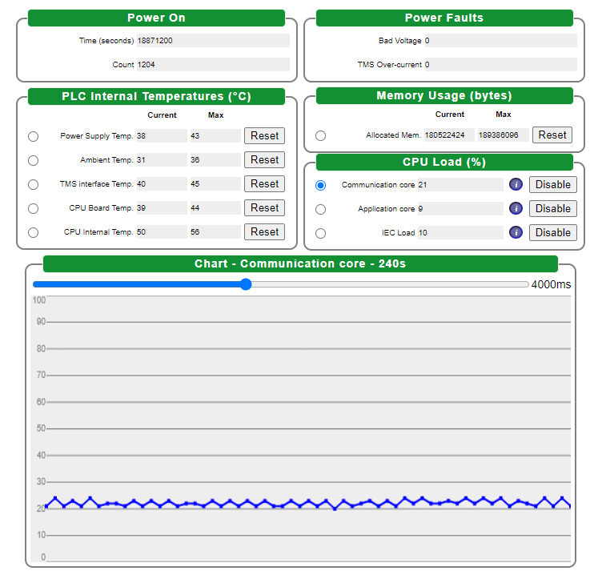
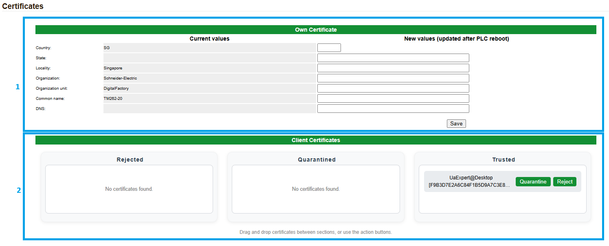
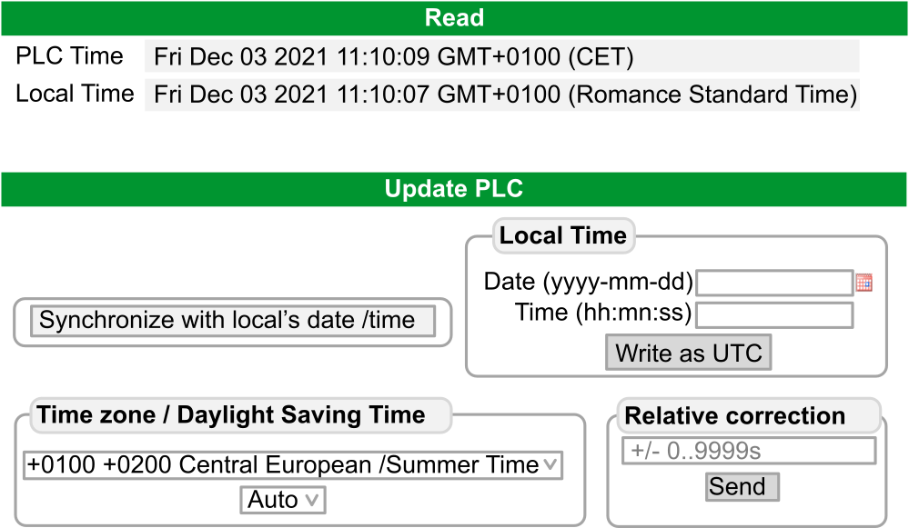
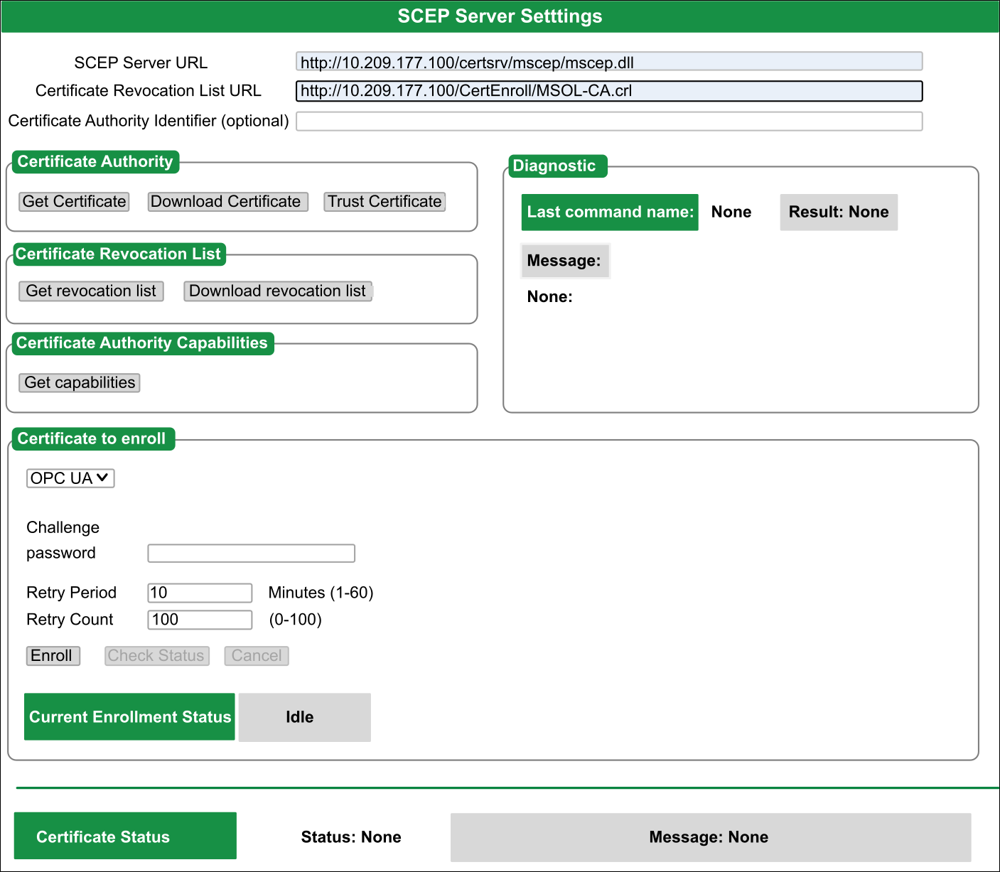
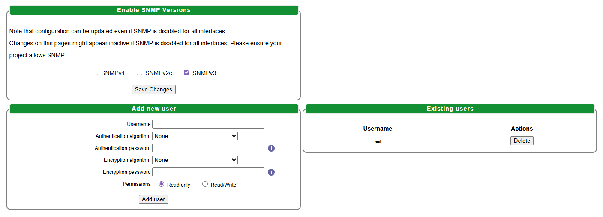

# Maintenance Menu

## Introduction

The Maintenance page provides access to the `/usr` folders of the controller [non-volatile memory](D-SE-0004156.html#D-SE-0004156) and information for device maintenance purposes.

## Maintenance: Post Conf Submenu

The Post Conf submenu allows you to update the [post configuration](D-SE-0010304.html#D-SE-0010304) file saved on the controller:

| Step | Action |
| --- | --- |
| 1 | Click Load. |
| 2 | [Modify the parameters](D-SE-0010302.html#D-SE-0010302__D-SE-0010302.12). |
| 3 | Click Save.  NOTE: The new parameters are considered at the next [Post Configuration file reading](D-SE-0010301.html#D-SE-0010301__D-SE-0010301.3). |

## Maintenance: User Management Submenu

The User Management submenu displays a screen that allows you to access four different actions, restricted by using secure protocol (HTTPS):

* Change password (of current user):

Allows you to change your password.

* User accounts management:

Allows you to manage user accounts management, removing passwords and returning the user accounts on the controller to default settings.

Click Disable to deactivate the user rights on the controller. (Passwords are saved and are restored if you click Enable). Then, click OK on the window that appears to confirm. As a result:

* Users no longer have to set and enter a password to connect to the controller.
* FTP, HTTP, and OPC UA server connections accept anonymous user connections. See  [Login and passwords table](D-SE-0095294.html#D-SE-0095294__D-SE-0095294.4).

NOTE: The Disable button is only active if the user has administrator privileges.

Click Enable to restore the previous user rights saved on the controller. Then, click OK on the window that appears to confirm. As a result, users have to enter the password previously set to connect to the controller. See  [Login and passwords table](D-SE-0095294.html#D-SE-0095294__D-SE-0095294.4).

NOTE: The Enable button only appears if the user rights are disabled and the user rights backup file is available on the controller.

Click Reset to default to return the user accounts on the controller to their default setting state. Then, click OK on the window that appears to confirm.

NOTE: Connections to FTP, HTTP, and the OPC UA server are blocked until a new password is set.

* Clone management:

Allows you to control whether user rights are copied and applied to the target controller when cloning a controller with an [SD card](D-SE-0083192.html#D-SE-0083192).

Click Exclude users rights to exclude copying user rights to the target controller when cloning a controller.

NOTE: By default, the users rights are excluded.

Click Include users rights to copy user rights to the target controller when cloning a controller. A popup prompts you to confirm copying the user rights. Click OK to continue.

NOTE: The Exclude users rights and Include users rights buttons are only active if the user is connected to the controller using a secure protocol.

* System use notification:

Allows you to customize a message which is displayed at login.

## Maintenance: Firewall Submenu

The Firewall submenu allows you to modify the default [firewall configuration file](D-SE-0033306.html#D-SE-0033306):

## Maintenance: System Log Files Submenu

The System Log Files submenu provides access to log files generated by the controller:

NOTE: A maximum of 300 log files can be stored in the Message Logger. When the maximum log file size is reached, previous logs must be deleted in order to continue saving new diagnostic information.

## Maintenance: Message Logger Submenu

The Message Logger submenu displays latest controller log messages:

## Maintenance: Run/Stop Controller Submenu

The Run/Stop Controller submenu allows you to manually stop and restart the controller:

## Maintenance: SelfAwareness Submenu

The SelfAwareness submenu allows you to access temperature, memory usage, processor load and devices information:

NOTE: The sample rate is set at 4 seconds. Setting under 4 seconds increases the Communication core and CPU Load.

The controller internal ambient maximum temperature is 100 °C (212 °F). The external ambient maximum temperature can be found in the hardware guide of your controller.

## Maintenance: Certificates Submenu

The following graphic shows the Certificates submenu:

**1:** Own Certificate allows you to modify the certificates owned by an M262 Logic/Motion Controller. The optional DNS value indicates the domain name for which the certificates is valid (OPC UA or HTTP/FTP).

NOTE: Any modification has an impact on OPC UA and HTTP/FTP certificates. See [Certificate Management](ControllerCybersecurity-61AB40B4.html#ControllerCybersecurity-61AB40B4__CertificateManagement-66B2DDC3).

NOTE: Any modification overwrites SCEP certificates and requires a new SCEP enrollment. See [Maintenance: SCEP Submenu](#MaintenancePage-6CE89C28__SCEP-618C8BD5).

**2:** Client Certificates allows you to manage certificate trust levels by moving certificates between Trusted, Quarantined and Rejected states.

## Maintenance: Date / Time Submenu

The Date / Time  submenu displays the date, time, time zone and optional daylight saving time and allows you to manually change them:

## Maintenance: SCEP Submenu

The SCEP submenu allows you to communicate with a SCEP server. This section describes how to specify settings that allow the device to obtain certificates from a Certificate Authority (CA) using Simple Certificate Enrollment Protocol (SCEP).

The following table describes the SCEP submenu:

| Element | Option | Description | |
| --- | --- | --- | --- |
| SCEP Server Settings | SCEP Server URL | Allows you to specify the URL of the SCEP server to which the device should send certificate requests. | |
| Certificate Revocation List URL | Allows you to specify the URL of the Certificate Revocation List. | |
| Certificate Authority Identifier (Optional) | Allows you to choose which certificate is required if a Certificate Authority (CA) has multiple certificates. | |
| Certificate Authority | Get Certificate | Allows you to obtain the certificate. | |
| Download Certificate | Allows you to download the certificate. | |
| Trust Certificate | Allows you to add the certificate to the trusted list of the device. | |
| Certificate Revocation List | Get revocation list | Allows you to obtain the certification revocation list from the Certificate Authority (CA). | |
| Download revocation list | Displays the content of the Certificate Revocation List (CRL) received. | |
| Certificate Authority Capabilities | Get capabilities | Allows you to request which functionality is available from the Certificate Authority (CA). | |
| Diagnostic | Last command name  Result  Message | Displays the last action executed, its result and a diagnostic message if necessary. | |
| Certificate to enroll | Selection list | From the selection list, select one of the following options to configure the certificate to enroll:  * OPC UA * HTTP (also used for FTP) | |
| Challenge password | Password used and provided by the Certificate Authority (CA) for router certificate enrollment and revocation. | |
| Retry Period | Specifies the delay, in minutes, between certificate request attempts. | |
| Retry Count | Specifies the number of times the device should resubmit a certificate request. | |
| Enroll | Allows you to start the enrollment process. | |
| Check Status | Allows you to verify the status of the enrollment process. | |
| Cancel | Allows you to cancel the enrollment process. | |
| Current Enrollment Status | Displays a message about the status of the enrollment process:  * Idle * On going | |
| Certificate Status | Displays the status of the certificate and an associated message: | |
| Starting | Enrollment process is starting |
| Success | Request pending for manual approval |
| Pending | * Request granted. Certificate will be applied on the next reboot   or   * Request granted. Certificate will be applied on the next reset cold, reset warm or application download |
| Cancel | Operation cancelled by the user |
| Error | Request rejected |

This table describes the Public Key Infrastructure (PKI) shared between the M262 Logic/Motion Controller and the SCEP server. It provides the folder list and their usage:

| M262 File System Folders | Description |
| --- | --- |
| /usr/pki/scep/castore | Stores working certificate received from SCEP server. |
| /usr/pki/scep/tmp | Stores temporary files. |
| /usr/pki/scep/csr | Stores the signed certificate request. |

## Maintenance: SNMP Submenu

The SNMP submenu allows you to choose the Simple Network Management Protocol (SNMP) version and add/remove SNMP user accounts. For more information, refer to [SNMP](D-SE-0002962.html).

The following table describes the SNMP submenu:

| Element | Option | Description |
| --- | --- | --- |
| Enable SNMP Versions | * SNMPv1 * SNMPv2c * SNMPv3 | Select the SNMP protocol version to enable, then confirm your selection by clicking Save Changes. This functionality is only available to users with the Device.SNMP.config permission. |
| Add new user (1) | Username | Enter the name of the new user account. |
| Authentication algorithm | Select the Authentication algorithm:   * None * MD5 * SHA-1 * SHA-224 * SHA-256 |
| Authentication password | Enter the authentication password of the new user account. It is only required when an Authentication algorithm other than None is selected. |
| Encryption algorithm | Select the Encryption algorithm:   * None * CBC-DES * CFB128-AES-128 * CFB128-AES-192 |
| Encryption password | Enter the encryption password of the new user account. It is only required when an Encryption algorithm other than None is selected. A user account with encryption also requires authentication. |
| Permissions | Select the actions authorized for the new user:   * Read only: the user can only view the SNMP parameters. * Read/Write: the user can view and modify the SNMP parameters. |
| Existing users (1) | – | Allows you to view and delete the existing user accounts. |
| **(1)** This element is only active with SNMPv3. It is not supported by SNMPv1 and SNMPv2c. | | |

EIO0000003651.14