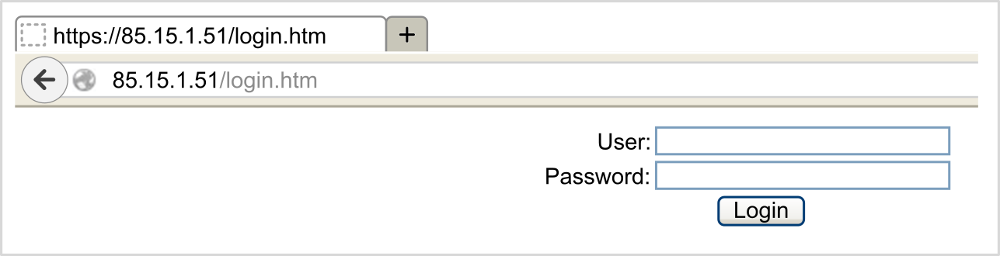
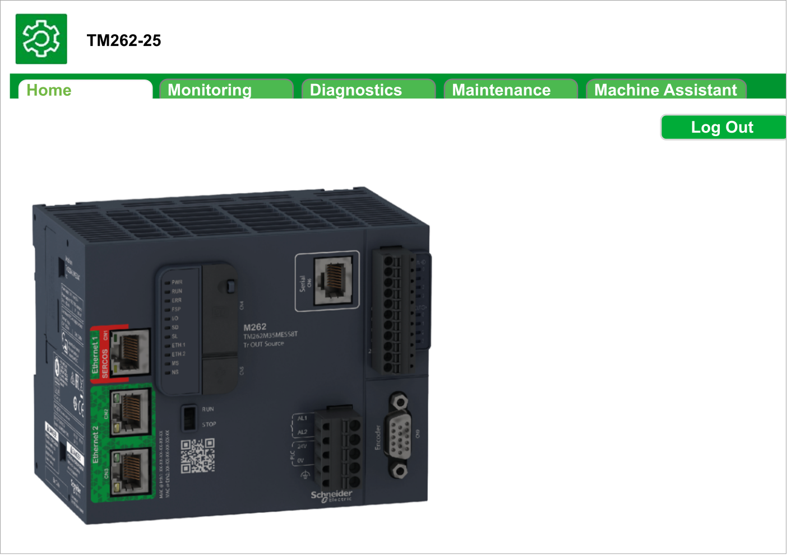

# Web Server

## Introduction

The controller provides an embedded Web server with a predefined, built-in website. You can use the website for module setup and control, as well as application diagnostics and monitoring. These pages are ready for use with a web browser on Windows PCs or mobile devices. No configuration or programming is required.

The Web server can be accessed by the web browsers listed below:

* Google Chrome (version 138 or greater)
* Mozilla Firefox (version 140 or greater)
* Microsoft Edge (version 138 or greater)

The Web server can be accessed by the mobile device web browsers listed below:

* iOS Safari
* Android Chrome

HTTP (non secured connections) requests are redirected to HTTPS (secure connections).

The Web server is limited to 10 [concurrent users](D-SE-0002954.html#D-SE-0002954__D-SE-0002954.5).

The Web server has access to your application for reading and writing data and controlling the state of the controller. By enabling the Web server, you enable these functions. You can disable the Web server on an interface by deselecting the Web server active parameter in the [Ethernet Configuration tab](D-SE-0003075.html#D-SE-0003075__D-SE-0003075.4).

If there are cybersecurity concerns over these functions, you must, at a minimum, assign a secure password to the Web server or disable the Web server to help prevent unauthorized access to the application.

The Web server allows you to remotely monitor a controller and its application, and to perform various maintenance activities including modifications to data and configuration parameters, and change the state of the controller. Ensure that the immediate physical environment of the machine and process is in a state that does not present risks to people or property before exercising control remotely.

| WARNING | |
| --- | --- |
|  | UNINTENDED EQUIPMENT OPERATION  * Configure and install the RUN/STOP input for the application, if available for your particular controller, so that local control over the starting or stopping of the controller can be maintained regardless of the remote commands sent to the controller. * Define a secure password for the Web server and do not allow unauthorized or otherwise unqualified personnel to use this feature. * Ensure that there is a local, competent, and qualified observer present when operating on the controller from a remote location. * You must have a complete understanding of the application and the machine/process it is controlling before attempting to adjust data, stopping an application that is operating, or starting the controller remotely. * Take the precautions necessary to assure that you are operating on the intended controller by having clear, identifying documentation within the controller application and its remote connection.  Failure to follow these instructions can result in death, serious injury, or equipment damage. |

## Web Server Access

Access to the Web server is controlled by User Rights when they are enabled in the controller. For more information, refer to [Users and Groups](D-SE-0002288.html#D-SE-0002288__D-SE-0002288.4).

To access the Web server you must first connect to the controller with EcoStruxure Machine Expert or Controller Assistant, and modify the default user password.

| WARNING | |
| --- | --- |
|  | UNAUTHORIZED DATA ACCESS  * Secure access to the FTP/Web server using User Rights. * If you disable User Rights, disable the FTP/Web server to prevent any unwanted or unauthorized access to data in your application.  Failure to follow these instructions can result in death, serious injury, or equipment damage. |

In order to change the password, go to Users and Groups tab of the device editor. For more information, refer to the EcoStruxure Machine Expert [Programming Guide](../../../../../api/crossBook?lang=en-US&virtualBookName=SoMProg&topicID=D_SE_0038269).

NOTE: The only way to gain access to a controller that has user access-rights enabled and for which you do not have the password(s) is by performing an Update Firmware operation. This clearing of User Rights can only be accomplished by using a SD card to update the controller firmware. In addition, you may clear the User Rights in the controller by running a script (refer to [Reset the User Rights to Default](D-SE-0083187.html#D-SE-0083187__D-SE-0083187.8)). This effectively removes the existing application from the controller memory, but restores the ability to access the controller.

## Home Page Access

To access the website home page, type the IP address of the controller into the browser.

This figure shows the Web server site login page:

This figure shows the home page of the Web server site once you have logged in:

NOTE: Schneider Electric adheres to industry best practices in the development and implementation of control systems. This includes a "Defense-in-Depth" approach to secure an Industrial Control System. This approach places the controllers behind one or more firewalls to restrict access to authorized personnel and protocols only.

| WARNING | |
| --- | --- |
|  | UNAUTHENTICATED ACCESS AND SUBSEQUENT UNAUTHORIZED MACHINE OPERATION  * Evaluate whether your application environments are connected to your critical infrastructure and, if so, take appropriate steps in terms of prevention, based on Defense-in-Depth, before connecting the automation system to any network. * Limit the number of devices connected to a network to the minimum necessary. * Isolate your industrial network from other networks inside your company. * Protect any network against unintended access by using firewalls, VPN, or other, proven security measures, such as an Intrusion Prevention System or Intrusion Detection System. * Monitor activities within your systems. * Prevent subject devices from direct access or direct link by unauthorized parties or unauthenticated actions. * Install certificates that are issued by publicly known Trusted Certificate Authorities. * Keep your systems up-to-date and rely only on legitimate sources. * Prepare a recovery plan including backup of your system and process information.  Failure to follow these instructions can result in death, serious injury, or equipment damage. |

For more information on organizational measures and rules covering access to infrastructures, refer to ISO/IEC 27000 series, Common Criteria for Information Technology Security Evaluation, ISO/IEC 15408, IEC 62351, ISA/IEC 62443, NIST Cybersecurity Framework, Information Security Forum - Standard of Good Practice for Information Security and refer to [Cybersecurity Guidelines for EcoStruxure Machine Expert, Modicon and PacDrive Controllers and Associated Equipment](https://www.se.com/ww/en/download/document/EIO0000004242/).

## Home Page Access Menu

The Home Page Access menu bar allows you to access the main Web server pages.

The Web server contains the following pages:

| Menu | Page | Description |
| --- | --- | --- |
| Home | [Home](#D-SE-0002960__D-SE-0002960.29) | Home page of the controller Web server page.  Provides access to the tabs:   * [Monitoring](MonitoringMenu-6CE51C74.html) * [Diagnostics](DiagnosticMenu-6CE5F84F.html) * [Maintenance](MaintenancePage-6CE89C28.html) * [Machine Assistant](Menu-6CE93DB9.html) |

Home page menu descriptions:

| Menu | Submenu | Description |
| --- | --- | --- |
| Monitoring | [Data Parameters](MonitoringMenu-6CE51C74.html#MonitoringMenu-6CE51C74__D-SE-0002960.9) | Allows you to display and modify controller variables. |
| [IO Viewer](MonitoringMenu-6CE51C74.html#MonitoringMenu-6CE51C74__D-SE-0002960.8) | Shows the module with module I/O values. |
| [Oscilloscope](MonitoringMenu-6CE51C74.html#MonitoringMenu-6CE51C74__D-SE-0002960.12) | Displays 2 variables in the form of a recorder-type time chart. |
| Diagnostics | [Controller](DiagnosticMenu-6CE5F84F.html#DiagnosticMenu-6CE5F84F__D-SE-0002960.13) | Displays controller status. |
| [Ethernet](DiagnosticMenu-6CE5F84F.html#DiagnosticMenu-6CE5F84F__D-SE-0002960.23) | Displays Ethernet diagnostic. |
| [TM3 Expansion](DiagnosticMenu-6CE5F84F.html#DiagnosticMenu-6CE5F84F__D-SE-0002960.31) | Displays expansion module status. |
| [TMS Expansion](DiagnosticMenu-6CE5F84F.html#DiagnosticMenu-6CE5F84F__D-SE-0002960.33) | Displays expansion module status. |
| [TMSES4](DiagnosticMenu-6CE5F84F.html#DiagnosticMenu-6CE5F84F__DiagnosticsTMSES4Submenu-13CC1AED) | Displays TMSES4 status. |
| [Scanner Status](DiagnosticMenu-6CE5F84F.html#DiagnosticMenu-6CE5F84F__D-SE-0002960.34) | Displays serial line status. |
| [EtherNet/IP Status](DiagnosticMenu-6CE5F84F.html#DiagnosticMenu-6CE5F84F__D-SE-0002960.35) | Displays Ethernet status. |
| [CANopen](DiagnosticMenu-6CE5F84F.html#DiagnosticMenu-6CE5F84F__DiagnosticsCANopenSubmenu-13AF825F) | Displays CANopen statistics. |
| Maintenance | [Post Conf](MaintenancePage-6CE89C28.html#MaintenancePage-6CE89C28__D-SE-0002960.37) | Allows you to access the post configuration file saved on the controller. |
| [User Management](MaintenancePage-6CE89C28.html#MaintenancePage-6CE89C28__D-SE-0002960.38) | Allows you to change user password and customize login message. Possible in secure mode (HTTPS) only.   * Change password (of current user): allows you to change user password. * Users account management: allows you to remove all passwords from the controller and reset user accounts to their default state. * Clone management: allows you to include or exclude user access rights when cloning a controller. * System use notification: allows you to customize a message which will be displayed at login. |
| [Firewall](MaintenancePage-6CE89C28.html#MaintenancePage-6CE89C28__D-SE-0002960.39) | Allows you to modify the firewall configuration. |
| [System Log Files](MaintenancePage-6CE89C28.html#MaintenancePage-6CE89C28__D-SE-0002960.40) | Allows you to access log files generated by the controller. |
| [Message Logger](MaintenancePage-6CE89C28.html#MaintenancePage-6CE89C28__D-SE-0002960.41) | Allows you to access controller messages. |
| [Run/Stop Controller](MaintenancePage-6CE89C28.html#MaintenancePage-6CE89C28__D-SE-0002960.43) | Allows you to send Run and Stop commands to the controller. |
| [SelfAwareness](MaintenancePage-6CE89C28.html#MaintenancePage-6CE89C28__D-SE-0002960.44) | Allows you to access temperature, memory usage, processor load and devices information. |
| [Certificates](MaintenancePage-6CE89C28.html#MaintenancePage-6CE89C28__D-SE-0002960.45) | Allows you to customize certificates owned by a Modicon M262 Logic/Motion Controller. |
| [Date / Time](MaintenancePage-6CE89C28.html#MaintenancePage-6CE89C28__D-SE-0002960.46) | Allows you to set the date, time, time zone and optional daylight saving time. |
| [SCEP](MaintenancePage-6CE89C28.html#MaintenancePage-6CE89C28__SCEP-618C8BD5) | Allows you to access the configuration of the SCEP server. |
| [SNMP](MaintenancePage-6CE89C28.html#MaintenancePage-6CE89C28__MaintenanceSNMPSubmenu-1442A2CD) | Allows you to choose the SNMP protocol version and add/delete user accounts. |
| Machine Assistant | List View | Displays the configuration in list view. |
| Graphic View | Displays the configuration in graphic view. |
| [Scan](D-SE-0094006.html#D-SE-0094006) | Allows you to scan the devices configured. |
| [Clear](D-SE-0094006.html#D-SE-0094006) | Allows you to clear the scan. |
| [Load .semdt file](D-SE-0094011.html#D-SE-0094011__D-SE-0094011.5) | Allows you to upload a .semdt file after scan. |
| [Export scan results](D-SE-0094011.html#D-SE-0094011__D-SE-0094011.4) | Allows you to export the scan results in your local SD Card. |

EIO0000003651.14