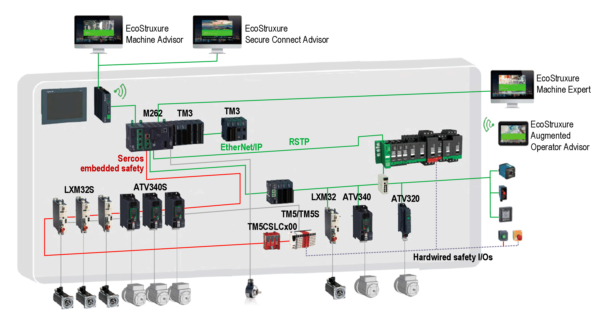

# Industrial Ethernet Presentation

## Overview

Industrial Ethernet is the term used to represent the industrial protocols that use the standard Ethernet physical layer and standard Ethernet protocols.

On an Industrial Ethernet network, you can connect:

* industrial devices (industrial protocols)
* non-industrial devices (other Ethernet protocols)

For more information, refer to [Industrial Ethernet Overview, User Guide](../../../../../api/crossBook?lang=en-US&virtualBookName=ESMEIndEthOverview&topicID=D_SE_0093831).

## Industrial Ethernet Architecture

This figure presents a typical Industrial Ethernet architecture:

This architecture is configurable with EcoStruxure Machine Expert.

## Industrial Ethernet Description

| M262 Logic/Motion Controller | |
| --- | --- |
| Features | Description |
| Topology | Daisy chain and Star via switches |
| Bandwidth | 10/100 Mbit/s for Ethernet 1 port  10/100/1000 Mbit/s for Ethernet 2 port |
| **EtherNet/IP Scanner** | |
| Performance | Up to 64 EtherNet/IP target devices managed by the controller, monitored within a timeslot of:   * 40 ms on TM262L01MESE8T, TM262L10MESE8T, TM262M05MESS8T and TM262M15MESS8T * 20 ms on TM262L20MESE8T, TM262M25MESS8T and TM262M35MESS8T |
| Number of connections | * 0...6 on Ethernet\_1 port of TM262M• * 0...64 on Ethernet\_2 port of TM262M• and on both Ethernet ports of TM262L• |
| Number of input words | 0...15360 |
| Number of output words | 0...15360 |
| I/O communications | EtherNet/IP Scanner service  Function block for configuration and data transfer |
| Originator/Target |
| **Modbus TCP IOScanner** | |
| Performance | Up to 64 Modbus TCP slave devices managed by the controller, monitored within a timeslot of:   * 20 ms on TM262L01MESE8T, TM262L10MESE8T, TM262M05MESS8T and TM262M15MESS8T * 10 ms on TM262L20MESE8T, TM262M25MESS8T and TM262M35MESS8T |
| Number of connections | * 0...6 on Ethernet\_1 port of TM262M• * 0...64 on Ethernet\_2 port of TM262M• and on both Ethernet ports of TM262L• |
| Number of input words | 0...8000 |
| Number of output words | 0...8000 |
| I/O communications | Modbus TCP IOScanner service  Function block for data transfer |
| Master/Slave |
| Sercos | |
| Performance | Refer to [Performance Overview](D-SE-0095310.html#D-SE-0095310__D-SE-0095310.3). |
| Other services | FDT/DTM/EDS management |
| FDR (Fast Device Replacement) |
| DHCP server |
| Security management (refer to [Security Parameters](D-SE-0003075.html#D-SE-0003075__D-SE-0003075.10) and [Firewall Configuration](D-SE-0033306.html#D-SE-0033306)) |
| Modbus TCP server |
| Modbus TCP client |
| EtherNet/IP adapter (controller as a target on EtherNet/IP) |
| EtherNet/IP Originator |
| Modbus TCP server (controller as a slave on Modbus TCP) |
| [Web server](D-SE-0002960.html) |
| [FTP server](D-SE-0002958.html) |
| [NTP](D-SE-0081018.html#D-SE-0081018__NTP-7F9D72DB) |
| [OPC UA](D-SE-0099767.html) |
| RSTP (ETH2) |
| [SNMP](D-SE-0002962.html) |
| IEC VAR ACCESS |
| Additional features | You can mix the Ethernet/IP and Modbus TCP server devices:   * 96 (64 EIP and 32 TCP) on TM262L01MESE8T, TM262L10MESE8T, TM262M05MESS8T and TM262M15MESS8T * 128 (64 EIP and 64 TCP) on TM262L20MESE8T, TM262M25MESS8T and TM262M35MESS8T.   Devices can be directly accessed for configuration, monitoring, and management purposes.  Network transparency between control network and device network (controller can be used as a gateway).  NOTE: Using the controller as a gateway can impact the performance of the controller. |
| [Single Wire Architecture](D-SE-0099977.html#D-SE-0099977) | Allows up to 6 Ethernet devices (EtherNet/IP, TCP/IP, and so on) to be added to the end of a cable containing Sercos devices. The last Sercos device acts as a gateway. No additional gateways or switches are required.  The Ethernet frames are embedded within the Sercos frames. |

## EtherNet/IP Overview

EtherNet/IP is the implementation of the CIP protocol over standard Ethernet.

The EtherNet/IP protocol uses an Originator/Target architecture for data exchange.

**Originators** are devices that initiate data exchanges with Target devices on the network. This applies to both I/O communications and service messaging. This is the equivalent of the role of a client in a Modbus network.

**Targets** are devices that respond to data requests generated by Originators. This applies to both I/O communications and service messaging. This is the equivalent of the role of a server in a Modbus network.

**EtherNet/IP Adapter** is an end-device in an EtherNet/IP network. I/O blocks and drives can be EtherNet/IP Adapter devices.

The communication between an EtherNet/IP Originator and Target is accomplished using an EtherNet/IP connection.

## Modbus TCP Overview

The Modbus TCP protocol uses a Client/Server architecture for data exchange.

The Modbus TCP explicit (non-cyclic) data exchanges are managed by the application.

Modbus TCP implicit (cyclic) data exchanges are managed by the Modbus TCP IOScanner. The Modbus TCP IOScanner is a service based on Ethernet that polls slave devices continuously to exchange data, status, and diagnostic information. This process monitors inputs and controls outputs of slave devices.

**Clients** are devices that initiate data exchange with other devices on the network. This applies to both I/O communications and service messaging.

**Servers** are devices that address any data requests generated by a Client. This applies to both I/O communications and service messaging.

The communication between the Modbus TCP IOScanner and the slave device is accomplished using Modbus TCP channels.

## Sercos Overview

For more information on Sercos standard and configuration, refer to [Overview of the Sercos Standard](D-SE-0095181.html#D-SE-0095181).

## Adding the Protocol Manager

The protocol manager must be present on the Ethernet\_1 (ETH1) or Ethernet\_2 (ETH2) node of the Devices tree to activate these functions and services:

* EtherNet/IP Scanner
* Generic TCP/UDP Manager
* Modbus TCP IO Scanner

When a protocol manager is defined on an interface, this interface address must be Fixed. The post-configuration defined for this interface is not applied, if any.

To manually add the protocol manager to the Ethernet\_1 (ETH1) / Ethernet\_2 (ETH2):

| Step | Action |
| --- | --- |
| 1 | In the Devices tree, select Ethernet\_1 (ETH1) / Ethernet\_2 (ETH2) and click the green plus button of the node, or right-click Ethernet\_1 (ETH1) / Ethernet\_2 (ETH2) and execute the Add Device command from the contextual menu.  **Result**: The Add Device dialog box opens. |
| 2 | In the Add Device dialog box, select your protocol manager:   * Protocol Managers > EtherNet/IP Scanner * Protocol Managers > ModbusTCP IOScanner * Protocol Managers > TCP/UDP Manager |
| 3 | Click the Add Device button. |
| 4 | Click the Close button. |

For more information, refer to [Industrial Ethernet Manager Configuration](../../../../../api/crossBook?lang=en-US&virtualBookName=ESMEModbusTCP&topicID=D_SE_0056936), [EtherNet/IP Target Settings](../../../../../api/crossBook?lang=en-US&virtualBookName=ESMEEtherNetIP&topicID=D_SE_0056939) and [Modbus TCP Settings](../../../../../api/crossBook?lang=en-US&virtualBookName=ESMEModbusTCP&topicID=D_SE_0056940).

## Adding the Sercos Master

The Sercos fieldbus must be present on the Ethernet\_1 (ETH1) to activate the Sercos Master.

To manually add the Sercos Master to the Ethernet\_1 (ETH1):

| Step | Action |
| --- | --- |
| 1 | In the Devices tree, select Ethernet\_1 (ETH1) and click the green plus button of the node, or right-click Ethernet\_1 (ETH1) and execute the Add Device command from the contextual menu.  **Result**: The Add Device dialog box opens. |
| 2 | In the Add Device dialog box, select Protocol Managers > Sercos Master. |
| 3 | Click the Add Device button. |
| 4 | Click the Close button. |

EIO0000003651.14