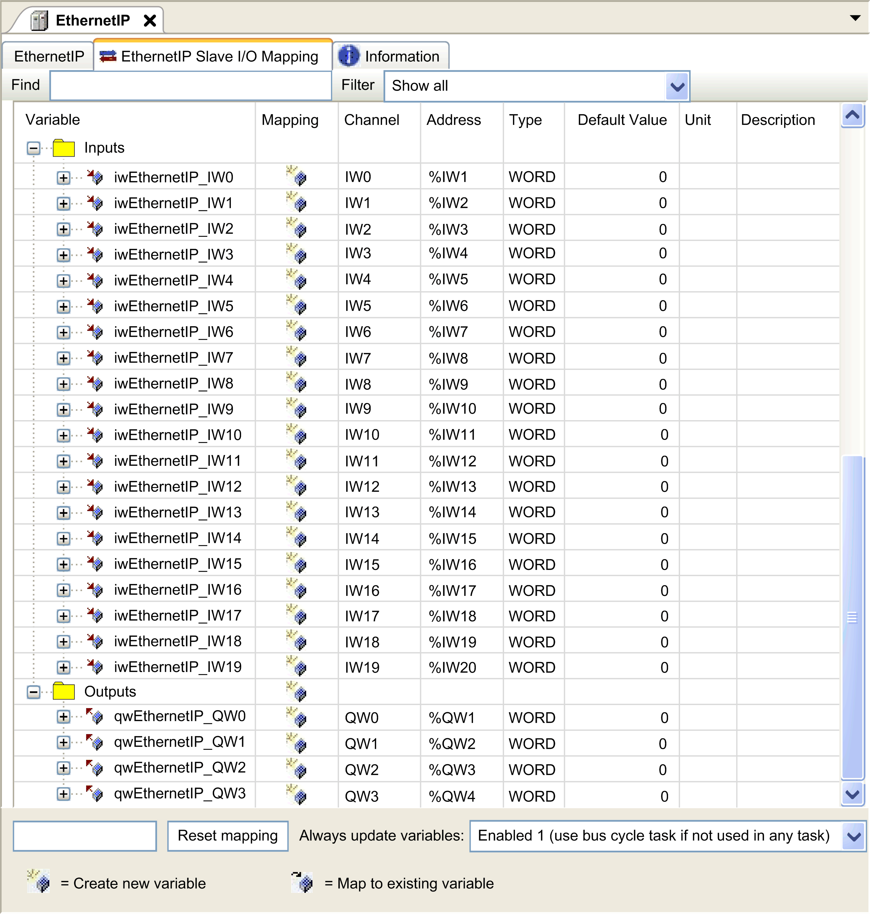

# Controller as a Target Device on EtherNet/IP

## Introduction

This section describes the configuration of the M262 Logic/Motion Controller as an EtherNet/IP target device (EtherNet/IP Adapter or EtherNet/IP Scanner).

For further information about EtherNet/IP, refer to the [www.odva.org](http://www.odva.org) website.

## EtherNet/IP Target Configuration

To configure your M262 Logic/Motion Controller as an EtherNet/IP target device, you must:

| Step | Action |
| --- | --- |
| 1 | Select EthernetIP in the Hardware Catalog. |
| 2 | Drag and drop it to the Devices tree on one of the highlighted nodes.  NOTE: If the chosen node is COM\_Bus, a TMSES4 expansion module is automatically added to your configuration.  For more information on adding a device to your project, refer to:  • Using the [Hardware Catalog](../../../../../api/crossBook?lang=en-US&virtualBookName=SoMProg&topicID=D_SE_0083368)  • Using the [Contextual Menu or Plus Button](../../../../../api/crossBook?lang=en-US&virtualBookName=SoMProg&topicID=D_SE_0083370) |

## EtherNet/IP Parameters Configuration

To configure the EtherNet/IP parameters, double-click EthernetIP in the Devices tree.

This dialog box is displayed:

The EtherNet/IP configuration parameters are defined as:

* Instance:

  Number referencing the input or output Assembly.
* Size:

  Number of channels of an input or output Assembly.

  The memory size of each channel is 2 bytes that stores the value of an %IWx or %QWx object, where x is the channel number.

  For example, if the Size of the Output Assembly is 20, it represents that there are 20 input channels (IW0...IW19) addressing %IWy...%IW(y+20-1), where y is the first available channel for the Assembly.

| Element | | Admissible Controller Range | Default Value |
| --- | --- | --- | --- |
| Output Assembly | Instance | 150...189 | 150 |
| Size | 2...250 | 20 |
| Input Assembly | Instance | 100...149 | 100 |
| Size | 2...250 | 20 |

## EDS File Generation

You can generate an EDS file to configure EtherNet/IP cyclic data exchanges.

To generate the EDS file:

| Step | Action |
| --- | --- |
| 1 | In the Devices tree, right-click the EthernetIP node and choose the Export as EDS command from the contextual menu. |
| 2 | Modify the default file name and location as required. |
| 3 | Click Save. |

NOTE: The Major Revision and Minor Revision objects of the EDS file, defined in the file, are used to ensure uniqueness of the EDS file. The values of these objects do not reflect the actual controller revision level.

A generic EDS file for the M262 Logic/Motion Controller is also available on the Schneider Electric website. You must adapt this file to your application by editing it and defining the required Assembly instances and sizes.

## EthernetIP Slave I/O Mapping Tab

Variables can be defined and named in the EthernetIP Slave I/O Mapping tab. Additional information such as topological addressing is also provided in this tab.

The table below describes the EthernetIP Slave I/O Mapping configuration:

| Channel | | | Type | Default Value | Description |
| --- | --- | --- | --- | --- | --- |
| Input | IW0 | | WORD | - | Command word of controller outputs (%QW) |
| IWxxx | |
| Output | QW0 | | WORD | - | State of controller inputs (%IW) |
| QWxxx | |

The number of words depends on the size parameter configured in [EtherNet/IP Target Configuration](#D-SE-0057366__D-SE-0057366.21).

Output means OUTPUT from Originator controller (= %IW for the controller).

Input means INPUT from Originator controller (= %QW for the controller).

## Connections on EtherNet/IP

To access a target device, an Originator opens a connection which can include several sessions that send requests.

One explicit connection uses one session (a session is a TCP or UDP connection).

One I/O connection uses two sessions.

The following table shows the EtherNet/IP connections limitations:

| Characteristic | Maximum |
| --- | --- |
| Explicit connections | 8 (Class 3) |
| I/O connections | 1 (Class 1) |
| Connections | 8 |
| Sessions | 16 |
| Simultaneous requests | 32 |

NOTE: The M262 Logic/Motion Controller supports cyclic connections only. If an Originator opens a connection using a change of state as a trigger, packets are sent at the RPI rate.

NOTE: For a network topology that has RSTP enabled, verify that the RPI/timeout combination respects the minimum convergence time of 100 ms that is required for RSTP.

## Profile

The controller supports the following objects:

| Object class | Class ID (hex) | Cat. | Number of Instances | Effect on Interface Behavior |
| --- | --- | --- | --- | --- |
| [Identity Object](#D-SE-0057366__D-SE-0057366.6) | 01 | 1 | 1 | Supports the reset service |
| [Message Router Object](#D-SE-0057366__D-SE-0057366.7) | 02 | 1 | 1 | Explicit message connection |
| [Assembly Object](#D-SE-0057366__D-SE-0057366.8) | 04 | 2 | 2 | Defines I/O data format |
| [Connection Manager Object](#D-SE-0057366__D-SE-0057366.22) | 06 | – | 1 | – |
| [TCP/IP Interface Object](#D-SE-0057366__D-SE-0057366.28) | F5 | 1 | 1 | TCP/IP configuration |
| [Ethernet Link Object](#D-SE-0057366__D-SE-0057366.13) | F6 | 1 | 1 | Counter and status information |
| [Interface Diagnostic Object](#D-SE-0057366__D-SE-0057366.23) | 350 | 1 | 1 | – |
| [IOScanner Diagnostic Object](#D-SE-0057366__D-SE-0057366.24) | 351 | 1 | 1 | – |
| [Connection Diagnostic Object](#D-SE-0057366__D-SE-0057366.34) | 352 | 1 | 1 | – |
| [Explicit Connection Diagnostic Object](#D-SE-0057366__D-SE-0057366.26) | 353 | 1 | 1 | – |
| [Explicit Connections Diagnostic List Object](#D-SE-0057366__D-SE-0057366.35) | 354 | 1 | 1 | – |

## Identity Object (Class ID = 01 hex)

The following table describes the class attributes of the Identity Object:

| Attribute ID (hex) | Access | Name | Data Type | Value (hex) | Details |
| --- | --- | --- | --- | --- | --- |
| 1 | Get | Revision | UINT | 01 | Implementation revision of the Identity Object. |
| 2 | Get | Max Instance | UINT | 01 | The largest instance number. |
| 6 | Get | Max Class Attribute | UINT | 01 | The largest class attributes value. |
| 7 | Get | Max Instance Attribute | UINT | 07 | The largest instance attributes value. |

The following table describes the Class Services:

| Service Code (hex) | Name | Description |
| --- | --- | --- |
| 01 | Get Attribute All | Returns the value of all class attributes. |
| 0E | Get Attribute Single | Returns the value of the specified attribute. |

The following table describes the Instance Services:

| Service Code (hex) | Name | Description |
| --- | --- | --- |
| 01 | Get Attribute All | Returns the value of all class attributes. |
| 05 | Reset (1) | Initializes EtherNet/IP component (controller reboot). |
| 0E | Get Attribute Single | Returns the value of the specified attribute. |

**(1)** Reset Service description:

When the Identity Object receives a Reset request, it:

* determines whether it can provide the type of reset requested
* responds to the request
* attempts to perform the type of reset requested

NOTE: The Reset Service only applies if the corresponding parameter has been activated in post configuration file. See [Post Configuration File Example for TM262M•](D-SE-0080403.html#D-SE-0080403__D-SE-0080403.11).

The Reset common service has one specific parameter, Type of Reset (USINT), with the following values:

| Value | Type of Reset |
| --- | --- |
| 0 | Reboots the controller  NOTE: This is the default value if this parameter is omitted. |
| 1 | Not supported |
| 2 | Not supported |
| 3...99 | Reserved |
| 100...199 | Vendor specific |
| 200...255 | Reserved |

The following table describes the Instance attributes:

| Attribute ID (hex) | Access | Name | Data Type | Value (hex) | Details |
| --- | --- | --- | --- | --- | --- |
| 1 | Get | Vendor ID | UINT | F3 | Schneider Automation ID |
| 2 | Get | Device type | UINT | 0E | Controller |
| 3 | Get | Product code | UINT | 4102 | Controller product code |
| 4 | Get | Revision | Struct of USINT, USINT | – | Product revision number of the controller (1).  Equivalent to the 2 low bytes of the controller version. |
| 5 | Get | Status | WORD | – | Status word(2) |
| 6 | Get | Serial number | UDINT | – | Serial number of the controller:  XX + 3 LSB of MAC address. |
| 7 | Get | Product name | Struct of USINT, STRING | – | – |

(1) Mapped in a WORD:

* MSB: minor revision (second USINT)
* LSB: major revision (first USINT)

Example: 0205 hex means revision V5.2.

(2) Status word (Attribute 5):

| Bit | Name | Description |
| --- | --- | --- |
| 0 | Owned | Unused. |
| 1 | Reserved | – |
| 2 | Configured | TRUE indicates the device application has been reconfigured. |
| 3 | Reserved | – |
| 4...7 | Extended Device Status | * 0: Self-testing or undetermined * 1: Firmware update in progress * 2: At least one invalid I/O connection detected * 3: No I/O connections established * 4: Non-volatile configuration invalid * 5: Unrecoverable error detected * 6: At least one I/O connection in RUNNING state * 7: At least one I/O connection established, all in idle mode * 8: Reserved * 9...15: Unused |
| 8 | Minor Recoverable Fault | TRUE indicates the device detected an error, which, under most circumstances, is recoverable.  This type of event does not lead to a change in the device state. |
| 9 | Minor Unrecoverable Fault | TRUE indicates the device detected an error, which, under most circumstances, is unrecoverable.  This type of event does not lead to a change in the device state. |
| 10 | Major Recoverable Fault | TRUE indicates the device detected an error, which requires the device to report an exception and enter into the HALT state.  This type of event leads to a change in the device state, but, under most circumstances, is recoverable. |
| 11 | Major Unrecoverable Fault | TRUE indicates the device detected an error, which requires the device to report an exception and enter into the HALT state.  This type of event leads to a change in the device state, but, under most circumstances, is not recoverable. |
| 12...15 | Reserved | – |

## Message Router Object (Class ID = 02 hex)

The following table describes the class attributes of the Message Router object:

| Attribute ID (hex) | Access | Name | Data Type | Value (hex) | Details |
| --- | --- | --- | --- | --- | --- |
| 1 | Get | Revision | UINT | 01 | Implementation revision number of the Message Router Object. |
| 2 | Get | Max Instance | UINT | 02 | The largest instance number. |
| 3 | Get | Number of Instance | UINT | 01 | The number of object instances. |
| 4 | Get | Optional Instance Attribute List | Struct of UINT, UINT [ ] | 02 | The first 2 bytes contain the number of optional instance attributes. Each following pair of bytes represents the number of other optional instance attributes (from 100 to 119). |
| 5 | Get | Optional Service List | UINT | 0A | The number and list of any implemented optional services attribute (0: no optional services implemented). |
| 6 | Get | Max Class Attribute | UINT | 07 | The largest class attributes value. |
| 7 | Get | Max Instance Attribute | UINT | 02 | The largest instance attributes value. |

The following table describes the Class services:

| Service Code (hex) | Name | Description |
| --- | --- | --- |
| 01 | Get\_Attribute\_All | Returns the value of all class attributes. |
| 0E | Get\_Attribute\_Single | Returns the value of the specified attribute. |

The following table describes the Instance services:

| Service Code (hex) | Name | Description |
| --- | --- | --- |
| 01 | Get\_Attribute\_All | Returns the value of all class attributes. |
| 0E | Get\_Attribute\_Single | Returns the value of the specified attribute. |

The following table describes the Instance attributes:

| Attribute ID (hex) | Access | Name | Data Type | Value | Description |
| --- | --- | --- | --- | --- | --- |
| 1 | Get | Implemented Object List | Struct of UINT, UINT [ ] | – | Implemented Object list. The first 2 bytes contain the number of implemented objects. Each 2 bytes that follow represents another implemented class number.  This list contains the following objects:   * Identity * Message Router * Assembly * Connection Manager * Parameter * File Object * Modbus * Port * TCP/IP * Ethernet Link |
| 2 | Get | Number available | UINT | 512 | Maximum number of concurrent CIP (Class 1 or Class 3) connections supported. |
| 3 | Get | Number active | UINT | – | Numbers of connections currently used by system component. |

## Assembly Object (Class ID = 04 hex)

The following table describes the class attributes of the Assembly object:

| Attribute ID (hex) | Access | Name | Data Type | Value (hex) | Details |
| --- | --- | --- | --- | --- | --- |
| 1 | Get | Revision | UINT | 02 | Implementation revision of the Assembly Object. |
| 2 | Get | Max Instance | UINT | BE | The largest instance number. |
| 3 | Get | Number of Instances | UINT | 03 | The number of object instances. |
| 4 | Get | Optional Instance Attribute List | Struct of:  UINT  UINT [ ] | 01  04 | The first 2 bytes contain the number of optional instance attributes. Each following pair of bytes represents the number of other optional instance attributes. |
| 5 | Get | Optional Service List | UINT | Not supported | The number and list of any implemented optional services attribute (0: no optional services implemented). |
| 6 | Get | Max Class Attribute | UINT | 07 | The largest class attributes value. |
| 7 | Get | Max Instance Attribute | UINT | 04 | The largest instance attributes value. |

The following table describes the Class Services:

| Service Code (hex) | Name | Description |
| --- | --- | --- |
| 0E | Get Attribute Single | Returns the value of the specified attribute. |

The following table describes the Instance Services:

| Service Code (hex) | Name | Description |
| --- | --- | --- |
| 0E | Get Attribute Single | Returns the value of the specified attribute. |
| 10 | Set Attribute Single | Modifies the value of the specified attribute. |

**Instances Supported**

Output means OUTPUT from Originator controller (= %IW for the controller).

Input means INPUT from Originator controller (= %QW for the controller).

The controller supports 2 Assemblies:

| Name | Instance | Data Size |
| --- | --- | --- |
| Controller Output (%IW) | Configurable: must be between 100 and 149 | 2...40 words |
| Controller Input (%QW) | Configurable: must be between 150 and 189 | 2...40 words |

NOTE: The Assembly object binds together the attributes of multiple objects so that information to or from each object can be communicated over a single connection. Assembly objects are static.

The Assemblies in use can be modified through the parameter access of the network configuration tool (RSNetWorx). The controller needs to recycle power to register a new Assembly assignment.

The following table describes the Instance attributes:

| Attribute ID (hex) | Access | Name | Data Type | Value | Description |
| --- | --- | --- | --- | --- | --- |
| 3 | Get/Set | Instance Data | ARRAY of Byte | – | Data Set service only available for Controller output. |
| 4 | Get | Instance Data Size | UINT | 4...80 | Size of data in byte. |

**Access from an EtherNet/IP Scanner**

When an EtherNet/IP Scanner needs to exchange assemblies with a M262 Logic/Motion Controller, it uses the following access parameters (Connection path):

* Class 4
* Instance xx where xx is the instance value (example: 2464 hex = instance 100).
* Attribute 3

In addition, a configuration assembly must be defined in the Originator.

For example: Class 4, Instance 3, Attribute 3, the resulting Connection Path is:

* 2004 hex
* 2403 hex
* 2c<xx> hex

## Connection Manager Object (Class ID = 06 hex)

The following table describes the class attributes of the Assembly Object:

| Attribute ID (hex) | Access | Name | Data Type | Value (hex) | Details |
| --- | --- | --- | --- | --- | --- |
| 1 | Get | Revision | UINT | 01 | Implementation revision of the Connection Manager Object. |
| 2 | Get | Max Instance | UINT | 01 | The largest instance number. |
| 3 | Get | Number of Instances | UINT | 01 | The number of object instances. |
| 4 | Get | Optional Instance Attribute List | Struct of:  UINT  UINT [ ] | – | The number and list of the optional attributes. The first word contains the number of attributes to follow and each following word contains another attribute code.  Following optional attributes include:   * total number of incoming connection open requests * the number of requests rejected due to non-conforming format of the Forward Open * the number of requests rejected because of insufficient resources * the number of requests rejected due to parameter value sent with the Forward Open * the number of Forward Close requests received * the number of Forward Close requests with an invalid format * the number of Forward Close requests that could not be matched to an active connection * the number of connections that have timed out because the other side stopped producing, or a network disconnection occurred |
| 6 | Get | Max Class Attribute | UINT | 07 | The largest class attributes value. |
| 7 | Get | Max Instance Attribute | UINT | 08 | The largest instance attributes value. |

The following table describes the Class Services:

| Service Code (hex) | Name | Description |
| --- | --- | --- |
| 01 | Get Attribute All | Returns the value of all class attributes. |
| 0E | Get Attribute Single | Returns the value of the specified attribute. |

The following table describes the Instance Services:

| Service Code (hex) | Name | Description |
| --- | --- | --- |
| 01 | Get Attribute All | Returns the value of all instance attributes. |
| 0E | Get Attribute Single | Returns the value of the specified attribute. |
| 4E | Forward Close | Closes an existing connection. |
| 52 | Unconnected Send | Sends a multi-hop unconnected request. |
| 54 | Forward Open | Opens a new connection. |

The following table describes the Instance attributes:

| Attribute ID (hex) | Access | Name | Data Type | Value | Description |
| --- | --- | --- | --- | --- | --- |
| 1 | Get | Open Requests | UINT | – | Number of Forward Open service requests received. |
| 2 | Get | Open Format Rejects | UINT | – | Number of Forward Open service requests which were rejected due to invalid format. |
| 3 | Get | Open Resource Rejects | ARRAY of Byte | – | Number of Forward Open service requests which were rejected due to lack of resources. |
| 4 | Get | Open Other Rejects | UINT | – | Number of Forward Open service requests which were rejected for reasons other than invalid format or lack of resources. |
| 5 | Get | Close Requests | UINT | – | Number of Forward Close service requests received. |
| 6 | Get | Close Format Requests | UINT | – | Number of Forward Close service requests which were rejected due to invalid format. |
| 7 | Get | Close Other Requests | UINT | – | Number of Forward Close service requests which were rejected for reasons other than invalid format. |
| 8 | Get | Connection Timeouts | UINT | – | Total number of connection timeouts that have occurred in connections controlled by this Connection Manager. |

## TCP/IP Interface Object (Class ID = F5 hex)

This object maintains link specific counters and status information for an Ethernet 802.3 communications interface.

The following table describes the class attributes of the TCP/IP Interface Object:

| Attribute ID (hex) | Access | Name | Data Type | Value | Details |
| --- | --- | --- | --- | --- | --- |
| 1 | Get | Revision | UINT | 4 | Implementation revision of the TCP/IP Interface Object. |
| 2 | Get | Max Instance | UINT | 2 | The largest instance number. |
| 3 | Get | Number of Instances | UINT | 2 | The number of object instances. |

The following table describes the Class Services:

| Service Code (hex) | Name | Description |
| --- | --- | --- |
| 01 | Get Attribute All | Returns the value of all class attributes. |
| 0E | Get Attribute Single | Returns the value of the specified attribute. |

**Instance Codes**

Only instance 1 is supported.

The following table describes the Instance Services:

| Service Code (hex) | Name | Description |
| --- | --- | --- |
| 01 | Get Attribute All | Returns the value of all instance attributes. |
| 0E | Get Attribute Single | Returns the value of the specified instance attribute. |

The following table describes the Instance Attributes:

| Attribute ID (hex) | Access | Name | Data Type | Value | Description |
| --- | --- | --- | --- | --- | --- |
| 1 | Get | Status | DWORD | Bit level | * 0: The interface configuration attribute has not been configured. * 1: The interface configuration contains a valid configuration. * 2...15: Reserved. |
| 2 | Get | Configuration Capability | DWORD | Bit level | * 0: BOOTP Client * 2: DHCP Client * 5: Configurable in the software   All other bits are reserved and set to 0. |
| 3 | Get | Configuration | DWORD | Bit level | * 0: The interface configuration is valid. * 1: The interface configuration is obtained with BOOTP. * 2: The interface configuration is obtained with DHCP. * 3: Reserved   All other bits are reserved and set to 0. |
| 4 | Get | Physical Link | UINT | Path size | Number of 16 bits word in the element Path. |
| Padded EPATH | Path | Logical segments identifying the physical link object. The path is restricted to one logical class segment and one logical instance segment. The maximum size is 12 bytes. |
| 5 | Get | Interface configuration | UDINT | IP Address | – |
| UDINT | Network Mask | – |
| UDINT | Gateway Address | – |
| UDINT | Primary Name | – |
| UDINT | Secondary Name | 0: No secondary name server address has been configured. |
| STRING | Default Domain Name | 0: No Domain Name is configured. |
| 6 | Get | Host Name | STRING | – | ASCII characters.  0: No host name is configured. |

## Ethernet Link Object (Class ID = F6 hex)

This object provides the mechanism to configure a TCP/IP network interface device.

The following table describes the class attributes of the Ethernet Link object:

| Attribute ID (hex) | Access | Name | Data Type | Value (hex) | Details |
| --- | --- | --- | --- | --- | --- |
| 1 | Get | Revision | UINT | 4 | Implementation revision of the Ethernet Link Object. |
| 2 | Get | Max Instance | UINT | 255 | The largest instance number. |
| 3 | Get | Number of Instances | UINT | 4 | The number of object instances. |

The following table describes the class services:

| Service Code (hex) | Name | Description |
| --- | --- | --- |
| 01 | Get Attribute All | Returns the value of all class attributes. |
| 0E | Get Attribute Single | Returns the value of the specified attribute. |

**Instance Codes**

Only instance 1 is supported.

The following table describes the instance services:

| Service Code (hex) | Name | Description |
| --- | --- | --- |
| 01 | Get Attribute All | Returns the value of all instance attributes. |
| 0E | Get Attribute Single | Returns the value of the specified instance attribute. |

The following table describes the instance attributes:

| Attribute ID (hex) | Access | Name | Data Type | Value | Description |
| --- | --- | --- | --- | --- | --- |
| 1 | Get | Interface Speed | UDINT | – | Speed in Mbit/s (10 or 100) |
| 2 | Get | Interface Flags | DWORD | Bit level | * 0: Link status * 1: Half/full duplex * 2...4: Negotiation status * 5: Manual setting / requires reset * 6: Local hardware error detected   All other bits are reserved and set to 0. |
| 3 | Get | Physical Address | ARRAY of 6 USINT | – | This array contains the MAC address of the product.  Format: XX-XX-XX-XX-XX-XX |

## EtherNet/IP Interface Diagnostic Object (Class ID = 350 hex)

The following table describes the class attributes of the EtherNet/IP Interface Diagnostic object:

| Attribute ID (hex) | Access | Name | Data Type | Value (hex) | Details |
| --- | --- | --- | --- | --- | --- |
| 1 | Get | Revision | UINT | 01 | Increased by 1 on each new update of the object. |
| 2 | Get | Max Instance | UINT | 01 | Maximum instance number of the object. |

The following table describes the instance attributes of the EtherNet/IP Interface Diagnostic object:

| Attribute ID (hex) | Access | Name | Data Type | Details |
| --- | --- | --- | --- | --- |
| 1 | Get | Protocols supported | UINT | Protocol(s) supported (0=not supported, 1=supported):   * Bit 0: EtherNet/IP * Bit 1: Modbus TCP * Bits 2...15: Reserved, 0 |
| 2 | Get | Connection Diag | STRUCT of | |
| Max CIP IO Connections opened | UINT | Maximum number of CIP I/O connections opened. |
| Current CIP IO Connections | UINT | Number of CIP I/O connections currently opened. |
| Max CIP Explicit Connections opened | UINT | Maximum number of CIP explicit connections opened. |
| Current CIP Explicit Connections | UINT | Number of CIP explicit connections currently opened |
| CIP Connections Opening Errors | UINT | Incremented on each unsuccessful attempt to open a CIP connection. |
| CIP Connections Timeout Errors | UINT | Incremented when a CIP connection times out. |
| Max EIP TCP Connections opened | UINT | Maximum number of TCP connections opened and used for EtherNet/IP communications. |
| Current EIP TCP Connections | UINT | Number of TCP connections currently open and being used for EtherNet/IP communications. |
| 3 | Get Clear | IO Messaging Diag | STRUCT of | |
| IO Production Counter | UDINT | Incremented each time a Class 0/1 CIP message is sent. |
| IO Consumption Counter | UDINT | Incremented each time a Class 0/1 CIP message is received. |
| IO Production Send Errors Counter | UINT | Incremented each Time a Class 0/1 message is not sent. |
| IO Consumption Receive Errors Counter | UINT | Incremented each time a consumption is received that contains an error. |
| 4 | Get Clear | Explicit Messaging Diag | STRUCT of | |
| Class3 Msg Send Counter | UDINT | Incremented each time a Class 3 CIP message is sent. |
| Class3 Msg Receive Counter | UDINT | Incremented each time a Class 3 CIP message is received. |
| UCMM Msg Send Counter | UDINT | Incremented each time a UCMM message is sent. |
| UCMM Msg Receive Counter | UDINT | Incremented each time a UCMM message is received. |
| 5 | Get | Com Capacity | STRUCT of | |
| Max CIP Connections | UINT | Maximum number of supported CIP connections. |
| Max TCP Connections | UINT | Maximum number of supported TCP connections. |
| Max Urgent priority rate | UINT | Maximum number of CIP transport class 0/1 Urgent priority message packets per second. |
| Max Scheduled priority rate | UINT | Maximum number of CIP transport class 0/1 Scheduled priority message packets per second. |
| Max High priority rate | UINT | Maximum number of CIP transport class 0/1 High priority message packets per second. |
| Max Low priority rate | UINT | Maximum number of CIP transport class 0/1 Low priority message packets per second. |
| Max Explicit Messaging rate | UINT | Max CIP transport class 2/3 or other EtherNet/IP messages packets per second |
| 6 | Get | Bandwidth Diag | STRUCT of | |
| Current sending Urgent priority rate | UINT | CIP transport class 0/1 Urgent priority message packets sent per second. |
| Current reception Urgent priority rate | UINT | CIP transport class 0/1 Urgent priority message packets received per second. |
| Current sending Scheduled priority rate | UINT | CIP transport class 0/1 Scheduled priority message packets sent per second. |
| Current reception Scheduled priority rate | UINT | CIP transport class 0/1 Scheduled priority message packets received per second. |
| Current sending High priority rate | UINT | CIP transport class 0/1 High priority message packets sent per second. |
| Current reception High priority rate | UINT | CIP transport class 0/1 High priority message packets received per second. |
| Current sending Low priority rate | UINT | CIP transport class 0/1 Low priority message packets sent per second. |
| Current reception Low priority rate | UINT | CIP transport class 0/1 Low priority message packets received per second. |
| Current sending Explicit Messaging rate | UINT | CIP transport class 2/3 or other EtherNet/IP message packets sent per second. |
| Current reception Explicit Messaging rate | UINT | CIP transport class 2/3 or other EtherNet/IP message packets received per second. |
| 7 | Get | Modbus Diag | STRUCT of | |
| Max. Modbus TCP Connections opened | UINT | Maximum number of TCP connections opened and used for Modbus communications. |
| Current Modbus TCP Connections | UINT | Number of TCP connections currently opened and used for Modbus communications. |
| Modbus TCP Msg Send Counter | UDINT | Incremented each time a Modbus TCP message is sent. |
| Modbus TCP Msg Receive Counter | UDINT | Incremented each time a Modbus TCP message is received. |

The following table describes the class services:

| Service Code (hex) | Name | Description |
| --- | --- | --- |
| 01 | Get\_Attributes\_All | Returns the value of all class attributes. |
| 0E | Get\_Attribute\_Single | Returns the value of a specified attribute. |
| 4C | Get\_and\_Clear | Gets and clears a specified attribute. |

## IOScanner Diagnostic Object (Class ID = 351 hex)

The following table describes the class attributes of the IOScanner Diagnostic object:

| Attribute ID (hex) | Access | Name | Data Type | Value (hex) | Details |
| --- | --- | --- | --- | --- | --- |
| 1 | Get | Revision | UINT | 1 | Increased by 1 on each new update of the object. |
| 2 | Get | Max Instance | UINT | 1 | Maximum instance number of the object. |

The following table describes the instance attributes of the IOScanner Diagnostic object:

| Attribute ID (hex) | Access | Name | Data Type | Details |
| --- | --- | --- | --- | --- |
| 1 | Get | IO Status Table | STRUCT of | |
| Size | UINT | Size in bytes of the Status attribute. |
| Status | ARRAY of UINT | I/O status. Bit n, where n is instance n of the object, provides the status of the I/O exchanged on the I/O connection:   * 0: The input or output status of the I/O connection is in error, or no device. * 1: The input or output status of the I/O connection is correct. |

The following table describes the class services:

| Service Code (hex) | Name | Description |
| --- | --- | --- |
| 01 | Get\_Attributes\_All | Returns the value of all class attributes. |

## IO Connection Diagnostic Object (Class ID = 352 hex)

The following table describes the class attributes of the IO Connection Diagnostic object:

| Attribute ID (hex) | Access | Name | Data Type | Value (hex) | Details |
| --- | --- | --- | --- | --- | --- |
| 1 | Get | Revision | UINT | 01 | Increased by 1 on each new update of the object. |
| 2 | Get | Max Instance | UINT | 01 | Maximum instance number of the object.  0...n  where n is the maximum number of CIP I/O connections.  NOTE: There is an IO Connection Diagnostic object instance for both O->T and T->O paths. |

The following table describes the instance attributes of the I/O Connection Diagnostic object:

| Attribute ID (hex) | Access | Name | Data Type | Details |
| --- | --- | --- | --- | --- |
| 1 | Get Clear | IO Com Diag | STRUCT of | |
| IO Production Counter | UDINT | Incremented each time a production is sent. |
| IO Consumption Counter | UDINT | Incremented each time a consumption is received. |
| IO Production Send Errors Counter | UINT | Incremented each time a production is not sent due to an error. |
| IO Consumption Receive Errors Counter | UINT | Incremented each time a consumption is received that contains an error. |
| CIP Connection TimeOut Errors | UINT | Incremented each time a connection times out. |
| CIP Connection Opening Errors | UINT | Incremented on each unsuccessful attempt to open a connection. |
| CIP Connection State | UINT | State of the CIP IO connection. |
| CIP Last Error General Status | UINT | General status of the last error detected on the connection. |
| CIP Last Error Extended Status | UINT | Extended status of the last error detected on the connection. |
| Input Com Status | UINT | Communication status of the inputs. |
| Output Com Status | UINT | Communication status of the outputs. |
| 2 | Get | Connection Diag | STRUCT of | |
| Production Connection ID | UDINT | Connection ID for production. |
| Consumption Connection ID | UDINT | Connection ID for consumption. |
| Production RPI | UDINT | Requested Packet Interval (RPI) for productions, in μs. |
| Production API | UDINT | Actual Packet Interval (API) for productions. |
| Consumption RPI | UDINT | RPI for consumptions. |
| Consumption API | UDINT | API for consumptions. |
| Production Connection Parameters | UDINT | Connection parameters for productions. |
| Consumption Connection Parameters | UDINT | Connection parameters for consumptions. |
| Local IP | UDINT | Local IP address for I/O communication. |
| Local UDP Port | UINT | Local UDP port number for I/O communication. |
| Remote IP | UDINT | Remote IP address for I/O communication. |
| Remote UDP Port | UINT | Remote UDP port number for I/O communication. |
| Production Multicast IP | UDINT | Multicast IP address for productions, or 0 if multicast is not used. |
| Consumption Multicast IP | UDINT | Multicast IP address for consumptions, or 0 if multicast is not used. |
| Protocols supported | UINT | Protocol(s) supported (0=not supported, 1=supported):   * Bit 0: EtherNet/IP * Bit 1: Modbus TCP * Bit 2: Modbus Serial * Bits 3...15: Reserved, 0 |

## Instance Attributes

The following table describes the class services:

| Service Code (hex) | Name | Description |
| --- | --- | --- |
| 01 | Get\_Attributes\_All | Returns the value of all class attributes. |
| 0E | Get\_Attribute\_Single | Returns the value of the specified attribute. |
| 4C | Get\_and\_Clear | Gets and clears a specified attribute. |

## Explicit Connection Diagnostic Object (Class ID = 353 hex)

The following table describes the class attributes of the Explicit Connection Diagnostic object:

| Attribute ID (hex) | Access | Name | Data Type | Value (hex) | Details |
| --- | --- | --- | --- | --- | --- |
| 1 | Get | Revision | UINT | 01 | Increased by 1 at each new update of the object. |
| 2 | Get | Max Instance | UINT | 0...n (maximum number of CIP IO connections) | Maximum instance number of the object. |

The following table describes the instance attributes of the Explicit Connection Diagnostic object:

| Attribute ID (hex) | Access | Name | Data Type | Details |
| --- | --- | --- | --- | --- |
| 1 | Get | Originator Connection ID | UDINT | O to T Connection ID |
| 2 | Get | Originator IP | UDINT | – |
| 3 | Get | Originator TCP Port | UINT | – |
| 4 | Get | Target Connection ID | UDINT | T to O Connection ID |
| 5 | Get | Target IP | UDINT | – |
| 6 | Get | Target TCP Port | UINT | – |
| 7 | Get | Msg Send Counter | UDINT | Incremented each time a Class 3 CIP Message is sent on the connection |
| 8 | Get | Msg ReceiveCounter | UDINT | Incremented each time a Class 3 CIP Message is received on the connection. |

## Explicit Connections Diagnostic List Object (Class ID = 354 hex)

The following table describes the class attributes of the Explicit Connections Diagnostic List object:

| Attribute ID (hex) | Access | Name | Data Type | Value (hex) | Details |
| --- | --- | --- | --- | --- | --- |
| 1 | Get | Revision | UINT | 01 | Increased by 1 at each new update of the object. |
| 2 | Get | Max Instance | UINT | 0...n | n is the maximum number of concurrent list accesses supported. |

The following table describes the instance attributes of the Explicit Connections Diagnostic List object:

| Attribute ID (hex) | Access | Name | Data Type | Details |
| --- | --- | --- | --- | --- |
| 1 | Get | Number of Connections | UINT | Total number of open Explicit connections. |
| 2 | Get | Explicit Messaging Connections Diagnostic List | ARRAY of STRUCT | Contents of instantiated Explicit Connection Diagnostic objects. |
| Originator Connection ID | UDINT | Originator to Target connection ID. |
| Originator IP | UDINT | Originator to Target IP address. |
| Originator TCP Port | UINT | Originator to Target port number. |
| Target Connection ID | UDINT | Target to Originator connection ID. |
| Target IP | UDINT | Target to Originator IP address. |
| Target TCP Port | UINT | Target to Originator port number. |
| Msg Send Counter | UDINT | Incremented each time a Class 3 CIP message is sent on the connection. |
| Msg Receive Counter | UDINT | Incremented each time a Class 3 CIP message is sent on the connection. |

The following table describes the class services:

| Service Code (hex) | Name | Description |
| --- | --- | --- |
| 08 | Create | Creates an instance of the Explicit Connections Diagnostic List object. |
| 09 | Delete | Deletes an instance of the Explicit Connections Diagnostic List object. |
| 33 | Explicit\_Connections\_Diagnostic\_Read | Explicit connections diagnostic read object. |

EIO0000003651.14