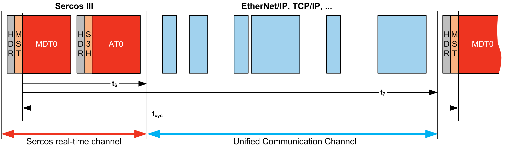
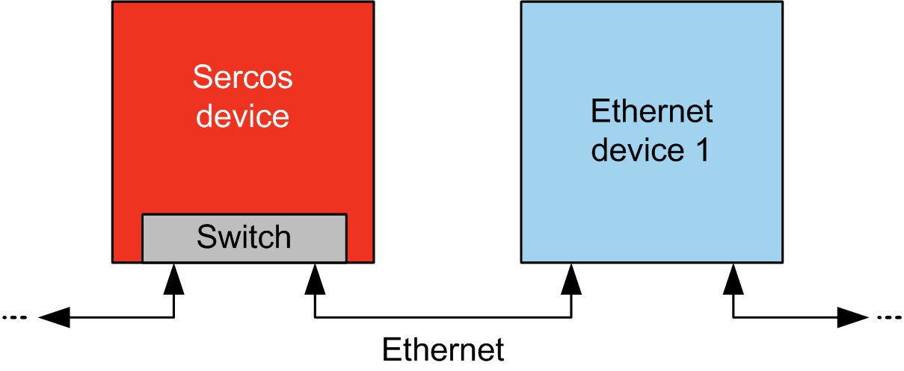
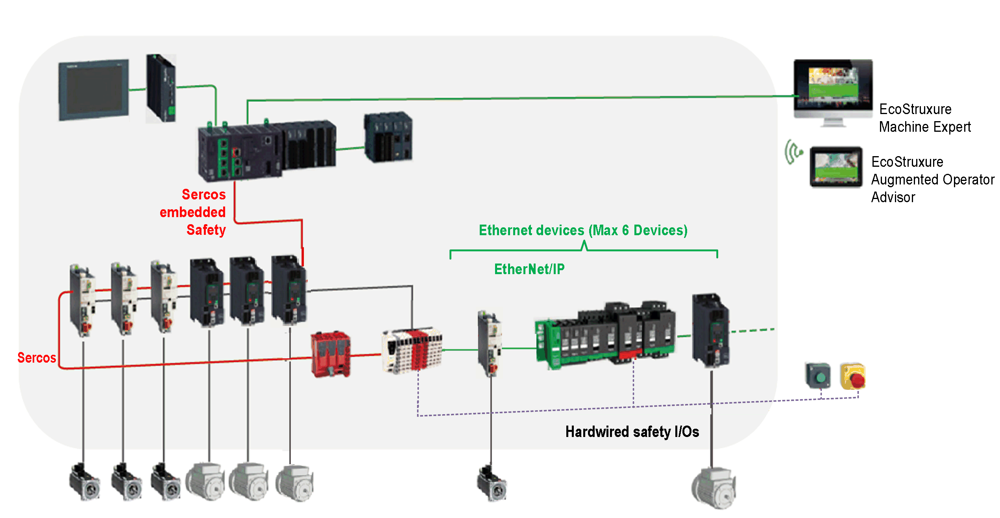
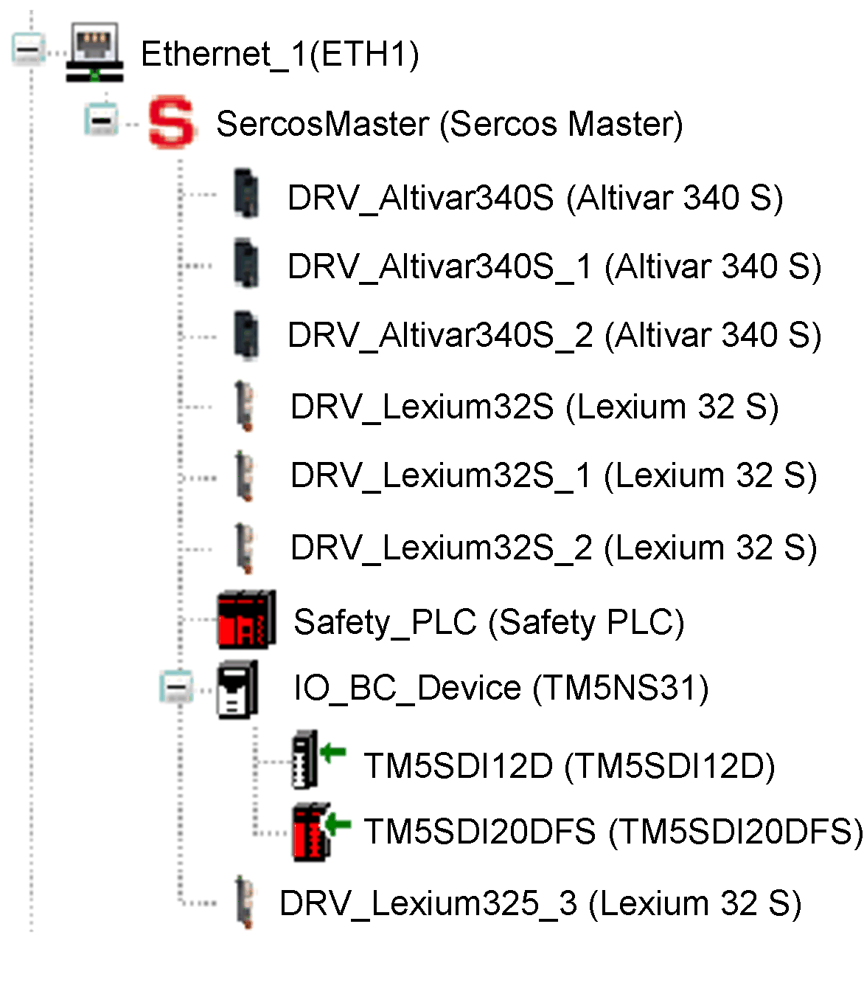

# Single Wire Architecture

## Overview

In addition to real-time and safety-critical data, the Sercos standard allows the transmission of Ethernet data over a common network infrastructure.

NOTE: The TM262M05MESS8T motion controller does not support the Single Wire Architecture.

The EtherNet/IP or TCP/IP frames are embedded within the Sercos frame:

This Single Wire Architecture can be implemented using a single network cable connected to the controller. The Ethernet devices are added to the end of the cable after the Sercos devices.

No additional cables or network components (gateways or switches) are required.

The last Sercos device on the cable acts as the gateway. It must have two Sercos connectors; one connected to the upstream Sercos devices, the other to the downstream Ethernet devices:

Up to 6 Ethernet devices can be added to the cable.

This figure shows an example Single Wire Architecture:

## Single Wire Architecture Implementation

This figure shows the implementation of the example Single Wire Architecture in EcoStruxure Machine Expert:

To build this configuration:

| Step | Action |
| --- | --- |
| 1 | Add the Sercos Master node and Sercos devices in the normal way. |
| 2 | Add up to a maximum of 6 Ethernet devices **below** the last Sercos device.  Any of the Ethernet target devices available in the Device editor window can be added: |
| 3 | Set the Sercos bus to the Phase 4 state to activate Ethernet communication.  When commissioning Sercos devices, it may be necessary to downgrade the Sercos phase, for example, by adjusting the Communication Cycle Time parameter in the Sercos device). In this case, the Ethernet devices will enter a fallback state. |

EIO0000003651.14