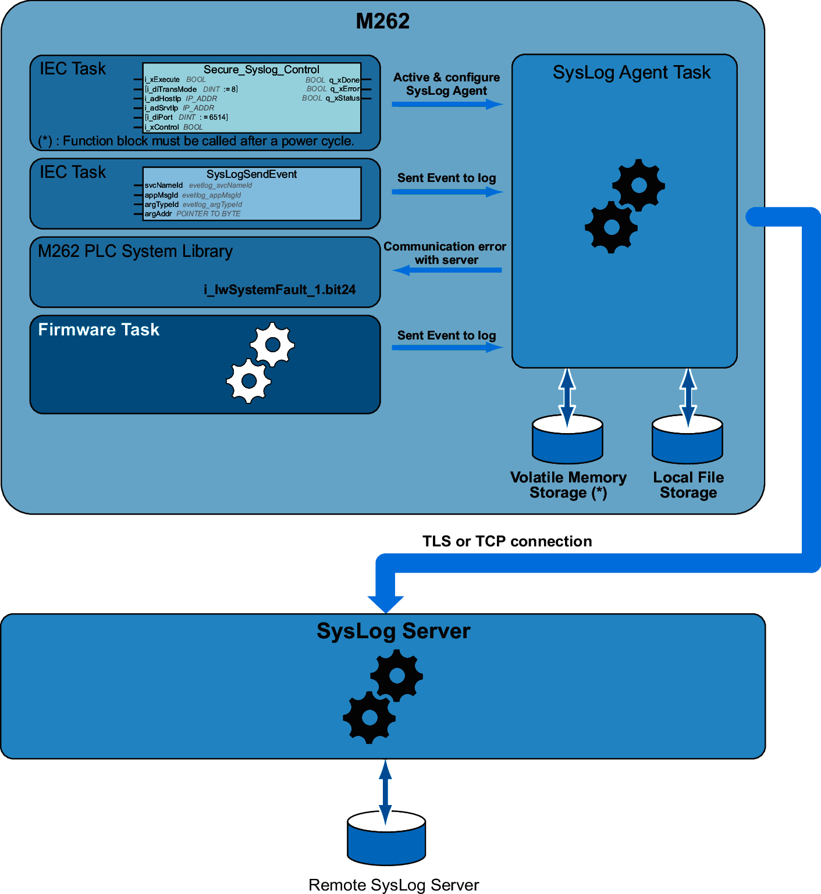

# SysLog Agent

## System Overview

To activate a SysLog Agent, you have to instantiate a function block in your application. This function block starts and configures a SysLog Agent which operates even if you operate commands to download an application, stop, run or halt your controller.

NOTE: SysLog Agent must be started again after a power cycle.

You can send an Event to Log by using the SysLogSendEvent function. Refer to [SysLogSendEvent function](../../../../../api/crossBook?lang=en-US&virtualBookName=sysloglib&topicID=FunctionDescription_F714B3CD).

SysLog Agent stores its configuration to communicate with the SysLog Server in the Volatile Memory Storage. SysLog Agent uses some directories as public key infrastructure (PKI) in Local File Storage to [manage certificates](../../../../../api/crossBook?lang=en-US&virtualBookName=sysloglib&topicID=TrustedServer_0CAED0C9) of allowed server.

SysLog Agent stores historical information about Event to Log on SysLog Server. These files are useful to restore Events to Log during a period of disconnection. The Modicon M262 Logic/Motion Controller can store at least 2048 Events in these files.

The file access is restricted by the configuration of User Rights on your controller.

## Diagnostic of SysLog Agent

A [system bit](../../../../../api/crossBook?lang=en-US&virtualBookName=m262sys&topicID=D_SE_0004809_2)  is set to 0 when an error is detected. This bit is identified as PLC\_GVL.PLC\_R.i\_lwSystemFault\_1.

## TLS and Controller Compatibility

SysLog Agent is compatible with:

* TLS1.2 and TLS1.3
* TM262 firmware version 5.1.6.1 or later

EIO0000003651.14