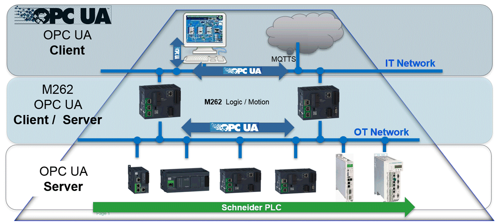

# OPC UA Overview

## Introduction

OPC Unified Architecture (OPC UA) is a vendor-independent communication protocol for industrial automation applications.

The M262 Logic/Motion Controller embeds both client and server services:

EIO0000003651.14