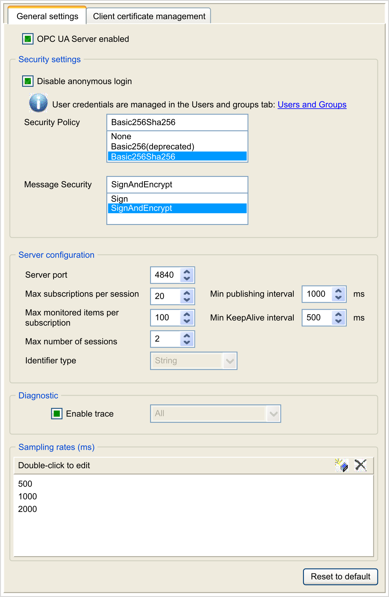
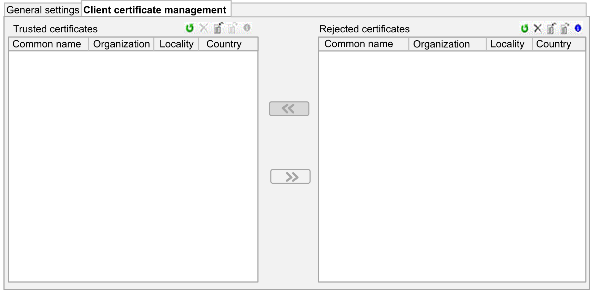

# OPC UA Server Configuration

## Introduction

The OPC UA Server Configuration window allows you to configure the OPC UA server. OPC UA server is using encrypted communication by default with maximum security settings set by default.

## Accessing the OPC UA Server Configuration Tab

To configure the OPC UA Server:

| Step | Action |
| --- | --- |
| 1 | In the Devices tree, double-click MyController. |
| 2 | Select the OPC UA Server Configuration tab. |

## OPC UA Server Configuration Tab

The following figure shows the OPC UA Server Configuration window:

## OPC UA Server Configuration Description

This table describes the OPC UA Server Configuration parameters:

General Settings

| Parameter | Value | Default value | Description |
| --- | --- | --- | --- |
| OPC UA Server Enabled | Enabled/ Disabled | Disabled | This checkbox is used to enable or disable the OPC UA Server and Client on the controller. |

Security Settings

| Parameter | Value | Default value | Description |
| --- | --- | --- | --- |
| Disable anonymous login | Enabled/ Disabled | Enabled | Uncheck this checkbox to allow anonymous login on OPC UA server. |
| Security Policy | None  Basic256(deprecated) (1)  Basic256Sha256 | Basic256Sha256 | This drop-down menu allows you to secure your exchanges by signing and encrypting the data you send and receive. |
| Message Security | None  Sign  SignAndEncrypt | SignAndEncrypt | The messages are related to the Security Policy selected. |
| **(1)** Security policies marked as deprecated are policies which no longer afford an acceptable level of security. | | | |

Server Configuration

| Parameter | Value | Default value | Description |
| --- | --- | --- | --- |
| Server port | 1...65535 | 4840 | The port number of the OPC UA server. OPC UA clients must append this port number to the TCP URL of the controller to connect to the OPC UA server. |
| Max. subscriptions per session | 1...100 (2) | 20 | Specify the maximum number of subscriptions allowed within each session. |
| Min. publishing interval | 200...5000 | 1000 | The publishing interval defines how frequently the OPC UA server sends notification packages to clients. Specify the minimum time that must elapse between notifications, in ms. |
| Max. monitored items per subscription | 1...10000 (2) | 100 | The maximum number of *monitored items* in each subscription that the server assembles into a notification package. |
| Min. KeepAlive interval | 500...5000 | 500 | The OPC UA server only sends notifications when the values of monitored items of data are modified. A *KeepAlive* notification is an empty notification sent by the server to inform the client that although no data has been modified, the subscription is still active. Specify the minimum interval between KeepAlive notifications, in ms. |
| Max. number of sessions | 1...4 | 2 | The maximum number of clients that can connect simultaneously to the OPC UA server. |
| Identifier type | String | String | Certain OPC UA clients require a specific format of unique symbol identifier (node ID). |
| **(2)** The total count (Max. subscriptions per session x Max. monitored items per subscription) cannot exceed 10000. | | | |

Diagnostic

| Parameter | Value | Default value | Description |
| --- | --- | --- | --- |
| Enable trace | Enabled/disabled | Enabled | Select this checkbox to include OPC UA diagnostic messages in the [controller log file](../../../../../api/crossBook?lang=en-US&virtualBookName=SoMProg&topicID=D_SE_0083391). Traces are available from the Log tab or from the [System Log File](MaintenancePage-6CE89C28.html#MaintenancePage-6CE89C28__D-SE-0002960.40) of the Web server.  You can select the category of events to write to the log file:   * None * Error * Warning * System * Info * Debug * Content * All (default) |
| Sampling rates (ms) | 200...5000 | 500  1000  2000 | The sampling rate indicates a time interval, in milliseconds (ms). When this interval has elapsed, the server sends the notification package to the client. The sampling rate can be shorter than the publishing interval, in which case notifications are queued until the publishing interval has elapsed.  Sampling rates must be in the range 200...5000 (ms).  Up to 3 different sampling rates can be configured.  Double-click on a sampling rate to edit its value.  To add a sampling rate to the list, right-click and choose Add a new rate.  To remove a sample rate from the list, select the value and click . |

Click Reset to default to return the configuration parameters on this window to their default values.

## Client Certificate Management Tab

This tab allows you to determine which OPC UA client certificates are trusted by the M262 Logic/Motion Controller OPC UA server.

## Client Certificate Management Tab, Toolbar

| Element | Description |
| --- | --- |
|  | Both certificate lists are loaded or refreshed. |
|  | Deletes the selected certificates. |
|  | Opens a Windows dialog box (Open) to import a certificate that is uploaded to the selected certificate list (trusted certificates list or rejected certificates list). |
|  | Opens a Windows dialog box (Save as) to export the selected certificates to a selectable path. |
|  | Opens a dialog box containing additional information on the selected certificate. |

## Trusted Certificates List and Rejected Certificates List

A certificate contains common information about the company that owns the certificate, how long a certificate is valid, and so on. The certificate management provides two list views:

* trusted certificates
* rejected certificates.

| Element | Description |
| --- | --- |
| Trusted certificates | This list includes the client certificates the server trusts. |
| Rejected certificated | This list includes the client certificates the server does not trust. |
|  | Use the << and >> buttons to move a rejected certificate to the Trusted certificates list or the opposite way.  During the moving procedure, a progress bar appears and displays the remaining files. |

NOTE: OPC UA client and server share the same default PKI folder structure, including the trusted and untrusted (rejected) folders, this means trusting or untrusting (rejecting) a certificate has the same effect for both client and server.

NOTE: The OPC UA self-signed certificate has a limitation when the network interface through which OPC UA communicates is using dynamic IP addresses (DHCP). If you configured DHCP in such interface, make sure your OPC UA peer accepts the M262 Logic/Motion Controller OPC UA self-signed certificate without validation.

## OPC UA Certificates Management Actions

This table describes each action concerning OPC UA certificates management and how to achieve it.

| Action / Task | EcoStruxure Machine Expert  Security Screen (1) | EcoStruxure Machine Expert  M262 Files Screen (2) | EcoStruxure Machine Expert  M262 OPC UA Server Screen (3) | M262 Webpage  Maintenance - Certificates | FTP  Protocol (2) |
| --- | --- | --- | --- | --- | --- |
| Access to M262 OPC UA PKI folders | YES | YES | YES | NO | YES |
| Import a certificate | YES | YES | YES | NO | YES |
| Export a Certificate | YES | YES | YES | NO | YES |
| Remove a certificate | YES | YES | YES | NO | YES |
| Trust / Untrust a certificate | NO | YES (4) | YES | YES (5) | YES (4) |
| Check a certificate information | YES | NO | YES | NO | NO |
| **PKI**: Public Key Infrastructure.  **(1)** Only for M262 own certificates folder.  **(2)** Except M262 own certificates folder.  **(3)** Only trusted and untrusted (rejected) certificate folders.  **(4)** Requires to manually move the certificate from the trusted folder to the untrusted (rejected) folder (and vice-versa).  **(5)** Requires Administrator access. | | | | | |

## OPC UA PKI Folder List and Usage

The table describes the Public Key Infrastructure (PKI) shared between the M262 Logic/Motion Controller OPC UA server and OPC UA client. It provides the folder list and their usage.

| M262 File System Folders | Description |
| --- | --- |
| /usr/pki | Root folder of the default PKI |
| /usr/pki/issuer/certs | Contains Certificate Authority (CA) certificates that are required to validate Certification Paths |
| /usr/pki/issuer/crl | Contains Certificate Revocation Lists (CRL) for CA certificates |
| /usr/pki/trusted/certs | Contains Trusted certificates |
| /usr/pki/trusted/crl | Contains Certificate Revocation Lists (CRL) for the Trusted certificates |
| /usr/pki/untrusted | Contains Untrusted certificates |
| /usr/pki/quarantine | Not used for M262 OPC UA (legacy for other services) |
| NOTE: Some of the PKI folders are only available after downloading the application enabling OPC UA (server/client), since some folders are only created in the runtime initialization of OPC UA. | |

EIO0000003651.14