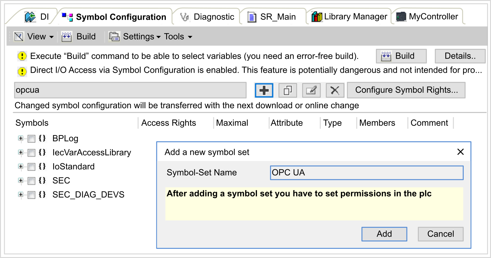
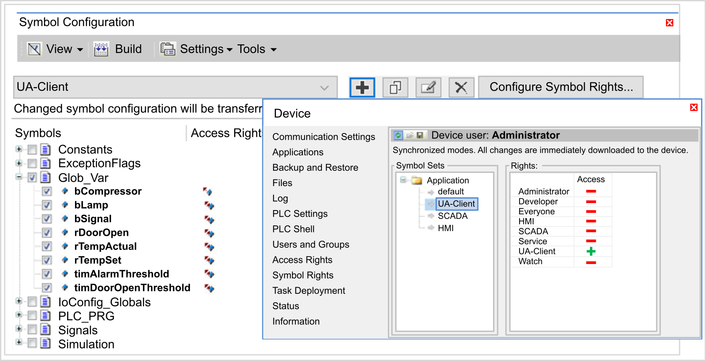

# OPC UA Server Symbols Configuration

## Introduction

Symbols are the items of data shared with OPC UA clients. Symbols are selected from a list of all the IEC variables used in the application. The selected symbols are then sent to the controller as part of the application download.

Each symbol is assigned a unique identifier. Identifiers are in string format.

This table describes IEC variable Base Types versus OPC UA Data Types:

| IEC variable Base Types | OPC UA Data Types |
| --- | --- |
| BOOL, BIT | Boolean |
| BYTE, USINT | Byte |
| INT | Int16 |
| WORD, UINT | Uint16 |
| DINT, TOD, TIME | Int32 |
| DWORD, UDINT | Uint32 |
| LINT, LTIME | Int64 |
| LWORD, ULINT | Uint64 |
| REAL | Float |
| LREAL | Double |
| WSTRING, STRING | Up to 255 characters - String |
| DATE, DT | Second precision - DateTime |
| SINT | SByte |

Bit memory variables (%MX) cannot be selected. In addition to IEC base data types, the OPC UA server can also expose OPC UA variables from IEC symbols that are composed of the following complex types:

* Arrays and Multi-Dimensional Arrays. These are limited to 3 dimensions.
* Structured data types, and nested structured data types. As long as they are not composed of a UNION field.

NOTE: For a STRING / WSTRING variable within Structured data types, if the number of characters exceeds specified length, the string is truncated.

## Displaying the List of Variables

To display the list of variables:

| Step | Action |
| --- | --- |
| 1 | On the Applications tree tab, right-click Application and choose Add object > Symbol Configuration.  **Result:** The Add Symbol Configuration window is displayed. The controller starts the OPC UA server. |
| 2 | Click Add. |

NOTE: The IEC objects `%MX`, `%IX`, `%QX` are not directly accessible. To access IEC objects you must first group their contents in located registers (refer to [Relocation Table](D-SE-0004337.html#D-SE-0004337)).

## Selecting OPC UA Server Symbols

The Symbol Configuration window displays the variables available for selection as symbols:

Select IoConfig\_Globals\_Mapping to select all the available variables. Otherwise, select individual symbols to share with OPC UA clients.

Each symbol has the following properties:

| Name | Description |
| --- | --- |
| Symbols | The variable name followed by the address of the variable. |
| Type | The data type of the variable. |
| Access type | Click repeatedly to specify the access rights of the symbol:   * read-only () (default), * write-only (), * or read/write ().   NOTE: Click in the Access type column of IoConfig\_Globals\_Mapping to set the access rights of all the symbols at once. |
| Comment | An optional comment. |

Click Refresh to update the list of available variables.

EIO0000003651.14