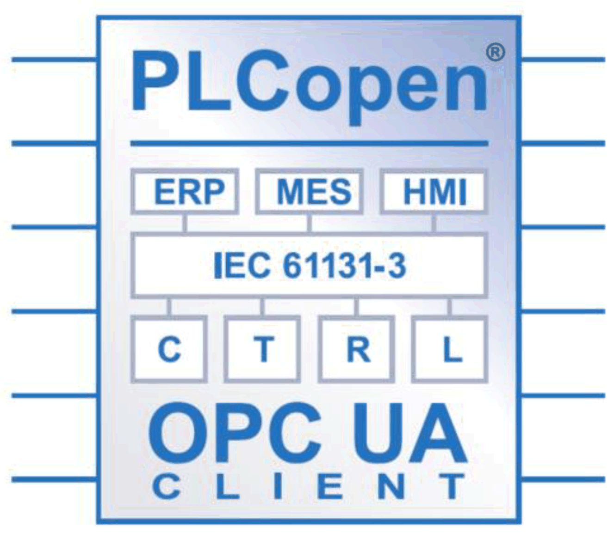
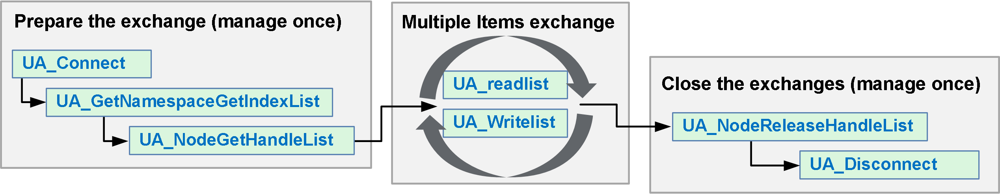

# Programming the OPC UA Client

## Overview

OPC UA client functionality is delivered in the OpcUaHandling library.

This library contains IEC 61131-3 standard function blocks to include in your application:

The function blocks allow you to:

* Read/write multiple data items
* Perform diagnostics

The following function blocks are supported:

* UA\_Connect
* UA\_ConnectionGetStatus
* UA\_Disconnect
* UA\_NamespaceGetIndexList
* UA\_NodeGetHandleList
* UA\_NodeGetInformation
* UA\_NodeReleaseHandleList
* UA\_ReadList
* UA\_WriteList
* UA\_Browse
* UA\_SubscriptionCreate
* UA\_SubscriptionDelete
* UA\_SubscriptionProceed
* UA\_MonitoredItemAddList
* UA\_MonitoredItemOperateList
* UA\_MonitoredItemRemoveList
* UA\_TranslatePathList
* FB\_TimeStamper

For details, refer to the [OpcUaHandling Library Guide](../../../../../api/crossBook?lang=en-US&virtualBookName=OpcUaLib&topicID=D_SE_0099923).

## Example: Managing a Read/Write List

This figure shows the function blocks used to read and write items of data managed by a remote OPC UA server:

NOTE: Ensure that OPC UA Server enabled is activated to use OPC UA Client. See [OPC UA Server Configuration Tab](D-SE-0068333.html#D-SE-0068333__D-SE-0068333.4).

EIO0000003651.14